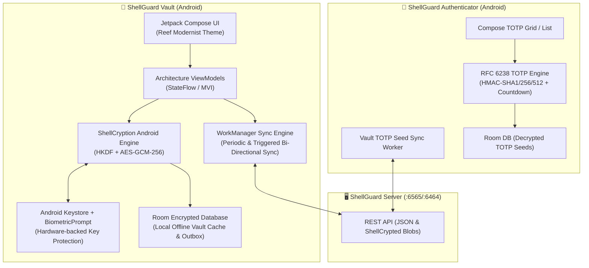

# 📱 ShellGuard — Android Native Client Architecture

> **STATIC REFERENCE CORPUS FOR ANDROID MOBILE APPLICATIONS**
> *This documentation provides complete, drop-in technical specifications for scaffolding native Android client applications for the ShellGuard ecosystem (Full Vault Client & Standalone TOTP Authenticator).*

---

## 🏗️ Mobile Ecosystem Overview

The ShellGuard mobile ecosystem consists of two first-class native Android applications built with modern Android standards:

---

## 🛠️ Technology Stack & Requirements

| Layer | Technology | Specification / Library |
|---|---|---|
| **Language** | Kotlin | 2.0+ (Strict Null Safety, Coroutines, Serialization) |
| **UI Framework** | Jetpack Compose | Material 3 + Custom Reef Modernist Design System |
| **Local Database** | Room | SQLite + SQLCipher (`net.zetetic:sqlcipher-android`) |
| **Dependency Injection** | Hilt / Koin | AndroidX Lifecycle Scoping |
| **Networking** | Retrofit or Ktor Client | OkHttp3 / Ktor CIO + Kotlinx Serialization |
| **Cryptography** | `javax.crypto` & `java.security` | Android Keystore, AES-GCM-256, HKDF-SHA256, BiometricPrompt |
| **TOTP Engine** | Native Kotlin | Custom RFC 6238 Implementation with Base32 decoding |
| **QR Code Scanner** | CameraX + ML Kit | `com.google.mlkit:barcode-scanning` |
| **Background Sync** | WorkManager | `androidx.work:work-runtime-ktx` with Exponential Backoff |

---

## 📂 Architecture Guide Index

1. [**Cryptography Specification & ShellCryption (`crypto-spec.md`)**](./crypto-spec.md) — Kotlin implementation of HKDF key derivation, AES-GCM-256 encrypt/decrypt, AAD binding verification, and Android Keystore master key storage.
2. [**Room Database Schema & DAOs (`room-schema.md`)**](./room-schema.md) — Room `@Entity` definitions, `@Dao` interfaces, TypeConverters, relational queries, and local cache models.
3. [**API Client & Sync Engine (`api-client.md`)**](./api-client.md) — Retrofit/Ktor service contracts, DTO envelopes, token interceptors (`hu-`/`api-`), and WorkManager sync repository.
4. [**TOTP Engine & Authenticator Protocol (`totp-engine.md`)**](./totp-engine.md) — RFC 6238 algorithmic token generator, time-window countdown flows, and Authenticator app synchronization.
5. [**Jetpack Compose UI & Design System (`ui-compose-models.md`)**](./ui-compose-models.md) — Navigation graphs, ViewModels, Reef Modernist color palette, and component states.
