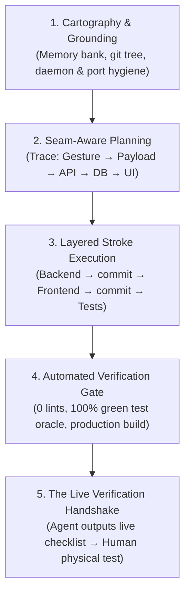

# 🛡️ Rule: Project Hygiene & End-to-End Development Protocol

**Core Stance:** "Don't trust, Verify" all claimed functions—especially critical functions that form the focal operating points of the application. Passing isolated test suites does not prove the application works. We verify the whole seam: from the user's physical gesture in the interface, through network transit and database persistence, and back to visual confirmation on screen.

---

## 🧭 The 5-Phase Development Lifecycle



---

## Phase 1: Cartography & Grounding (Start of Every Session)

Before writing or modifying a single line of code:

1. **Memory Bank Re-anchoring**:
   - Read `.agents/memory-bank/activeContext.md`, `progress.md`, and relevant architectural specs.
   - Ground current intent in the trajectory of recent commits and active decisions.
2. **Working Tree Snapshot**:
   - Run `git status` and `git diff --stat`.
   - Never assume the tree is clean. If uncommitted in-flight user edits exist, identify and preserve them.
3. **Daemon & Port Listener Hygiene**:
   - In development environments with file watchers (`tsx --watch`, `vite`), detached or orphaned background processes can silently hold network sockets (e.g. ports `6565`, `6464`).
   - Check active listeners before debugging or launching dev servers:
     ```bash
     ss -tulpn | grep -E '6464|6565' || fuser 6464/tcp 6565/tcp
     ```
   - Evict stale or zombie listeners (`npm run scuttle:stop` or `fuser -k <port>/tcp || true`) to guarantee file watchers bind cleanly to live sockets and route changes are not shadowed by stale code.

---

## Phase 2: Seam-Aware Planning (Mandatory Pre-Execution)

Even when the task appears trivially simple or the path is obvious, formulate an explicit implementation plan before touching code. Deceptive simplicity is where seam defects hide.

### The Seam Tracing Invariant
Trace the **complete operational circuit** across every architectural boundary:
$$\text{User Gesture} \longrightarrow \text{State Dispatch} \longrightarrow \text{Payload Serialization} \longrightarrow \text{Network Transit} \longrightarrow \text{DB Mutation} \longrightarrow \text{Cache Invalidation} \longrightarrow \text{UI Reflection}$$

Every plan must explicitly address:
- **Destructive Action Safety**: Does this delete, purge, or overwrite data? If so, is it gated by a custom confirmation modal (`ConfirmDialog`), with contextual warnings and state reset on target change?
- **State Teardown**: If an active entity is deleted, is its active selection pointer (e.g. `selectedItemId`) immediately cleared to prevent dead views?
- **Polymorphic Type Dispatch**: Are all entity types (passwords, notes, keys, TOTP, attachments) explicitly partitioned? Does unhandled data default to the canonical primary vault (`/api/vault`), never falling back into secondary sub-resources?
- **Async Error Boundaries**: Are all client API calls wrapped in `try / catch` with visible UI feedback, and are cache/vault refetches (`scuttleVault`) explicitly awaited?

---

## Phase 3: Layered Stroke Execution & Incremental Commits

Work in distinct strokes. Never assemble massive, monolithic pull requests or giant multi-domain commits. Decouple your edits into coherent structural layers:

1. **Stroke 1: Database & Backend**:
   - Migrations, SQLite queries, Express route handlers, Zod schemas.
   - Run targeted backend tests to verify endpoints hold.
   - Commit under `git-hygiene.md` with two-layer attribution (`feat(api):` or `fix(api):`).
2. **Stroke 2: Client UI & State Adapters**:
   - React components, state handlers, modal dialogs, client utilities.
   - Verify layout, interactions, and console in dev server.
   - Commit under `git-hygiene.md` (`feat(ui):` or `fix(ui):`).
3. **Stroke 3: Seam & Interface Tests**:
   - Build targeted tests that verify component dispatch, payload building, and state teardown (not just isolated math or mock units).
   - Verify all tests pass.
   - Commit under `git-hygiene.md` (`test:`).
4. **Stroke 4: Documentation & Memory Bank**:
   - Update architecture docs, schemas, and memory bank files (`activeContext.md`, `decision-log.md`, `progress.md`).
   - Commit under `git-hygiene.md` (`docs:`).

---

## Phase 4: Automated Verification Gate (Machine Truth)

Before declaring any code ready for review or testing:

1. **Type Checking & Linting**:
   - Run `npm run lint` (`tsc --noEmit`). Zero errors permitted.
2. **Full Test Oracle**:
   - Run `npm test`. Every test suite must exit 100% green.
3. **Production Compilation**:
   - Run `npm run build`. Vite production build must succeed without bundling or syntax errors.
4. **Agent Self-Inspection**:
   - Inspect the exact `git diff` line-by-line. Confirm every import resolves, no debug artifacts remain, and no unintended files were touched.

---

## Phase 5: The Live Verification Handshake (Human Operational Truth)

Passing machine tests in Phase 4 is necessary, but **not sufficient**. Automated tests verify only what their assertions anticipate; they do not verify that a human clicking in a running browser triggers the desired behavior.

### The Agent's Duty
Upon completing Phase 4, the Agent MUST formulate and present a clear, numbered **Live Verification Checklist** tailored for Lucas (Project Manager):
- **Target URL / View**: The exact view or route to navigate to (e.g. `http://localhost:6464`).
- **Input Data**: The exact test data to enter (e.g. create password with title `"Test-Item"`, username `"lucas"`).
- **Physical Action Sequence**: Exact step-by-step clicks (e.g. "1. Click item 'Test-Item', 2. Click trash icon in detail pane, 3. Observe ConfirmDialog modal, 4. Click 'Delete Item'").
- **Expected Visible Result**: The exact on-screen reaction (e.g. "Modal closes, item disappears from middle list pane, right detail pane resets to empty state, database count decrements").
- **Negative / Edge Verification**: Test dismiss/cancel actions (e.g. clicking Cancel leaves item intact).

### The Human Operator's Role
Lucas physically executes the checklist in the live application.
- **The Golden Rule**: Work is **NEVER** marked complete, merged to main, or tagged for release until the human operator has physically verified the focal operations live.

---

## 🎯 Seam Tests vs. Isolated Unit Tests

When writing automated tests, prioritize **Seam Tests** over redundant pure unit tests:
- **Isolated Unit Test (Low Seam Value)**: Testing that a utility function correctly formats a string in memory.
- **Seam Test (High Seam Value)**: 
  - Testing that a component's delete handler calls the correct API endpoint for every item type (`password` $\rightarrow$ `/api/vault`, `note` $\rightarrow$ `/api/notes`, `key` $\rightarrow$ `/api/keys`).
  - Testing that bulk update payloads preserve existing tags and custom fields.
  - Testing that error responses from the server populate error state in the view rather than failing silently.

---

## ⛔ Inviolable Anti-Patterns

1. ❌ **NEVER** declare a task complete based solely on a passing test suite without running the Live Verification Handshake.
2. ❌ **NEVER** execute a "mega-commit" bundling backend schemas, frontend components, and tests into a single diff.
3. ❌ **NEVER** touch code without verifying development port listeners (`6565`, `6464`) to prevent zombie process route shadowing.
4. ❌ **NEVER** use negative fallback routing for polymorphic items where unhandled types route to secondary resources (like `/api/attachments`).
5. ❌ **NEVER** perform destructive mutations without modal confirmation symmetry and selection state teardown.
