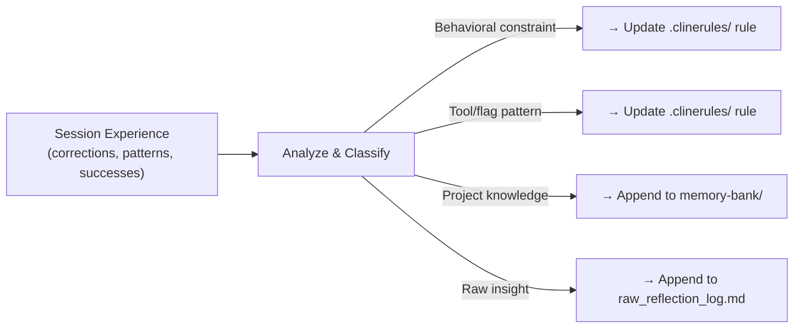

# 🧠 Learn Workflow — `/learn`

> **Use When:** The user invokes `/learn` or you want to persist a reusable behavior from a correction, success, or new pattern.
> **Pair With:** `.clinerules/memory-bank/raw_reflection_log.md`, `.clinerules/memory-bank/consolidated_learnings.md`.
> **Replaces:** `.agents/rules/continuous-improvement.md`, `.agents/rules/advanced-learning.md`.

---

## Overview

This workflow transforms raw session experience into persistent behavioral change. It bridges the gap between what happened *in this session* and what Cline should *remember for all future sessions*.

---

## Phase 1: Extract — Analyze Recent Session

**MUST** scan the recent conversation for:

1. **Corrections & Constraints**: User statements like "no", "instead", "that failed", "wrong", "don't do X". These signal behavioral guardrails that should become rules.
2. **New Patterns**: Successful multi-step operations, flag combinations, or architectural approaches that worked. These signal process improvements.
3. **Preferences**: Naming conventions, structural choices, style decisions. These signal project-specific conventions.
4. **Knowledge**: Environment quirks, API behaviors, dependency versions, test commands. These signal memory bank entries.

---

## Phase 2: Classify — Rule vs Skill vs Memory

| Finding Type | → Becomes | Location |
|:-------------|:----------|:---------|
| Behavioral constraint ("never X", "must Y") | **Rule update** | Direct update to `.clinerules/` file |
| Process / workflow pattern | **Workflow update** | `.clinerules/workflows/` file |
| Tool flag / cheatsheet pattern | **Rule update** | Existing `.clinerules/` file or new rule |
| Project-specific knowledge | **Memory bank entry** | `raw_reflection_log.md` + `consolidated_learnings.md` |
| Correction to a misunderstanding | **Rule update or Knowledge entry** | Update relevant `.clinerules/` or consolidate |

### Classification Heuristics

**MUST** determine root cause, not surface symptom:
- A user said "that's wrong" — *why* was it wrong? Was it a formatting issue, a security violation, a naming mismatch?
- A multi-step operation succeeded — *what was the pivotal step* that made it work?
- A pattern emerged — *is this specific to ShellGuard, or generally applicable?*

---

## Phase 3: Propose — Create Learning Proposal

**MUST** write a `learning_proposal.md` artifact with:

1. **What was learned**: The raw insight from the session.
2. **Classification**: Rule, workflow, memory bank, or knowledge.
3. **Target file**: The exact `.clinerules/` file to create or update.
4. **Precise diff**: The exact text to add, change, or remove.
5. **Rationale**: Why this improves future sessions.

Set `request_feedback = true`. Present to the user for review.

**DO NOT** modify any files in Phase 3 — this is a proposal phase only.

---

## Phase 4: Apply — After User Approval

Once the user approves:

1. **Update target files**: Apply the proposed changes to `.clinerules/` files directly.
2. **Log to raw reflection**: Append a new entry to `raw_reflection_log.md` with the date, task reference, and what was learned.
3. **Consolidate**: If the insight is durable and broadly applicable, add it to `consolidated_learnings.md`.
4. **Prune raw log**: Remove processed entries from `raw_reflection_log.md` after consolidation.

---

## Advanced Learning Enhancement

When patterns recur across multiple sessions or the user's feedback indicates a deeper knowledge gap, **SHOULD** also:

1. **Cross-reference**: Connect the new insight with existing entries in `consolidated_learnings.md`.
2. **Synthesize**: Identify if the new finding refines, contradicts, or extends prior knowledge.
3. **Predict**: Note what related topics the user might need next, based on pattern trajectories.
4. **Evolve**: Track how understanding of a concept has changed over time (e.g., "initial understanding → refined insight → current state").

---

## Trigger Conditions

**MUST** execute this workflow when:
- User explicitly invokes `/learn`.
- User provides a correction or override that reveals a missing constraint.
- A complex multi-step operation succeeds and should be documented as a pattern.
- Before session handoff, if significant new knowledge was generated.

**SHOULD** execute this workflow when:
- `raw_reflection_log.md` has grown by 5+ entries since last consolidation.
- A pattern repeats across different contexts (signal it's generalizable).
- User feedback indicates a misunderstanding that needs to be locked in as a rule.

---

## Quality Assurance

Before completing this workflow, verify:
1. **Proposal was reviewed**: User approved the learning proposal before any file changes.
2. **Target file exists**: The `.clinerules/` file being updated is the correct one.
3. **No duplication**: The insight doesn't already exist in the target file.
4. **Memory bank logged**: `raw_reflection_log.md` has a new entry.
5. **Consolidated (if applicable)**: `consolidated_learnings.md` reflects the durable insight.
6. **Raw log pruned**: Processed entries are removed from `raw_reflection_log.md`.