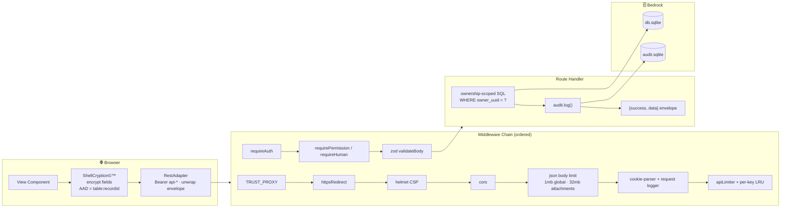
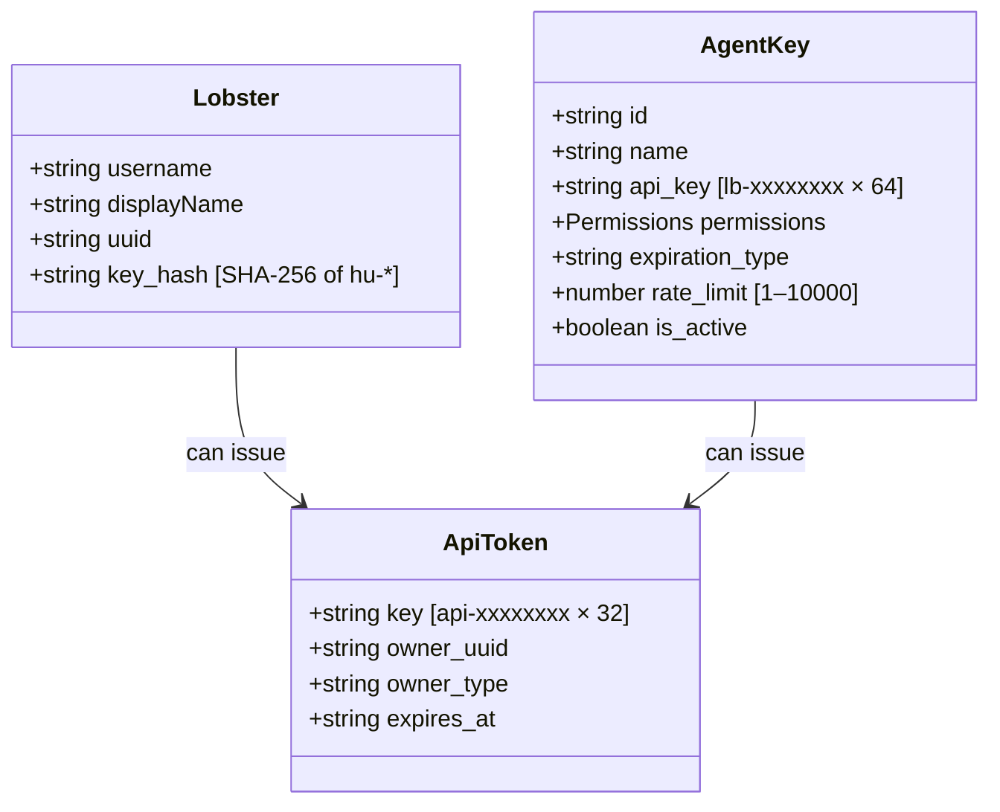

# 🏗️ System Blueprint: ShellGuard

[](#)
[](#)
[](#-appendix-shellguard-deltas-vs-clawchives)

> ASCII Construction Blueprint — the authoritative structural reference for ShellGuard v0.2.0. This document covers architecture, patterns, constraints, and implementation details.

---

## 📖 Table of Contents

<details>
<summary>Expand to navigate sections</summary>

- [📂 Complete Directory Structure](#-complete-directory-structure)
- [📊 Data Flow & Architecture](#-data-flow--architecture)
- [🏗️ Architectural Tenets](#️-architectural-tenets)
- [🔑 Key System Architecture](#-key-system-architecture)
- [🔐 Hard Constraints & Stability Locks](#-hard-constraints--stability-locks)
- [🔌 API Routes & Endpoints](#-api-routes--endpoints)
- [🧪 Test Architecture](#-test-architecture)
- [Appendix: ShellGuard Deltas vs ClawChives](#-appendix-shellguard-deltas-vs-clawchives)
- [Cross-References](#cross-references)

</details>

---

## 📂 Complete Directory Structure

```text
ShellGuard/
│
├── 📄 server.ts                       # Express 5 entrypoint — exports `app` for the test seam
├── 📄 package.json                    # NPM dependencies & scripts (name "shellguard", v0.2.0)
├── 📄 vite.config.ts                  # Vite :5353 strictPort, /api proxy → :5454, "@" alias
├── 📄 tsconfig.json / tsconfig.node.json  # Strict TypeScript rules
├── 📄 .env.example                    # Environment variable reference (openssl hint included)
│
├── 🐳 Dockerfile                      # Multi-stage node:20-alpine single image (UI + API)
├── 🐳 docker-compose.yml              # Production reef (build locally, ./data bind mount)
├── 🐳 docker-compose.dev.yml          # Pull-and-run reef (ghcr.io/clawstackstudios/shellguard:main)
├── 🐳 docker-entrypoint.sh            # PUID/PGID remap, chown DATA_DIR, su-exec privilege drop
├── 📄 .dockerignore                   # Excludes node_modules/.git/dist/data — keeps the lockfile IN
├── 📄 shellguard-unraid-template.xml  # Community Applications template
├── ⚙️ .github/workflows/docker-publish.yml  # CI → ghcr.io/clawstackstudios/shellguard
│
├── 🗄️ migrations/
│   ├── 0001_initial.up.sql            # Schema v1 baseline (lobsters, vault_*, settings…)
│   ├── 0001_initial.down.sql          # Rollback
│   ├── 0002_metadata_encryption.up.sql   # Per-row metadata encryption support
│   └── 0002_metadata_encryption.down.sql # Rollback metadata encryption
│
├── 🔧 scripts/
│   ├── scuttle-reset.ts               # Scuttles data-dev/ or data/ (--env production|development)
│   ├── encrypt-existing-metadata.ts   # Batch encrypt plaintext metadata (migration helper)
│   └── decrypt-existing-metadata.ts   # Batch decrypt metadata for downgrade
├── 🤖 skills/shellguard/SKILL.md      # Agent API reference — served at GET /skill.md
├── 🧪 tests/                          # Vitest + supertest suites, per-suite DATA_DIR isolation
│   ├── helpers/                       # testDb, testFactories, testAuth
│   ├── auth-flow.test.ts
│   ├── security.test.ts               # Cross-owner isolation + permission bypass attempts
│   ├── vault-crud.test.ts             # Envelope shapes + opacity invariant
│   ├── settings.test.ts
│   ├── metadata-encryption.test.ts    # Per-row AES-256-GCM: unit crypto, API round-trip,
│   │                                  # backward-compat passthrough
│   └── build-gates.test.ts            # Asserts Dockerfile/config shape before CI does
│
└── src/
    ├── config/                        # ◀ Server-side configuration
    │   ├── apiConfig.ts               #   PORT/HOST resolution, prod vs dev binding
    │   └── corsConfig.ts              #   Env-aware origin policy (TypeScript, unlike CC's .js)
    │
    ├── server/                        # ◀ Backend Source (modular, twin of ClawChives layout)
    │   ├── database/
    │   │   ├── connection.ts          #   better-sqlite3-multiple-ciphers, WAL/NORMAL pragmas,
    │   │   │                          #   umask 077 + 0o600 sidecars, sqlcipher_export fallback
    │   │   ├── migrationRunner.ts     #   Transactional runner tracking schema_migrations
    │   │   ├── schema.ts              #   audit.sqlite DDL (segregated append-only logs)
    │   │   └── index.ts               #   Runs migrations at load; exports {db, auditDb, audit,
    │   │                              #     purgeExpiredTokens}
    │   ├── middleware/
    │   │   ├── auth.ts                #   detectKeyType, HUMAN_PERMISSIONS, requireAuth,
    │   │   │                          #   requirePermission, requireHuman
    │   │   ├── rateLimiter.ts         #   authLimiter (15m window), apiLimiter (100/min),
    │   │   │                          #   per-key LRU limiter honoring agent rate_limit
    │   │   ├── errorHandler.ts        #   zod parse→400, UNIQUE→409, FK→400, prod-safe 500
    │   │   ├── validate.ts            #   Zod validateBody middleware
    │   │   └── httpsRedirect.ts       #   ENFORCE_HTTPS redirect behind TRUST_PROXY awareness
    │   ├── routes/
    │   │   ├── auth.ts                #   register/token/validate (+ SG-only me/profile)
    │   │   ├── vault.ts               #   Pearl logins CRUD
    │   │   ├── notes.ts               #   Secure notes CRUD
    │   │   ├── sshKeys.ts             #   SSH key CRUD
    │   │   ├── attachments.ts         #   Attachment CRUD (32mb body limit here only)
    │   │   ├── agentKeys.ts           #   LobsterKeys©™ lifecycle (create/revoke/delete)
    │   │   ├── settings.ts            #   Per-user KV preferences
    │   │   ├── admin.ts               #   SuperLobster Panel API (ADMIN_TOKEN cookie-session; ADMIN.md)
    │   ├── utils/
    │   │   ├── auditLogger.ts         #   audit.log() with extended redaction list (delta #2)
    │   │   ├── crypto.ts              #   generateString/generateId/constantTimeCompare
    │   │   ├── tokenExpiry.ts         #   TTL parser: 30m/12h/24h/7d/never/ISO/bare-minutes
    │   │   ├── parsers.ts             #   Row mappers (incl. parseAgentKey)
    │   │   ├── fieldEncryption.ts     #   Per-row AES-256-GCM metadata encryption,
    │   │   │                          #   HKDF key derivation, singleton fieldCipher
    │   │   └── metadataGuard.ts       #   Column registry, prepareWrite/prepareRead/
    │   │                              #   prepareReadAll helpers
    │   └── validation/schemas.ts      #   AuthSchemas + entity schemas (title ≤255, url ≤2048…)
    │
    ├── lib/                           # ◀ Client crypto & utilities
    │   ├── shellCryption.ts           #   HKDF(hu-, uuid) → AES-GCM-256; {v,alg,iv,ct,aad} blobs
    │   ├── crypto.ts                  #   hashToken (SHA-256), rejection-sampling key generation
    │   ├── generator.ts               #   Password generator, complexity scoring, TOTP helpers
    │   ├── podUtils.ts                #   Nested pod (folder) tree, colors, counts
    │   └── clipboardManager.ts        #   Clipboard hygiene for copied secrets
    │
    ├── components/                    # ◀ Reef Modernist UI
    │   ├── Vault/                     #   PasswordVaultView, VaultTabView, PodModal, folder tree
    │   ├── Generator/                 #   GeneratorToolView, GeneratorOptions
    │   ├── Settings/                  #   ImportExportView (CSV metadata / JSON re-auth export)
    │   ├── Layout/                    #   Header, Sidebar
    │   ├── Theme/                     #   ThemeToggle
    │   ├── Branding/                  #   InteractiveBrand
    │   ├── LoginView.tsx / SetupView.tsx / LandingView.tsx
    │
    ├── services/api/restAdapter.ts    # ◀ HTTP adapter: unwraps {success,data}, Bearer injection,
    │                                  #   exported ApiError + SESSION_KEYS constants
    ├── types.ts                       #   Shared interfaces (VaultItem, SecureNote, SshKey…)
    ├── App.tsx                        #   Root view router (~25 REST call sites)
    └── main.tsx                       #   React mount point
```

> **Deleted in this release:** `src/services/database/db.ts` (inline-DDL singleton), `src/services/auth/*`, `src/services/vault/*Routes.ts`, `src/services/agents/agentRoutes.ts`, all `patch_*.cjs` scaffolding, `metadata.json`, `bun.lock`, and the root `shellguard.db` file itself.

---

## 📊 Data Flow & Architecture

### Request-Response Pipeline

Every mutation follows the same gauntlet. There are no shortcuts — a handler that skips a stage is a bug.



**Static serving (production):** `dist/` assets ship with immutable cache headers, `index.html` is no-cache, and a regex catch-all — `/^(?!\/api\/)(?!\/assets\/)(?!\/skill\.md).*/` — falls through to the SPA. Express 5's path-to-regexp v8 rejects the old `app.get("*")`; the regex literal is required. Unknown `/api/*` paths return a JSON 404, never an HTML page.

### Auth State Machine

```
┌─────────────────────────────────────────────────────────────┐
│                AUTHENTICATION FLOW                          │
└─────────────────────────────────────────────────────────────┘

  SETUP (First Run)                 LOGIN (Returning Lobster)
  ─────────────────                 ─────────────────────────

  SetupView                         LoginView
      ↓                                 ↓
  Generate hu- key                  Paste hu- or lb- key
  (crypto.getRandomValues)              ↓
      ↓                             SHA-256 → keyHash (client)
  SHA-256 → keyHash (client)            ↓
      ↓                             POST /api/auth/token
  POST /api/auth/register           {uuid?, keyHash}
  {username, keyHash, uuid}             ↓
      ↓                             api- token issued (TTL via
  Identity stored:                  TOKEN_TTL_DEFAULT)
  lobsters.key_hash (UNIQUE)            ↓
      ↓                             sessionStorage "sg_api_token"
  One-Field Login                       ↓
  POST /api/auth/token ↓            RestAdapter: ALL requests
  …same as right column →           Authorization: Bearer api-*
      ↓                                 ↓
  HKDF(hu-, uuid) → AES-GCM-256     HKDF(hu-, uuid) → AES-GCM-256
  ShellKey mounted in memory            ↓
      ↓                             Grotto (authenticated)
  Grotto (authenticated)


  EXPIRY / LOCK
  ─────────────
  Inactivity timeout ("Retract") or token TTL reached
      ↓
  sessionStorage cleared · CryptoKey discarded from memory
      ↓
  LoginView — re-authentication required
```

The raw `hu-` key never crosses the network — only its SHA-256 hash is transmitted, and the derived ShellCryption key lives exclusively in browser memory for the session.

---

## 🏗️ Architectural Tenets

<details>
<summary>View Core Principles</summary>

1. **Zero-Knowledge First** — The client encrypts; the server stores ciphertext. If a feature requires the server to see plaintext, the design is wrong.
2. **Server-First Data** — All persistence flows through the Express API into SQLite. No client-side database, no shadow copies of truth.
3. **Twin Verbatim** — Server modules mirror ClawChives file-for-file so fixes diff cleanly across both reefs. Deliberate deviations must be documented in the deltas appendix.
4. **Ownership Scoping Everywhere** — Every query filters `owner_uuid`. A missing scope clause is a security bug, not a style issue.
5. **Audit on Mutation** — Every write emits an `audit.log()` event to the segregated `audit.sqlite`, redacted per delta #2.
6. **Validate at the Gate** — Every mutating route runs `validateBody` against a Zod schema before touching SQL.
7. **Envelope Contract** — All responses use `{success, data}`; the RestAdapter unwraps centrally so views never parse envelopes.
8. **Fresh Migrations Only** — Schema changes land as new `migrations/NNNN_*.up/down.sql` files. Inline DDL and try/catch ALTERs are forbidden.
9. **Reef Modernist Lock-in** — UI integrates within established shells; visual placement is frozen (see [DESIGN.md](./DESIGN.md)).
10. **Mechanical Client Edits** — Client refactors during parity work touch wiring, not structure. Decomposition is a separate roadmap effort.

</details>

---

## 🔑 Key System Architecture

### Key Types & Metadata



### Key Types Reference

| Prefix | Type | Length | Usage |
|---|---|---|---|
| `hu-` | **Human Key** (ShellKey©™) | 64 chars (67 total) | Personal identity. One-Field Login. Seeds the ShellCryption key via HKDF. |
| `lb-` | **Lobster/Agent Key** | 64 chars (67 total) | Delegated access for AI agents. Granular permissions, expiry (`never`/`30d`/`90d`/`1y`), rate limits (1–10000 req/min). |
| `api-` | **Session Token** | 32 chars (36 total) | Short-lived bearer issued by `/api/auth/token`. TTL from `TOKEN_TTL_DEFAULT` (default 24h). |

### Entropy & Generation Rules

```
✓ hu- keys MUST use browser crypto.getRandomValues()
  └─ 32 bytes entropy → hex-encoded 64 chars
  └─ Stored ONLY as SHA-256 hash in lobsters.key_hash (UNIQUE index)

✓ lb- keys MUST use browser crypto.getRandomValues()
  └─ Same entropy profile, generated in Settings → Agent Keys
  └─ Hashed before storage in lobster_keys.api_key

✓ api- tokens MUST use server crypto.randomBytes()
  └─ 16 bytes entropy → 32 hex chars, prefixed "api-"
  └─ Issued per session, expires_at enforced on every request

✓ Key comparison ALWAYS constant-time (XOR accumulator / timingSafeEqual)

✓ ShellCryption key derivation (client-only):
  HKDF-SHA-256(
    ikm  = hu- key,
    salt = user uuid,
    info = "clawchives-shellcryption-v1"
  ) → AES-GCM 256-bit key, non-extractable
```

### Permission Model

Agent keys carry a granular permission set. Route guards map HTTP verbs onto it:

| Verb | Required Permission |
|---|---|
| `GET` | `canRead` |
| `POST` | `canWrite` |
| `PUT` / `PATCH` | `canEdit` |
| `DELETE` | `canDelete` |

`requireHuman` additionally walls off configuration surfaces (`/api/settings`, `/api/agent-keys`, `/api/auth/profile`) so a scoped Lobster Key can never mint new keys or rewrite system preferences — regardless of which permissions you granted it.

---

## 🔐 Hard Constraints & Stability Locks

### The Zero-Knowledge Invariant (LOAD-BEARING — DO NOT WEAKEN)

```
📌 THE SERVER IS A CIPHER-KEEPER, NEVER A KEY-HOLDER.

✓ Secret material (titles, secrets, note content, key values, TOTP seeds,
  attachment bytes) reaches the server ONLY as ShellCryption blobs:

      {"v":1,"alg":"AES-GCM-256","iv":"<b64>","ct":"<b64>","aad":"table:recordId"}

✓ AAD BINDS table:recordId — a ciphertext lifted from one row and planted
  in another fails GCM authentication. The server cannot shuffle blobs.

✓ The decryption key is derived client-side per session:
  HKDF(hu- key, salt=user uuid) → AES-GCM-256.
  It NEVER leaves browser memory. The server holds no key material and
  therefore CANNOT decrypt anything, even under compulsion.

✓ DB_ENCRYPTION_KEY (SQLCipher + Per-Row) is OPTIONAL defense-in-depth:
  - SQLCipher: whole-file AES-256 encryption of the SQLite database
  - Per-Row: AES-256-GCM encryption of metadata columns (title, username,
    url, category, notes, file_name) stored as {v:1, alg:"SG-META", iv, ct}
    in the same TEXT columns — no schema changes needed
  - Both layers activate together when DB_ENCRYPTION_KEY is set
  - When unset the server WARNS but NEVER BLOCKS startup; enabling
    encryption remains the operator's choice
  - Legacy plaintext metadata is backward-compatible (passes through on read)

⛔ FORBIDDEN:
  - Decrypting or re-encrypting secrets server-side
  - Decrypting or re-encrypting metadata columns without DB_ENCRYPTION_KEY
  - Logging ciphertext, titles, urls, usernames, secrets or tokens
    (delta #2 redaction list)
  - Storing secret material outside the {v,alg,iv,ct,aad} blob shape
  - Changing AAD semantics without a migration + breaking-change notice
```

### Ownership Isolation Rules

```
📌 CRITICAL: Every row in every user-data table includes owner_uuid

(owner_uuid replaces ClawChives' user_uuid — delta #5)

owner_uuid guarantees:
  ✓ Lobsters cannot see other lobsters' pearls
  ✓ Agents can only reach records owned by their creator
  ✓ Settings are per-identity
  ✓ Cross-owner reads return 404, not 403 (no existence leak)

Query Pattern (LOCKED):
  SELECT * FROM vault_pearls
  WHERE owner_uuid = :uuid AND id = :id

  ⛔ FORBIDDEN:
  SELECT * FROM vault_pearls WHERE id = :id
  (missing owner_uuid filter = security bug, tests will scuttle it)
```

### Session State Invariants

```
✓ LOCKED: sg_api_token (sessionStorage, exported SESSION_KEYS constant)
  - Cleared on logout, inactivity lock and tab close
  - Never persisted to localStorage

✓ LOCKED: Preferences split
  - localStorage = first-paint cache only (theme must apply pre-auth)
  - Server settings = source of truth for non-secret prefs
  - Generator history = sessionStorage only, never synced

✓ LOCKED: Raw hu- key + derived CryptoKey never leave the browser
  - Not in telemetry, not in error reports, not in exports without
    explicit re-authentication (ImportExportView gate)

✓ LOCKED: Every mutation audited
  - AUTH_*, AGENT_KEY_CREATED/REVOKED/DELETED, VAULT_ITEM_*,
    ATTACHMENT_UPLOADED, SETTINGS_UPDATED, SYSTEM_*
  - Retention: 90 days default (system_settings), daily prune, 10k cap
```

### Database Connection Rules

```
✓ Driver: better-sqlite3-multiple-ciphers (SQLCipher support)
✓ Dual databases: db.sqlite (data) + audit.sqlite (append-only logs)
✓ Pragmas: WAL journal · synchronous NORMAL · foreign_keys ON · busy_timeout
✓ File mode: umask 077, 0o600 on sidecar files
✓ sqlcipher_export fallback re-keys transparently when DB_ENCRYPTION_KEY
  is added or removed
✓ Migrations run transactionally at module load; version tracked in
  schema_migrations; startup logs "Applied version N"
✓ Per-row field encryption initialized at startup via initFieldCipher()
  - Reads DB_ENCRYPTION_KEY, derives AES-256 key via HKDF-SHA256
  - Singleton fieldCipher used by all vault routes for encrypt/decrypt
  - Null when DB_ENCRYPTION_KEY is not set (passthrough mode)
⚠ KNOWN TRAP (fixed here): SQLite CURRENT_TIMESTAMP and JS ISO strings do
  NOT compare correctly — token expiry uses JS ISO comparison, never raw
  SQL predicate `expires_at > CURRENT_TIMESTAMP`
```

---

## 🔌 API Routes & Endpoints

All endpoints live in `src/server/routes/`. Responses use the `{success, data}` envelope.

### Health & Auth

| Method | Endpoint | Auth | Description |
|---|---|---|---|
| `GET` | `/api/health` | ✗ Public | Health check + record counts |
| `POST` | `/api/auth/register` | ✗ Public | Register identity (username, SHA-256 keyHash, uuid) — 409 on duplicate |
| `POST` | `/api/auth/token` | ✗ Public | Issue `api-` token from `hu-`/`lb-` keyHash (constant-time compare) |
| `GET` | `/api/auth/validate` | ✓ Bearer | Validate current bearer token |
| `GET` | `/api/auth/me` | ✓ Bearer | Current profile *(ShellGuard-only)* |
| `PUT` | `/api/auth/profile` | ✓ Bearer | Update display name *(ShellGuard-only)* |

### Vault Pearls (`routes/vault.ts`)

| Method | Endpoint | Permission | Description |
|---|---|---|---|
| `GET` | `/api/vault` | canRead | List pearl logins (newest first, owner-scoped) |
| `POST` | `/api/vault` | canWrite | Create login — title ≤255, url ≤2048, notes ≤10000, optional TOTP seed |
| `PUT` | `/api/vault/:id` | canEdit | Update login |
| `DELETE` | `/api/vault/:id` | canDelete | Delete login |

### Secure Notes (`routes/notes.ts`)

| Method | Endpoint | Permission | Description |
|---|---|---|---|
| `GET` | `/api/notes` | canRead | List secure notes |
| `POST` | `/api/notes` | canWrite | Create note (content encrypted client-side) |
| `PUT` | `/api/notes/:id` | canEdit | Update note |
| `DELETE` | `/api/notes/:id` | canDelete | Delete note |

### SSH Keys (`routes/sshKeys.ts`)

| Method | Endpoint | Permission | Description |
|---|---|---|---|
| `GET` | `/api/keys` | canRead | List SSH keys |
| `POST` | `/api/keys` | canWrite | Store SSH key material (encrypted client-side) |
| `PUT` | `/api/keys/:id` | canEdit | Update SSH key |
| `DELETE` | `/api/keys/:id` | canDelete | Delete SSH key |

### Secure Attachments (`routes/attachments.ts`)

| Method | Endpoint | Permission | Description |
|---|---|---|---|
| `GET` | `/api/attachments` | canRead | List attachments |
| `POST` | `/api/attachments` | canWrite | Upload base64 attachment — dedicated 32mb body limit, 10 MB per-file hard cap (zod: 14M-char blob) |
| `PUT` | `/api/attachments/:id` | canEdit | Update attachment |
| `DELETE` | `/api/attachments/:id` | canDelete | Delete attachment |

Passwords reference attachments by ID: `vault_pearls.attachments` holds a JSON array of `vault_secure_attachments` IDs (no sensitive data). Unlimited attachments per login, one file each, 10 MB max per file. Deleting a pearl cascade-deletes its linked attachments (ownership-scoped).

### Agent Keys (`routes/agentKeys.ts`) — human-only

| Method | Endpoint | Permission | Description |
|---|---|---|---|
| `GET` | `/api/agent-keys` | human-only | List active Lobster Keys |
| `POST` | `/api/agent-keys` | human-only | Create key (permissions, expirationType enum, rateLimit 1–10000) |
| `PATCH` | `/api/agent-keys/:id/revoke` | human-only | Revoke immediately (irreversible) |
| `DELETE` | `/api/agent-keys/:id` | human-only | Permanently delete record |

### Settings (`routes/settings.ts`) — human-only

| Method | Endpoint | Permission | Description |
|---|---|---|---|
| `GET` | `/api/settings/:key` | human-only | Read synced preference (`appearance/theme`, `generator`, `pods`, `security`) |
| `PUT` | `/api/settings/:key` | human-only | Write preference (JSON ≤ 256KB); audited by key name only |

### SuperLobster Panel (`routes/admin.ts`) — ADMIN_TOKEN cookie-session

Token-gated instance admin plane. **Disabled entirely when `ADMIN_TOKEN` is unset** (503 on auth routes). Session auth is a volatile in-memory store + `sg_admin_session` cookie (httpOnly, SameSite=Strict, 20-min sliding) — fully isolated from user Bearer tokens. Full threat model in [ADMIN.md](./ADMIN.md).

| Method | Endpoint | Description |
|---|---|---|
| `POST` | `/api/admin/auth` | ADMIN_TOKEN → session cookie (stricter rate limit: 5/10min) |
| `GET` | `/api/admin/verify` | Session handshake |
| `POST` | `/api/admin/logout` | Destroy session |
| `GET` | `/api/admin/users` | Lobsters overview — **strict metadata only** (uuid, username, display_name, created_at, per-type counts, active agent keys, last login); never vault payload columns |
| `DELETE` | `/api/admin/users/:uuid` | Cascade delete lobster + all owned data across 8 tables (transactional; requires `expect` body matching username/uuid; audited with before-counts) |
| `GET` | `/api/admin/status` | Read-only instance fingerprint — encryption flags, version, retention (no secrets) |
| `GET`/`PATCH` | `/api/admin/settings` | Whitelist-only: retention days + backup config. Non-whitelisted keys silently ignored |
| `GET` | `/api/admin/uptime` | Uptime sessions from audit reef |
| `GET` | `/api/admin/audit` | Recent ADMIN*/AUTH*/BACKUP* events |
| `POST` | `/api/admin/backup` | One-shot Online Backup API snapshot of db.sqlite + audit.sqlite → `DATA_DIR/backups/` (server-side write; **no download**) |
| `GET` | `/api/admin/backups` | List backup sets (names/sizes/timestamps only) |

**No HTTP restore endpoint exists** — restores are offline file swaps at shell trust tier (ADMIN.md §5). `audit.sqlite` is never swapped by a restore (append-only reef survives).

### Static & Skill

| Method | Endpoint | Auth | Description |
|---|---|---|---|
| `GET` | `/skill.md` | ✗ Public | Agent skill document from `skills/shellguard/SKILL.md` |
| `*` | SPA catch-all | ✗ Public | Regex fallback to `index.html` (excludes `/api`, `/assets`, `/skill.md`) |

> Prior to v0.3.0 there were **no admin endpoints**. The SuperLobster Panel (v0.3.0) ships with its own secrets-aware threat model in [ADMIN.md](./ADMIN.md) — strict metadata, whitelist settings, no downloads, no HTTP restore.

### Audit Taxonomy

Events written to the segregated `audit.sqlite` (never to `db.sqlite`):

| Event Family | Examples | Redaction Rule |
|---|---|---|
| `AUTH_*` | `AUTH_REGISTERED`, `AUTH_TOKEN_ISSUED`, `AUTH_LOGIN_FAILED` | Actor uuid + outcome only; never hashes or tokens |
| `AGENT_KEY_*` | `AGENT_KEY_CREATED`, `AGENT_KEY_REVOKED`, `AGENT_KEY_DELETED` | Key id/name only; never the `lb-` value |
| `VAULT_ITEM_*` | `VAULT_ITEM_CREATED/UPDATED/DELETED` | type + id + category only — **never title/url/username/secret/ciphertext** |
| `ATTACHMENT_UPLOADED` | byte size + mime type | Never filename contents beyond metadata, never blob |
| `SETTINGS_UPDATED` | key name only | Never values |
| `SYSTEM_*` | retention prune, startup | Operational metadata |

Retention defaults to 90 days (tunable via `system_settings.audit_retention_days`), pruned daily, hard-capped at 10,000 rows.

---

## 🧪 Test Architecture

Vitest + supertest. Isolation follows the twin pattern exactly: each suite sets a distinct `tests/data-*/` `DATA_DIR` inside `vi.hoisted()` **before** dynamically importing the server — the database singleton evaluates at module load, so hoisting order is load-bearing.

| Suite | Focus |
|---|---|
| `auth-flow.test.ts` | Duplicate register 409, token issuance/expiry (TTL `1m` → 401 after 60s), wrong hash 401, revoked key |
| `security.test.ts` | **Cross-owner isolation (highest-value invariant)**, permission-bypass attempts, `hu-`/`lb-`/`api-` format enforcement, entropy assertions, 6 bad logins → 429 |
| `vault-crud.test.ts` | Envelope shapes, **opacity invariant** (server stores client blob byte-for-byte, decryptable by nobody server-side), attachment size rejection |
| `settings.test.ts` | Per-user KV read/write, human-only enforcement |
| `unit/errorHandler.test.ts` | Parse→400, UNIQUE→409, FK→400, prod-safe 500 |
| `metadata-encryption.test.ts` | Per-row AES-256-GCM: unit crypto, API round-trip, backward-compat passthrough |
| `build-gates.test.ts` | Dockerfile/config shape gates before CI publishes |

Run them: `npm test` (all), `npm run test:integration`, `npm run test:security`, `npm run test:build-gates`, `npm run test:full`.

---

## 📎 Appendix: ShellGuard Deltas vs ClawChives

ShellGuard ports the ClawChives v3.4.0 server **file-for-file** (the twin-verbatim policy) so future fixes diff cleanly across both repos. The following deltas are **deliberate**, reviewed, and documented — anything not listed here should be treated as a drift bug:

| # | Delta | Why |
|---|---|---|
| 1 | Fixed `TOKEN_TTL_DEFAULT` parser (`30m`/`12h`/`24h`/`7d`/`never`/ISO/bare-minutes) | CC's parser breaks on its own documented `1440` value; fixed here, to be upstreamed back |
| 2 | Extended audit redaction (never log titles/urls/usernames/secrets/tokens/ciphertext) | CC's redaction list is insufficient for a secrets vault |
| 3 | Helmet CSP without jina/microlink `connect-src` | ShellGuard has no reader-mode feature |
| 4 | Global 1mb body limit; dedicated 32mb only on `/api/attachments` | CC's default 100kb breaks base64 attachments; a flat 50mb is DoS surface |
| 5 | Column `owner_uuid` everywhere (not CC's `user_uuid`); routes `/api/agent-keys` and `/api/vault\|notes\|keys\|attachments` | Consistent schema naming in the ShellGuard domain |
| 6 | Keep SG-only `GET /api/auth/me`, `PUT /api/auth/profile`; drop `POST /api/auth/lookup` | Profile UI needs them; lookup is redundant via the token endpoint |
| 7 | sessionStorage key stays `sg_api_token` (exported constant) | Product identity |
| 8 | Drop CC's migrationRunner legacy-seed hook | Fresh start — no pre-existing DB ever exists |
| 9 | `src/config/corsConfig.ts` in TypeScript (CC ships `.js`) | Strict-TS codebase |
| 10 | Lockfile kept out of `.dockerignore`; `npm ci` in images | CC's exclusion is a reproducibility bug worth not inheriting |
| 11 | PUT→`canEdit`, POST→`canWrite`, DELETE→`canDelete`, GET→`canRead` | CC permission convention; safe due to fresh start |
| 12 | No admin routes/`requireAdmin`/admin UI this cycle | Deferred per locked decision — see [ROADMAP.md](./ROADMAP.md) |
| 13 | Per-row metadata encryption (AES-256-GCM) of title/username/url/category/notes/file_name via DB_ENCRYPTION_KEY | Defense-in-depth: agents see decrypted metadata but never secrets; stolen DB files have encrypted metadata even without SQLCipher |

---

## Cross-References

**For contribution rules & development workflow:**
→ See [CONTRIBUTING.md](./CONTRIBUTING.md)

**For security model, vulnerability reporting, and vault threat scenarios:**
→ See [SECURITY.md](./SECURITY.md)

**For ClawStack©™ standards alignment and verification evidence:**
→ See [CRUSTSECURITY.md](./CRUSTSECURITY.md)

**For schema v1 data reefs and topology map:**
→ See [BLUEPRINT.md](./BLUEPRINT.md)

**For project roadmap and future development:**
→ See [ROADMAP.md](./ROADMAP.md)

**For quick-start instructions and environment setup:**
→ See [QUICKSTART.md](./QUICKSTART.md) and [README.md](./README.md)

---

<div align="center">

```
    Built with 🛡️ by ClawStack Studios©™
    Maintained by CrustAgent©™
```

</div>
