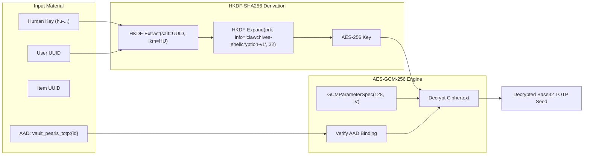

# 🔐 ShellGuard-TOTP — Cryptography & Android KeyStore Specification

> **Implementation Guide for ShellCryption (HKDF-SHA256 + AES-GCM-256), Android KeyStore, and Biometric Quick Unlock**  
> *Targeted for Google AI Studio Android Application Generator.*

---

## 1. Cryptographic Invariants & Parity

The Android client matches the web client (`src/lib/shellCryption.ts`) and backend (`src/server/utils/fieldEncryption.ts`) with **100% cryptographic parity**.



---

## 2. ShellCryption Envelope Schema

Encrypted TOTP secret fields in the database and API payload adhere to the following JSON structure:

```json
{
  "v": 1,
  "alg": "AES-GCM-256",
  "iv": "3f8a9b1c2d3e4f5a6b7c8d9e",
  "ct": "v8K2mN9pQ...Base64...==",
  "aad": "vault_pearls_totp:e4b2d1c0-7f3a-4e9b-8d1c-2e3f4a5b6c7d"
}
```

### AAD Binding Invariant
- For TOTP secrets embedded in vault pearls, the AAD string **MUST** be formatted as:  
  `vault_pearls_totp:<pearl_id>`
- If `envelope.aad != "vault_pearls_totp:$pearlId"`, the client must abort decryption immediately to prevent ciphertext substitution attacks across items.

---

## 3. ShellCryption Key Derivation & Decryption Engine (Kotlin)

```kotlin
package com.clawstack.shellguard.totp.crypto

import android.util.Base64
import kotlinx.serialization.Serializable
import kotlinx.serialization.json.Json
import java.nio.charset.StandardCharsets
import java.security.SecureRandom
import javax.crypto.Cipher
import javax.crypto.Mac
import javax.crypto.spec.GCMParameterSpec
import javax.crypto.spec.SecretKeySpec

@Serializable
data class ShellCryptionEnvelope(
    val v: Int = 1,
    val alg: String = "AES-GCM-256",
    val iv: String,
    val ct: String,
    val aad: String
)

object ShellCryptionEngine {
    private const val HKDF_ALGORITHM = "HmacSHA256"
    private const val HKDF_INFO_STRING = "clawchives-shellcryption-v1"
    private const val CIPHER_TRANSFORMATION = "AES/GCM/NoPadding"
    private const val GCM_IV_LENGTH_BYTES = 12
    private const val GCM_TAG_LENGTH_BITS = 128

    private val json = Json { ignoreUnknownKeys = true }

    /**
     * Derives a 256-bit AES key from the master human key and user UUID.
     */
    fun deriveShellKey(huKey: String, userUuid: String): SecretKeySpec {
        val ikm = huKey.toByteArray(StandardCharsets.UTF_8)
        val salt = userUuid.toByteArray(StandardCharsets.UTF_8)
        val info = HKDF_INFO_STRING.toByteArray(StandardCharsets.UTF_8)

        val prk = hkdfExtract(salt, ikm)
        val okm = hkdfExpand(prk, info, 32)

        return SecretKeySpec(okm, "AES")
    }

    /**
     * Decrypts a ShellCryption JSON envelope string using the derived key and expected AAD.
     */
    fun decryptField(
        encryptedJson: String,
        shellKey: SecretKeySpec,
        table: String,
        recordId: String
    ): String {
        if (encryptedJson.isBlank()) return ""

        val envelope = try {
            json.decodeFromString<ShellCryptionEnvelope>(encryptedJson)
        } catch (e: Exception) {
            // Not a valid JSON envelope, return as raw plaintext fallback
            return encryptedJson
        }

        val expectedAad = "$table:$recordId"
        require(envelope.aad == expectedAad) {
            "AAD mismatch! Expected '$expectedAad' but found '${envelope.aad}'. Possible substitution attack."
        }

        val iv = Base64.decode(envelope.iv, Base64.NO_WRAP)
        val ciphertextWithTag = Base64.decode(envelope.ct, Base64.NO_WRAP)

        val cipher = Cipher.getInstance(CIPHER_TRANSFORMATION)
        val spec = GCMParameterSpec(GCM_TAG_LENGTH_BITS, iv)
        cipher.init(Cipher.DECRYPT_MODE, shellKey, spec)
        cipher.updateAAD(envelope.aad.toByteArray(StandardCharsets.UTF_8))

        val decryptedBytes = cipher.doFinal(ciphertextWithTag)
        return String(decryptedBytes, StandardCharsets.UTF_8)
    }

    /**
     * Encrypts a plaintext TOTP seed into a ShellCryption envelope.
     */
    fun encryptField(
        plaintext: String,
        shellKey: SecretKeySpec,
        table: String,
        recordId: String
    ): String {
        val secureRandom = SecureRandom()
        val iv = ByteArray(GCM_IV_LENGTH_BYTES)
        secureRandom.nextBytes(iv)

        val aadString = "$table:$recordId"
        val cipher = Cipher.getInstance(CIPHER_TRANSFORMATION)
        val spec = GCMParameterSpec(GCM_TAG_LENGTH_BITS, iv)
        cipher.init(Cipher.ENCRYPT_MODE, shellKey, spec)
        cipher.updateAAD(aadString.toByteArray(StandardCharsets.UTF_8))

        val ciphertextWithTag = cipher.doFinal(plaintext.toByteArray(StandardCharsets.UTF_8))

        val envelope = ShellCryptionEnvelope(
            v = 1,
            alg = "AES-GCM-256",
            iv = Base64.encodeToString(iv, Base64.NO_WRAP),
            ct = Base64.encodeToString(ciphertextWithTag, Base64.NO_WRAP),
            aad = aadString
        )

        return json.encodeToString(ShellCryptionEnvelope.serializer(), envelope)
    }

    private fun hkdfExtract(salt: ByteArray, ikm: ByteArray): ByteArray {
        val mac = Mac.getInstance(HKDF_ALGORITHM)
        val actualSalt = if (salt.isEmpty()) ByteArray(32) else salt
        mac.init(SecretKeySpec(actualSalt, HKDF_ALGORITHM))
        return mac.doFinal(ikm)
    }

    private fun hkdfExpand(prk: ByteArray, info: ByteArray, length: Int): ByteArray {
        val mac = Mac.getInstance(HKDF_ALGORITHM)
        mac.init(SecretKeySpec(prk, HKDF_ALGORITHM))

        val result = ByteArray(length)
        var previousT = ByteArray(0)
        var offset = 0
        var blockIndex: Byte = 1

        while (offset < length) {
            mac.update(previousT)
            mac.update(info)
            mac.update(blockIndex)
            previousT = mac.doFinal()

            val toCopy = minOf(previousT.size, length - offset)
            System.arraycopy(previousT, 0, result, offset, toCopy)
            offset += toCopy
            blockIndex++
        }
        return result
    }
}
```

---

## 4. Hardware-Backed Android KeyStore & Biometric Sealing

To enable instantaneous, secure offline unlocking without prompting the user to type their 64-character `hu-` key on every launch:

```kotlin
package com.clawstack.shellguard.totp.crypto

import android.security.keystore.KeyGenParameterSpec
import android.security.keystore.KeyProperties
import java.security.KeyStore
import javax.crypto.Cipher
import javax.crypto.KeyGenerator
import javax.crypto.SecretKey
import javax.crypto.spec.GCMParameterSpec

object AndroidKeyStoreHelper {
    private const val ANDROID_KEYSTORE = "AndroidKeyStore"
    private const val BIOMETRIC_WRAPPER_ALIAS = "sg_totp_biometric_wrapper"
    private const val CIPHER_TRANSFORMATION = "AES/GCM/NoPadding"

    fun getOrCreateBiometricSecretKey(): SecretKey {
        val keyStore = KeyStore.getInstance(ANDROID_KEYSTORE).apply { load(null) }
        if (keyStore.containsAlias(BIOMETRIC_WRAPPER_ALIAS)) {
            val entry = keyStore.getEntry(BIOMETRIC_WRAPPER_ALIAS, null) as KeyStore.SecretKeyEntry
            return entry.secretKey
        }

        val keyGenerator = KeyGenerator.getInstance(
            KeyProperties.KEY_ALGORITHM_AES,
            ANDROID_KEYSTORE
        )

        val spec = KeyGenParameterSpec.Builder(
            BIOMETRIC_WRAPPER_ALIAS,
            KeyProperties.PURPOSE_ENCRYPT or KeyProperties.PURPOSE_DECRYPT
        )
            .setBlockModes(KeyProperties.BLOCK_MODE_GCM)
            .setEncryptionPaddings(KeyProperties.ENCRYPTION_PADDING_NONE)
            .setKeySize(256)
            .setUserAuthenticationRequired(true) // Enforces Biometric Authentication
            .setInvalidatedByBiometricEnrollment(true) // Wipes key if new fingerprint/face is added
            .build()

        keyGenerator.init(spec)
        return keyGenerator.generateKey()
    }

    fun getBiometricCipher(mode: Int, iv: ByteArray? = null): Cipher {
        val cipher = Cipher.getInstance(CIPHER_TRANSFORMATION)
        val key = getOrCreateBiometricSecretKey()
        if (mode == Cipher.ENCRYPT_MODE) {
            cipher.init(mode, key)
        } else {
            requireNotNull(iv) { "IV must not be null for decryption" }
            cipher.init(mode, key, GCMParameterSpec(128, iv))
        }
        return cipher
    }
}
```

---

## 5. Standard Key Hashing (`ClawCrypto.kt`)

```kotlin
package com.clawstack.shellguard.totp.crypto

import java.security.MessageDigest

object ClawCrypto {
    /**
     * Hashes a plaintext hu- or lb- key using SHA-256 and returns a lowercase 64-char hex string.
     */
    fun hashHumanKey(rawKey: String): String {
        require(rawKey.startsWith("hu-") || rawKey.startsWith("lb-")) { "Key must begin with 'hu-' or 'lb-' prefix" }
        val digest = MessageDigest.getInstance("SHA-256")
        val hashBytes = digest.digest(rawKey.toByteArray(Charsets.UTF_8))
        return hashBytes.joinToString("") { "%02x".format(it) }
    }
}
```

---

## 6. Memory Hygiene & Secret Zeroing

1. **Short-Lived References**: Decrypted TOTP secrets should never be held in global singletons or static variables.
2. **Byte Zeroing Helper**:
   ```kotlin
   fun wipeByteArray(bytes: ByteArray) {
       bytes.fill(0.toByte())
   }
   ```
3. **Local Encryption at Rest**: Decrypted secrets stored in Room DB are secured on-disk via **SQLCipher whole-database encryption**, meaning a compromised device storage cannot extract seeds without the KeyStore-derived SQLCipher passphrase.

---

## 7. Comprehensive Cryptographic Unit Test Suite (`ShellCryptionEngineTest.kt`)

Verifies HKDF-SHA256 key derivation, AES-GCM-256 field encryption/decryption, and strict AAD tamper detection:

```kotlin
package com.clawstack.shellguard.totp.crypto

import org.junit.Assert.*
import org.junit.Test
import javax.crypto.AEADBadTagException

class ShellCryptionEngineTest {

    private val testHuKey = "hu-0195a6c17d847249b56fe1c66708b7617b075fa053229b19e917d2a58b9074d2"
    private val testUserUuid = "550e8400-e29b-41d4-a716-446655440000"

    @Test
    fun testHkdfKeyDerivation_IsDeterministic() {
        val key1 = ShellCryptionEngine.deriveShellKey(testHuKey, testUserUuid)
        val key2 = ShellCryptionEngine.deriveShellKey(testHuKey, testUserUuid)

        assertArrayEquals("HKDF key derivation must be deterministic", key1.encoded, key2.encoded)
        assertEquals("AES", key1.algorithm)
        assertEquals(32, key1.encoded.size) // 256-bit key
    }

    @Test
    fun testHkdfKeyDerivation_DistinctPerUser() {
        val key1 = ShellCryptionEngine.deriveShellKey(testHuKey, testUserUuid)
        val otherUserUuid = "6ba7b810-9dad-11d1-80b4-00c04fd430c8"
        val key2 = ShellCryptionEngine.deriveShellKey(testHuKey, otherUserUuid)

        assertFalse("Different user UUIDs must derive distinct keys", key1.encoded.contentEquals(key2.encoded))
    }

    @Test
    fun testFieldEncryptionAndDecryption_Success() {
        val shellKey = ShellCryptionEngine.deriveShellKey(testHuKey, testUserUuid)
        val originalSeed = "JBSWY3DPEHPK3PXP"
        val table = "vault_pearls_totp"
        val recordId = "item-uuid-12345"

        val encryptedJson = ShellCryptionEngine.encryptField(
            plaintext = originalSeed,
            shellKey = shellKey,
            table = table,
            recordId = recordId
        )

        assertTrue(encryptedJson.contains("\"alg\":\"AES-GCM-256\""))
        assertTrue(encryptedJson.contains("\"aad\":\"vault_pearls_totp:item-uuid-12345\""))

        val decrypted = ShellCryptionEngine.decryptField(
            encryptedJson = encryptedJson,
            shellKey = shellKey,
            table = table,
            recordId = recordId
        )

        assertEquals("Decrypted plaintext must match original seed", originalSeed, decrypted)
    }

    @Test(expected = Exception::class)
    fun testFieldDecryption_FailsOnTamperedAadRecordId() {
        val shellKey = ShellCryptionEngine.deriveShellKey(testHuKey, testUserUuid)
        val originalSeed = "JBSWY3DPEHPK3PXP"

        val encryptedJson = ShellCryptionEngine.encryptField(
            plaintext = originalSeed,
            shellKey = shellKey,
            table = "vault_pearls_totp",
            recordId = "item-1"
        )

        // Attempting to decrypt with a different recordId (AAD mismatch) must throw tag verification failure
        ShellCryptionEngine.decryptField(
            encryptedJson = encryptedJson,
            shellKey = shellKey,
            table = "vault_pearls_totp",
            recordId = "item-TAMPERED"
        )
    }

    @Test(expected = Exception::class)
    fun testFieldDecryption_FailsOnTamperedAadTable() {
        val shellKey = ShellCryptionEngine.deriveShellKey(testHuKey, testUserUuid)
        val originalSeed = "JBSWY3DPEHPK3PXP"

        val encryptedJson = ShellCryptionEngine.encryptField(
            plaintext = originalSeed,
            shellKey = shellKey,
            table = "vault_pearls_totp",
            recordId = "item-1"
        )

        // Attempting to decrypt with table "vault_pearls" instead of "vault_pearls_totp"
        ShellCryptionEngine.decryptField(
            encryptedJson = encryptedJson,
            shellKey = shellKey,
            table = "vault_pearls",
            recordId = "item-1"
        )
    }

    @Test
    fun testClawCryptoHashHumanKey() {
        val hash = ClawCrypto.hashHumanKey("hu-0195a6c17d847249b56fe1c66708b7617b075fa053229b19e917d2a58b9074d2")
        assertEquals(64, hash.length)
        assertTrue(hash.matches(Regex("^[a-f0-9]{64}$")))
    }
}
```

