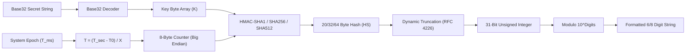

# ⏱️ ShellGuard-TOTP — TOTP Engine & QR Code Specification

> **Algorithmic TOTP Generator (RFC 6238), Base32 Decoders, Live Countdown Flows & ML Kit QR Parser**  
> *Targeted for Google AI Studio Android Application Generator.*

---

## 1. RFC 6238 TOTP Engine Implementation

The TOTP engine computes time-based one-time passwords deterministically from a shared Base32 secret without network communication.



### Kotlin Engine (`TotpEngine.kt`)

```kotlin
package com.clawstack.shellguard.totp.engine

import java.nio.ByteBuffer
import java.security.GeneralSecurityException
import javax.crypto.Mac
import javax.crypto.spec.SecretKeySpec
import kotlin.math.pow
import kotlin.time.Duration.Companion.seconds
import kotlin.time.DurationUnit
import kotlin.time.TimeSource

object TotpEngine {
    const val DEFAULT_TIME_STEP_SECONDS = 30L
    const val DEFAULT_DIGITS = 6

    enum class HashAlgorithm(val hmacName: String) {
        SHA1("HmacSHA1"),
        SHA256("HmacSHA256"),
        SHA512("HmacSHA512");

        companion object {
            fun fromString(value: String?): HashAlgorithm {
                return when (value?.uppercase()?.trim()) {
                    "SHA256", "HMACSHA256" -> SHA256
                    "SHA512", "HMACSHA512" -> SHA512
                    else -> SHA1
                }
            }
        }
    }

    /**
     * Computes the current TOTP numeric code for a given secret using Kotlin Time counter synchronization.
     */
    fun generateTotp(
        secretBase32: String,
        timestampMillis: Long = System.currentTimeMillis(),
        timeStepSeconds: Long = DEFAULT_TIME_STEP_SECONDS,
        digits: Int = DEFAULT_DIGITS,
        algorithm: HashAlgorithm = HashAlgorithm.SHA1
    ): String {
        val cleanSecret = secretBase32.replace(" ", "").replace("-", "").uppercase()
        if (cleanSecret.isBlank()) return "------"

        return try {
            val keyBytes = Base32Decoder.decode(cleanSecret)
            val timeWindow = (timestampMillis / 1000L) / timeStepSeconds
            val counterBytes = ByteBuffer.allocate(8).putLong(timeWindow).array()

            val mac = Mac.getInstance(algorithm.hmacName)
            mac.init(SecretKeySpec(keyBytes, algorithm.hmacName))
            val hash = mac.doFinal(counterBytes)

            // Dynamic Truncation (RFC 4226 section 5.4)
            val offset = hash[hash.size - 1].toInt() and 0x0F
            val binary = ((hash[offset].toInt() and 0x7F) shl 24) or
                    ((hash[offset + 1].toInt() and 0xFF) shl 16) or
                    ((hash[offset + 2].toInt() and 0xFF) shl 8) or
                    (hash[offset + 3].toInt() and 0xFF)

            val otp = binary % (10.0.pow(digits.toDouble())).toInt()
            otp.toString().padStart(digits, '0')
        } catch (e: Exception) {
            "------"
        }
    }

    /**
     * Returns the remaining seconds in the active window (e.g., 30 down to 1).
     */
    fun getRemainingSeconds(
        timestampMillis: Long = System.currentTimeMillis(),
        timeStepSeconds: Long = DEFAULT_TIME_STEP_SECONDS
    ): Int {
        val currentSecond = (timestampMillis / 1000L) % timeStepSeconds
        return (timeStepSeconds - currentSecond).toInt()
    }

    /**
     * Returns the normalized progress ratio (1.0 down to 0.0) for UI animation.
     */
    fun getProgressRatio(
        timestampMillis: Long = System.currentTimeMillis(),
        timeStepSeconds: Long = DEFAULT_TIME_STEP_SECONDS
    ): Float {
        val remaining = getRemainingSeconds(timestampMillis, timeStepSeconds)
        return remaining.toFloat() / timeStepSeconds.toFloat()
    }
}
```

---

## 2. Base32 Decoder (RFC 4648)

```kotlin
package com.clawstack.shellguard.totp.engine

object Base32Decoder {
    private const val ALPHABET = "ABCDEFGHIJKLMNOPQRSTUVWXYZ234567"

    fun decode(base32: String): ByteArray {
        val clean = base32.trim().replace("=", "").replace(" ", "").replace("-", "").uppercase()
        var buffer = 0
        var bitsLeft = 0
        val output = mutableListOf<Byte>()

        for (char in clean) {
            val charValue = ALPHABET.indexOf(char)
            if (charValue < 0) continue // Skip invalid characters

            buffer = (buffer shl 5) or charValue
            bitsLeft += 5

            if (bitsLeft >= 8) {
                output.add(((buffer shr (bitsLeft - 8)) and 0xFF).toByte())
                bitsLeft -= 8
            }
        }
        return output.toByteArray()
    }
}
```

---

## 3. Reactive Ticker StateFlow (Kotlin Time Synchronized)

To keep all TOTP counters synchronized without running independent timers per item:

```kotlin
package com.clawstack.shellguard.totp.engine

import kotlin.time.Duration.Companion.seconds
import kotlinx.coroutines.delay
import kotlinx.coroutines.flow.Flow
import kotlinx.coroutines.flow.flow

data class TotpTickerState(
    val timestampMillis: Long,
    val remainingSeconds: Int,
    val progress: Float
)

object TotpTicker {
    /**
     * Global ticker emitting once every second synchronized via Kotlin Time.
     */
    fun observeTicker(periodSeconds: Long = 30L): Flow<TotpTickerState> = flow {
        while (true) {
            val now = System.currentTimeMillis()
            val remaining = TotpEngine.getRemainingSeconds(now, periodSeconds)
            val progress = TotpEngine.getProgressRatio(now, periodSeconds)

            emit(TotpTickerState(now, remaining, progress))
            delay(1.seconds)
        }
    }
}
```

---

## 4. `otpauth://` URI Parser

When scanning standard QR codes from third-party services:

```kotlin
package com.clawstack.shellguard.totp.engine

import android.net.Uri

data class ParsedTotpUri(
    val title: String,
    val username: String?,
    val secret: String,
    val issuer: String,
    val algorithm: String = "SHA1",
    val digits: Int = 6,
    val period: Int = 30
)

object TotpUriParser {
    fun parse(rawUriString: String): ParsedTotpUri? {
        val clean = rawUriString.trim()
        if (!clean.startsWith("otpauth://totp/", ignoreCase = true)) {
            // Treat as raw Base32 secret string if not a URI
            if (clean.matches(Regex("^[A-Z2-7\\s-]{16,64}$", RegexOption.IGNORE_CASE))) {
                return ParsedTotpUri(
                    title = "New 2FA Account",
                    username = null,
                    secret = clean.replace(" ", "").replace("-", "").uppercase(),
                    issuer = "Manual Entry"
                )
            }
            return null
        }

        return try {
            val uri = Uri.parse(clean)
            val path = uri.path?.removePrefix("/") ?: ""
            val secret = uri.getQueryParameter("secret") ?: return null
            val issuerQuery = uri.getQueryParameter("issuer")
            val algorithm = uri.getQueryParameter("algorithm") ?: "SHA1"
            val digits = uri.getQueryParameter("digits")?.toIntOrNull() ?: 6
            val period = uri.getQueryParameter("period")?.toIntOrNull() ?: 30

            // Parse Label: "Issuer:Username" or just "Label"
            val label = java.net.URLDecoder.decode(path, "UTF-8")
            val parts = label.split(":")
            val effectiveIssuer = issuerQuery ?: if (parts.size > 1) parts[0].trim() else "ShellGuard"
            val username = if (parts.size > 1) parts[1].trim() else label.trim()

            ParsedTotpUri(
                title = effectiveIssuer,
                username = username,
                secret = secret.replace(" ", "").uppercase(),
                issuer = effectiveIssuer,
                algorithm = algorithm,
                digits = digits,
                period = period
            )
        } catch (e: Exception) {
            null
        }
    }
}
```

---

## 5. CameraX & ML Kit Scanner Pipeline

```kotlin
// In build.gradle.kts:
// implementation("androidx.camera:camera-camera2:1.3.4")
// implementation("androidx.camera:camera-lifecycle:1.3.4")
// implementation("androidx.camera:camera-view:1.3.4")
// implementation("com.google.mlkit:barcode-scanning:17.3.0")

package com.clawstack.shellguard.totp.ui.scanner

import androidx.camera.core.ExperimentalGetImage
import androidx.camera.core.ImageAnalysis
import androidx.camera.core.ImageProxy
import com.google.mlkit.vision.barcode.BarcodeScanning
import com.google.mlkit.vision.common.InputImage

class QrCodeAnalyzer(
    private val onQrCodeScanned: (String) -> Unit
) : ImageAnalysis.Analyzer {

    private val scanner = BarcodeScanning.getClient()

    @androidx.annotation.OptIn(ExperimentalGetImage::class)
    override fun analyze(imageProxy: ImageProxy) {
        val mediaImage = imageProxy.image
        if (mediaImage != null) {
            val image = InputImage.fromMediaImage(mediaImage, imageProxy.imageInfo.rotationDegrees)
            scanner.process(image)
                .addOnSuccessListener { barcodes ->
                    for (barcode in barcodes) {
                        barcode.rawValue?.let { qrValue ->
                            onQrCodeScanned(qrValue)
                        }
                    }
                }
                .addOnCompleteListener {
                    imageProxy.close()
                }
        } else {
            imageProxy.close()
        }
    }
}
```

---

## 6. Comprehensive Unit Test Suite (`TotpEngineTest.kt`)

Verifies RFC 6238 standard test vectors, algorithm hashing, Base32 decoding, and countdown synchronization:

```kotlin
package com.clawstack.shellguard.totp.engine

import org.junit.Assert.*
import org.junit.Test

class TotpEngineTest {

    // RFC 6238 Appendix B standard ASCII secret: "12345678901234567890" (20 bytes)
    // Base32 representation: "GEZDGNBVGY3TQOJQGEZDGNBVGY3TQOJQ"
    private val rfcSecretBase32 = "GEZDGNBVGY3TQOJQGEZDGNBVGY3TQOJQ"

    @Test
    fun testRfc6238Sha1Vectors_6Digits() {
        // T = 59s -> window = 1
        assertEquals("287082", TotpEngine.generateTotp(
            secretBase32 = rfcSecretBase32,
            timestampMillis = 59_000L,
            timeStepSeconds = 30L,
            digits = 6,
            algorithm = TotpEngine.HashAlgorithm.SHA1
        ))

        // T = 1111111109s -> window = 37037036
        assertEquals("081804", TotpEngine.generateTotp(
            secretBase32 = rfcSecretBase32,
            timestampMillis = 1111111109_000L,
            timeStepSeconds = 30L,
            digits = 6,
            algorithm = TotpEngine.HashAlgorithm.SHA1
        ))

        // T = 1111111111s -> window = 37037037
        assertEquals("140504", TotpEngine.generateTotp(
            secretBase32 = rfcSecretBase32,
            timestampMillis = 1111111111_000L,
            timeStepSeconds = 30L,
            digits = 6,
            algorithm = TotpEngine.HashAlgorithm.SHA1
        ))

        // T = 1234567890s -> window = 41152263
        assertEquals("890059", TotpEngine.generateTotp(
            secretBase32 = rfcSecretBase32,
            timestampMillis = 1234567890_000L,
            timeStepSeconds = 30L,
            digits = 6,
            algorithm = TotpEngine.HashAlgorithm.SHA1
        ))

        // T = 2000000000s -> window = 66666666
        assertEquals("692790", TotpEngine.generateTotp(
            secretBase32 = rfcSecretBase32,
            timestampMillis = 2000000000_000L,
            timeStepSeconds = 30L,
            digits = 6,
            algorithm = TotpEngine.HashAlgorithm.SHA1
        ))
    }

    @Test
    fun testRfc6238Sha1Vectors_8Digits() {
        // T = 59s (8 digits) -> "94287082"
        assertEquals("94287082", TotpEngine.generateTotp(
            secretBase32 = rfcSecretBase32,
            timestampMillis = 59_000L,
            timeStepSeconds = 30L,
            digits = 8,
            algorithm = TotpEngine.HashAlgorithm.SHA1
        ))

        // T = 1234567890s (8 digits) -> "68890059"
        assertEquals("68890059", TotpEngine.generateTotp(
            secretBase32 = rfcSecretBase32,
            timestampMillis = 1234567890_000L,
            timeStepSeconds = 30L,
            digits = 8,
            algorithm = TotpEngine.HashAlgorithm.SHA1
        ))
    }

    @Test
    fun testBase32Decoder_ValidAndPadded() {
        val decoded = Base32Decoder.decode("JBSWY3DPEHPK3PXP")
        val text = String(decoded, Charsets.UTF_8)
        assertEquals("Hello!", text)
    }

    @Test
    fun testCountdownRatio() {
        val t29 = 29_000L
        val remaining = TotpEngine.getRemainingSeconds(t29, 30L)
        val ratio = TotpEngine.getProgressRatio(t29, 30L)
        assertEquals(1, remaining)
        assertEquals(1f / 30f, ratio, 0.001f)
    }

    @Test
    fun testOtpauthUriParser() {
        val uri = "otpauth://totp/GitHub:octocat?secret=JBSWY3DPEHPK3PXP&issuer=GitHub&algorithm=SHA1&digits=6&period=30"
        val parsed = TotpUriParser.parse(uri)
        assertNotNull(parsed)
        assertEquals("GitHub", parsed!!.issuer)
        assertEquals("octocat", parsed.username)
        assertEquals("JBSWY3DPEHPK3PXP", parsed.secret)
        assertEquals(6, parsed.digits)
        assertEquals(30, parsed.period)
    }
}
```

