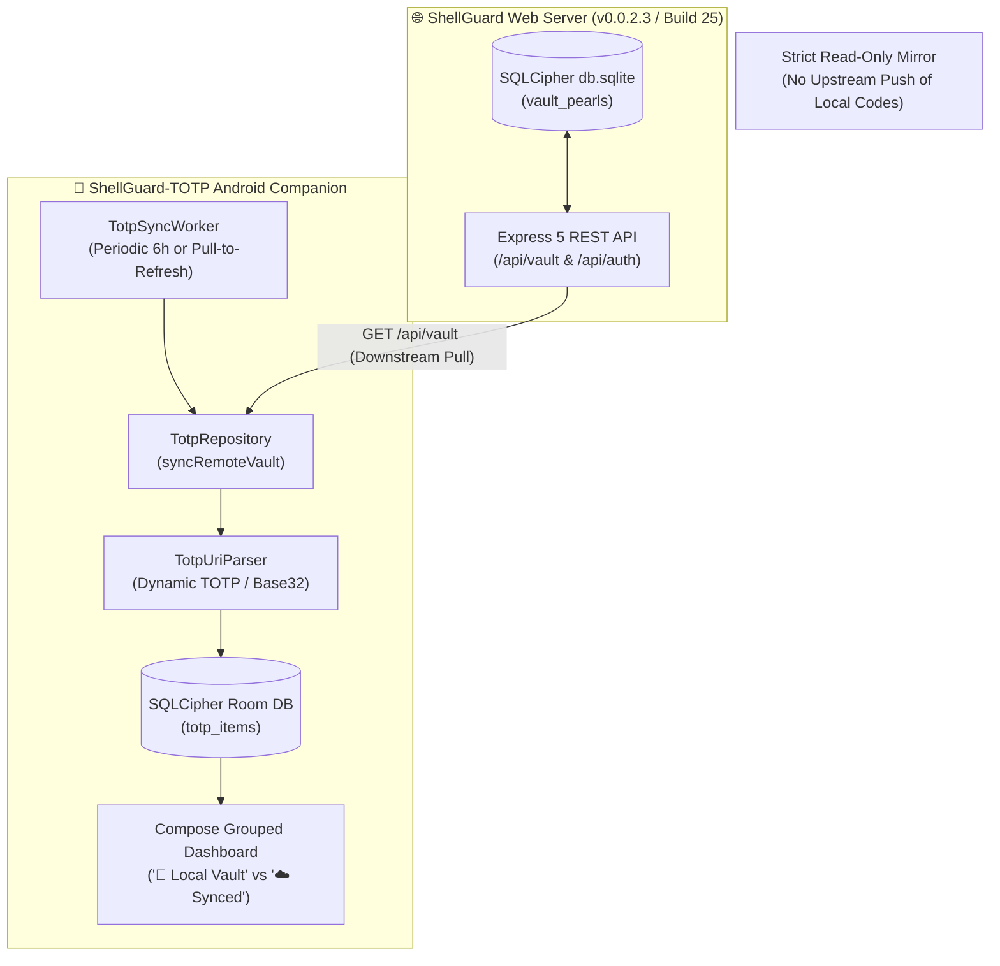

# ShellGuard TOTP & Web Vault Compatibility Layer (v0.0.2.3 / Build 25)

> **CANONICAL INTEROPERABILITY SPECIFICATION BETWEEN SHELLGUARD WEB SERVER & SHELLGUARD-TOTP ANDROID**  
> *Defines wire contracts, triple-layer encryption mapping, dynamic RFC 6238 TOTP parameter encoding, the `sgtotp.bak` unified schema, and One-Way Mirror Sync invariants.*

---

## 1. Architectural Paradigm: One-Way Mirror Sync & Local Vault Isolation

ShellGuard adheres to a strict **One-Way Mirror Sync** architecture to eliminate multi-master collision complexity, race conditions, and accidental credential overwrites on mobile devices:



### Core Invariants:
1. **Remote Connection as Read-Only Mirror**:
   The Android companion acts strictly as a read-only downstream mirror for vault items originating on the web server. It queries `GET /api/vault`, extracts items with non-empty `totp_secret`, decrypts the client-side ShellCryption envelope using the user's `hu-` ShellKey, and stores them locally with `is_local_only = 0` and `sync_state = "SYNCED"`.
2. **Local Code Isolation**:
   Any TOTP code added manually or scanned via CameraX QR on Android is assigned `is_local_only = 1`, `owner_uuid = "local"`, and `sync_state = "LOCAL"`. These codes are **never pushed upstream** to the web server.
3. **Grouped Dashboard Separation**:
   The Android UI visually segregates items into two distinct vertical groups:
   - `📱 Local Vault` (created offline on-device)
   - `☁️ Synced from ShellGuard` (mirrored from the server; editing and deleting are disabled)
4. **Canonical Interoperability via `sgtotp.bak`**:
   The Android backup engine (`BackupManager`) exclusively exports Local Codes into the `sgtotp.bak` format. Remote codes are skipped to eliminate data duplication across ecosystems. The Web Server can import `sgtotp.bak` directly via `src/lib/sgtotpBackup.ts`.

---

## 2. Triple-Layer Encryption & Schema Mapping

The Web Server stores vault records under a triple-layer encryption model. Both client and server roles must be respected:

```mermaid
flowchart LR
    A["Plaintext Field<br/>(e.g. totp_secret URI)"] -->|Layer 1: ShellCryption<br/>HKDF + AES-GCM-256 (hu- key)| B["Client Ciphertext<br/>{v, alg, iv, ct, aad}"]
    B -->|Layer 2: MetadataGuard<br/>AES-256-GCM (DB_ENCRYPTION_KEY)| C["Encrypted DB Row<br/>(Server Metadata)"]
    C -->|Layer 3: SQLCipher<br/>Whole Database AES-256| D[("Disk Storage<br/>db.sqlite")]
```

| Layer | Scope | Key Source | Algorithm | Fields Encrypted | Decrypted By |
|:---|:---|:---|:---|:---|:---|
| **Layer 1: ShellCryption** | End-to-End Client | `hu-` Identity Key via HKDF-SHA256 | AES-GCM-256 | `secret`, `totp_secret`, `content`, `key_value`, `password_history`, `custom_fields` | Android App / Browser Client only |
| **Layer 2: MetadataGuard** | Server Row-Level | `DB_ENCRYPTION_KEY` via HKDF-SHA256 | AES-256-GCM (`SG-META`) | `title`, `username`, `url`, `uris`, `category`, `notes`, `tags` | Server automatically on `prepareReadAll` |
| **Layer 3: SQLCipher** | Whole-Database | `DB_ENCRYPTION_KEY` | AES-256 | Entire SQLite database pages on disk | SQLite engine on open |

### `vault_pearls` Column Specification (Migrations 0001–0008):

| Column | Type | Migration | Encryption Layer | Server `GET /api/vault` Output | Android DTO Field |
|:---|:---|:---|:---|:---|:---|
| `id` | `TEXT PRIMARY KEY` | 0001 | None | Plain UUID string | `PearlDto.id` |
| `owner_uuid` | `TEXT NOT NULL` | 0001 | None | Lobster UUID | `PearlDto.owner_uuid` |
| `title` | `TEXT NOT NULL` | 0001 | Layer 2 (Metadata) | Decrypted UTF-8 string | `PearlDto.title` |
| `secret` | `TEXT NOT NULL` | 0001 | Layer 1 (Client) | Encrypted JSON envelope | `PearlDto.secret` |
| `username` | `TEXT DEFAULT ''` | 0001 | Layer 2 (Metadata) | Decrypted UTF-8 string | `PearlDto.username` |
| `url` | `TEXT DEFAULT ''` | 0001 | Layer 2 (Metadata) | Decrypted UTF-8 string | `PearlDto.url` |
| `type` | `TEXT DEFAULT 'password'` | 0001 | None | `"password"` | *Ignored on Android* |
| `category` | `TEXT DEFAULT 'Personal'` | 0001 | Layer 2 (Metadata) | Decrypted Pod string | `PearlDto.category` |
| `notes` | `TEXT DEFAULT ''` | 0001 | Layer 2 (Metadata) | Decrypted UTF-8 string | `PearlDto.notes` |
| `totp_secret` | `TEXT DEFAULT ''` | 0001 | Layer 1 (Client) | Encrypted JSON envelope | `PearlDto.totp_secret` |
| `attachments` | `TEXT DEFAULT '[]'` | 0001 / 0005 | Layer 1 (Client IDs) | JSON array string | `PearlDto.attachments` |
| `custom_fields` | `TEXT DEFAULT ''` | 0003 | Layer 1 (Client) | Encrypted JSON or string | `PearlDto.custom_fields` |
| `tags` | `TEXT DEFAULT '[]'` | 0006 | Layer 2 (Metadata) | Decrypted JSON array string | *Ignored on Android* |
| `uris` | `TEXT DEFAULT '[]'` | 0007 | Layer 2 (Metadata) | Decrypted JSON array string | *Ignored on Android* |
| `password_history`| `TEXT DEFAULT '[]'` | 0007 | Layer 1 (Client) | Encrypted JSON array string | *Ignored on Android* |
| `created_at` | `TEXT NOT NULL` | 0001 | None | ISO-8601 string | `PearlDto.created_at` |

> [!NOTE]
> Android's Kotlinx Serialization parser is configured with `ignoreUnknownKeys = true`. Newer columns introduced on the Web Server (`tags`, `uris`, `password_history`, `type`) are safely ignored by the Android companion without deserialization errors.

---

## 3. Dynamic RFC 6238 TOTP Wire Contract & URI Parsing

In v0.0.2.3, the Web Vault introduced dynamic TOTP parameter preservation (`src/lib/totpUtils.ts`). When a TOTP secret contains non-default parameters or is imported from Bitwarden, the web server formats it as a full `otpauth://totp/` URI before sealing it under Layer 1 ShellCryption:

### Parameter Matrix:

| Parameter | Supported Values | Standard Default | URI Encoding Condition |
|:---|:---|:---|:---|
| `algorithm` | `SHA1`, `SHA256`, `SHA512`, `STEAM` | `SHA1` | Encoded if `!== 'SHA1'` |
| `digits` | `6`, `8` (Steam: `5`) | `6` | Encoded if `!== 6` |
| `period` | `15`, `30`, `60` (or custom seconds) | `30` | Encoded if `!== 30` |
| `secret` | Uppercase Base32 (no spaces/hyphens) | *Required* | Always present as `?secret=` |

### The Critical Seam: Android Downstream Ingestion
When the Android companion decrypts `pearl.totp_secret`, the decrypted payload can be **either**:
1. A raw Base32 secret string (e.g. `JBSWY3DPEHPK3PXP`)
2. A complete `otpauth://totp/...` URI (e.g. `otpauth://totp/Vault:GitHub?secret=JBSWY3DPEHPK3PXP&algorithm=SHA256&digits=8&period=30`)
3. A Steam Guard URI (`steam://...`)

```kotlin
// REQUIRED INGESTION PATTERN IN TotpRepository.kt:
val decryptedPayload = ShellCryptionEngine.decryptField(
    encryptedJson = pearl.totp_secret!!,
    shellKey = itemKey,
    table = "vault_pearls_totp",
    recordId = pearl.id
)

// MUST pipe through TotpUriParser to extract parameters and sanitize secret:
val parsed = TotpUriParser.parse(decryptedPayload)
val cleanSecret = parsed?.secret ?: decryptedPayload.replace(" ", "").replace("-", "").uppercase()
val algorithm = parsed?.algorithm ?: "SHA1"
val digits = parsed?.digits ?: 6
val period = parsed?.period ?: 30

val entity = TotpItemEntity(
    id = pearl.id,
    ownerUuid = userUuid,
    title = pearl.title.ifBlank { parsed?.title ?: "2FA Account" },
    username = pearl.username ?: parsed?.username,
    category = pearl.category,
    secret = cleanSecret,
    algorithm = algorithm,
    digits = digits,
    period = period,
    isLocalOnly = false,
    syncState = "SYNCED",
    remoteUpdatedAt = pearl.updated_at,
    localUpdatedAt = System.currentTimeMillis()
)
```

> [!WARNING]
> If the Android client treats `decryptedPayload` as a raw Base32 secret without parsing via `TotpUriParser`, the `secret` column will be populated with `"OTPAUTH://TOTP/..."`. This causes `Base32Decoder` to fail or generate invalid codes, breaking remote sync functionality.

---

## 4. Delta Sync Protocol & The `updated_at` Pragma

### Server Database Reality:
In the current SQLite schema of `vault_pearls`, there is **no native `updated_at` column**. Rows carry only `created_at`.
When `GET /api/vault` executes `SELECT *`, the returned JSON objects do not contain an `updated_at` property.

### Android Client Resilience:
The Android client's `classifyDeltaPearls` algorithm handles missing or null `updated_at` gracefully:
- If `updated_at` is `null`, the pearl is classified as **changed**.
- The client decrypts and upserts the item into the Room database, guaranteeing zero missing records.
- Pruning (`pruneDeletedRemoteItems`) collects all remote IDs returned by the server and deletes any local records where `owner_uuid == userUuid && is_local_only == 0 && id NOT IN (remoteIds)`.

---

## 5. `sgtotp.bak` Interoperability Specification

The `sgtotp.bak` format is the unified backup format produced by the Android companion and consumed by the Web Server's import pipeline (`src/lib/sgtotpBackup.ts`).

### A. Encrypted Envelope Schema (`shellguard-totp-backup-v1`)

```json
{
  "version": 1,
  "type": "shellguard-totp-backup-v1",
  "format": "sgtotp.bak",
  "protectionMode": "PIN",
  "isBiometricEnabled": false,
  "pinLength": 6,
  "createdAt": 1725243851000,
  "ownerUuid": "local",
  "itemCount": 1,
  "checksumSha256": "3a7b8c...",
  "encryptedEnvelopeJson": "{\"v\":1,\"alg\":\"AES-GCM-256\",\"iv\":\"...\",\"ct\":\"...\",\"aad\":\"totp_backup:local\"}"
}
```

### B. Decrypted Items Payload (`BackupItemDto[]`)

```json
[
  {
    "id": "c1f7b0a2-1111-4444-8888-abcdef012345",
    "ownerUuid": "local",
    "title": "Cloudflare",
    "username": "lucas@clawstack.com",
    "category": "Infrastructure/Edge",
    "secret": "JBSWY3DPEHPK3PXP",
    "algorithm": "SHA256",
    "digits": 8,
    "period": 30,
    "isLocalOnly": true,
    "syncState": "LOCAL",
    "remoteUpdatedAt": null,
    "localUpdatedAt": 1725243851000
  }
]
```

### C. Web Server Ingestion Pipeline (`sgtotpBackup.ts`):
1. **Sniff**: `sniffSgTotpBackup(text)` distinguishes encrypted envelopes (`shellguard-totp-backup-v1`), unencrypted envelopes (`shellguard-totp-plain-export-v1`), and bare arrays.
2. **Key Derivation**: HKDF-SHA256 (`ikm = exportKey`, `salt = ownerUuid`, `info = "clawchives-shellcryption-v1"`, `length = 32`).
3. **Decryption**: AES-GCM-256 with strict AAD binding `totp_backup:{ownerUuid}`.
4. **Integrity Check**: Computes SHA-256 over decrypted JSON string; asserts match against `envelope.checksumSha256`.
5. **Fresh ID Generation**: Web Server **never reuses Android UUIDs**; it generates fresh IDs via `crypto.randomUUID()` (with RFC 4122 v4 fallback).
6. **Category Normalization**: Runs `normalizePod(item.category)` to conform to Web Vault Pod taxonomy.
7. **URI Formatting**: Formats non-standard TOTP items via `formatTotpSecret()` before sealing into Layer 1 `vault_pearls_totp:{new_id}` ShellCryption.

---

## 6. API Wire Contracts

### A. Authentication Token Handshake
- **Route**: `POST /api/auth/token`
- **Rate Limit**: 10 requests / 15 minutes per IP

#### Request:
```json
{
  "type": "human",
  "keyHash": "e3b0c44298fc1c149afbf4c8996fb92427ae41e4649b934ca495991b7852b855"
}
```

#### Response (`201 Created`):
```json
{
  "success": true,
  "data": {
    "token": "api-abcdef1234567890abcdef1234567890",
    "type": "human",
    "createdAt": "2026-09-22T19:00:00.000Z",
    "expiresAt": "2026-09-23T19:00:00.000Z",
    "user": {
      "uuid": "u-1234-5678",
      "username": "lucas",
      "displayName": "Lucas"
    }
  }
}
```

### B. Vault Retrieval (Sync Pull)
- **Route**: `GET /api/vault`
- **Headers**: `Authorization: Bearer <token>`
- **Behavior**: Retrieves all pearls owned by caller. Layer 2 metadata columns (`title`, `username`, `url`, `uris`, `category`, `notes`, `tags`) are decrypted server-side before response transmission.

#### Response (`200 OK`):
```json
{
  "success": true,
  "data": [
    {
      "id": "p-9876-5432",
      "owner_uuid": "u-1234-5678",
      "title": "AWS Root Console",
      "secret": "{\"v\":1,\"alg\":\"AES-GCM-256\",\"iv\":\"...\",\"ct\":\"...\",\"aad\":\"vault_pearls:p-9876-5432\"}",
      "username": "root@clawstack.com",
      "url": "https://aws.amazon.com",
      "uris": "[]",
      "type": "password",
      "category": "Infrastructure",
      "tags": "[\"production\",\"critical\"]",
      "notes": "Hardware key backup",
      "totp_secret": "{\"v\":1,\"alg\":\"AES-GCM-256\",\"iv\":\"...\",\"ct\":\"...\",\"aad\":\"vault_pearls_totp:p-9876-5432\"}",
      "password_history": "[]",
      "attachments": "[]",
      "custom_fields": "",
      "created_at": "2026-09-20T12:00:00.000Z"
    }
  ]
}
```

---

## 7. Version Compatibility Matrix

| Web Server Version | Android TOTP Companion | Interoperability Status | Notes |
|:---|:---|:---|:---|
| **v0.0.2.3 (Build 25)** | **v0.0.2.3 (Build 16)** | 🟢 **100% Full Parity** | Dynamic TOTP URI parsing, `sgtotp.bak` two-step import, ignoreUnknownKeys schema resilience. |
| **v0.0.2.3 (Build 25)** | v0.0.2.2 (Build 15) | 🟡 **Partial / Degraded** | Plain Base32 syncs normally; `otpauth://` formatted secrets (SHA256/8-digit/Bitwarden) fail code generation on device. |
| v0.0.2.2 (Build 24) | v0.0.2.2 (Build 15) | 🟢 **Full Parity** | Standard Base32 secrets only. |

