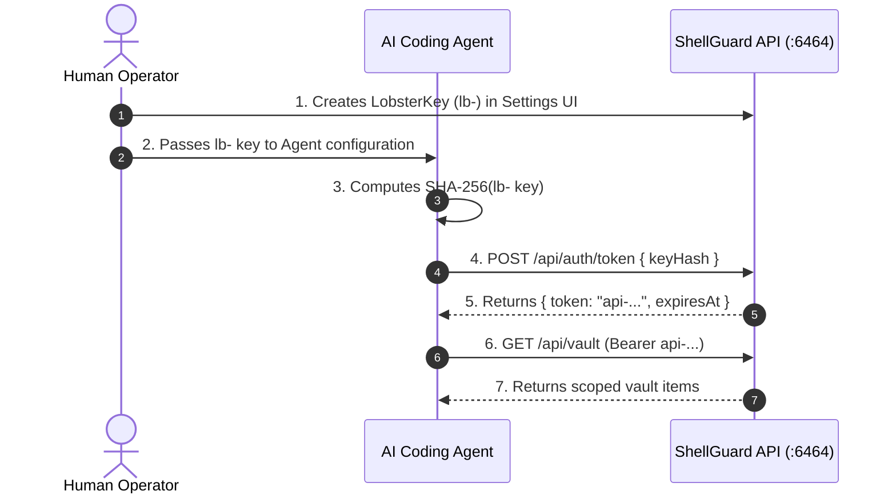

# Autonomous AI Agent Integration

<CopyPage />

ShellGuard is designed specifically for autonomous AI agents (Lobsters) that need programmatic access to infrastructure secrets without risking complete vault compromise.

---

## 🤖 Why Dedicated Agent Keys?

In traditional vaults, granting an AI coding agent access to an API key meant sharing a master password or exporting all credentials into plaintext environment variables.

ShellGuard introduces **LobsterKeys (`lb-`)**:

- **Granular Permissions**: Agents only get the permissions they need (`canRead`, `canWrite`, `canEdit`, `canDelete`).
- **Cryptographic Hashing**: Agents authenticate by hashing their `lb-` key with SHA-256 before transmitting over HTTP.
- **Short-Lived Sessions**: Keys exchange for an `api-` Bearer token with configurable expiry (e.g. 15m, 1h, 1d).
- **Per-Agent Rate Limiting**: Prevent runaway script loops with burst and RPM limits.
- **Instant Revocation**: Humans can revoke any agent key in one click from the UI.

---

## 🧭 Integration Flow

---

## Explore Agent Docs

<CardGrid cols="3">
  <Card title="LobsterKeys Lifecycle" href="/agent-integration/lobster-keys" icon="🗝️">
    Key format, SHA-256 hashing, permissions, and revocation.
  </Card>
  <Card title="REST API Reference" href="/agent-integration/api-reference" icon="📡">
    Complete endpoint matrix, request bodies, and envelope schemas.
  </Card>
  <Card title="Agent Skill (/skill.md)" href="/agent-integration/skill-guide" icon="📜">
    Pre-packaged system instructions for autonomous LLMs.
  </Card>
</CardGrid>
