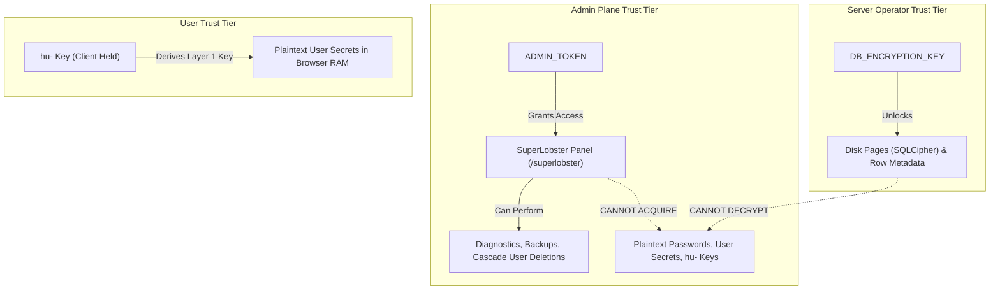

# The Three Secrets Model

<CopyPage />

ShellGuard establishes a strict hierarchy of trust governed by **The Three Secrets**.

---

## 🗝️ The Secrets Breakdown

| Secret | Governs | Stored | Threat Mitigation |
|---|---|---|---|
| **`ADMIN_TOKEN`** | Opens the `/superlobster` control plane | Environment variable (`.env`) | Token brute-forcing & unauthorized administration |
| **`DB_ENCRYPTION_KEY`** | Unlocks SQLCipher (Layer 3) & Per-Row Metadata AES (Layer 2) | Environment variable (`.env`) | Server disk exfiltration & filesystem theft |
| **`hu-` Key (per user)** | Authenticates user identity & unlocks Zero-Knowledge secrets (Layer 1) | User's offline Vault Access File (`.json`) | Total server compromise & database breach |

---

## ⚖️ Trust Boundaries

### Key Invariant:
Even if a rogue administrator possesses both the `ADMIN_TOKEN` and the host `DB_ENCRYPTION_KEY`, they **cannot** decrypt any user's passwords, TOTP seeds, or files.
