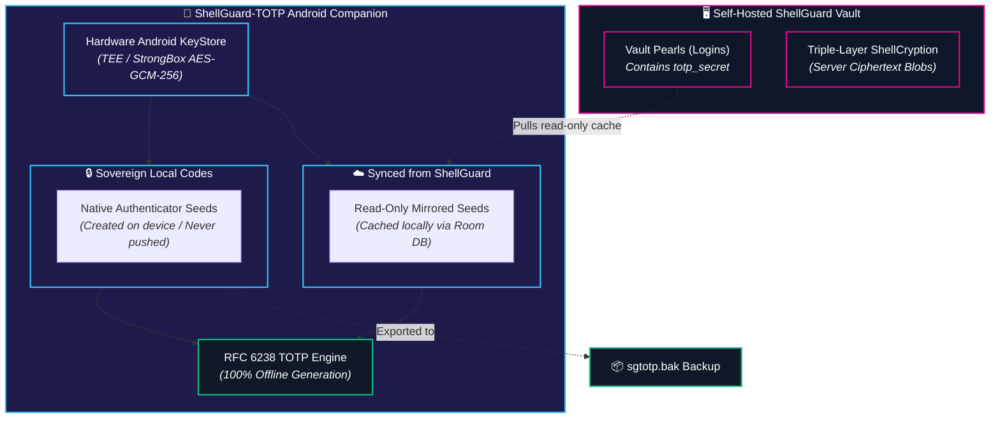

# 📱 ShellGuard-TOTP Companion

<CopyPage />

**ShellGuard-TOTP** is the official native Android companion application for the ShellGuard secrets ecosystem. Built with Kotlin and Jetpack Compose, it serves as a sovereign, offline-first two-factor authentication (TOTP) authenticator that pairs seamlessly with your self-hosted ShellGuard vault.

---

## 🏗️ Architectural Topology: One-Way Mirror Sync

Unlike traditional cloud-based authenticators that require centralized servers and third-party account brokers, ShellGuard-TOTP implements a **One-Way Mirror Sync** architecture that prioritizes zero-knowledge isolation and offline sovereignty.

### Core Sync Invariants:
1. **Remote Read-Only Mirror:** When paired with your self-hosted ShellGuard instance, the Android app acts as a read-only mirror for vault logins containing TOTP seeds (`vault_pearls`). These appear in a dedicated *"☁️ Synced from ShellGuard"* group.
2. **Strictly Sovereign Local Codes:** Any two-factor code created directly on the Android device is designated as a **Local Code** (`isLocalOnly = true`). Local codes remain private to your phone and are never automatically transmitted upstream.
3. **Selective Encrypted Backups:** Only Local Codes are exported into [`.sgtotp.bak` backup files](/companion/sync-and-backups) to prevent secret duplication and eliminate collision risks with your main vault.

---

## ⚡ Core Capabilities

- **100% Offline-First Operation:** Generates dynamic time-based 6-digit and 8-digit verification codes using the device hardware clock without needing active cellular data or Wi-Fi.
- **Hardware-Backed KeyStore Protection:** Master encryption keys are wrapped inside the Android Trusted Execution Environment (TEE) or StrongBox Keymaster.
- **Biometric Authentication:** Supports instant fingerprint and face unlock via `BiometricPrompt` with zero biometric data exposure.
- **Instant QR Code Ingestion:** Real-time in-memory QR decoding powered by CameraX and ML Kit, plus an in-memory "Scan from Gallery" photo picker fallback.
- **Cross-Ecosystem Backup Compatibility:** Encrypted `.sgtotp.bak` archives can be directly imported and decrypted client-side inside the ShellGuard Web Vault.
- **Window Screenshot Suppression:** Protected by `FLAG_SECURE` to prevent screen recorders, malware, and Android task-switcher previews from exposing OTP codes.

---

## 🧭 Companion Documentation Guide

Explore the technical architecture and operational specifications of ShellGuard-TOTP:

<CardGrid cols="2">
  <Card title="Security & Hardware Enclaves" href="/companion/security" icon="🛡️" tag="Security">
    Deep-dive into the Android KeyStore, BiometricPrompt isolation, <code>FLAG_SECURE</code>, and RAM zeroization.
  </Card>
  <Card title="Sync & Encrypted Backups" href="/companion/sync-and-backups" icon="📦" tag="Interoperability">
    Learn the <code>sgtotp.bak</code> wire format, HKDF/AES-GCM encryption, and bidirectional vault restoration.
  </Card>
  <Card title="RFC 6238 TOTP Engine" href="/companion/totp-engine" icon="⚡" tag="Cryptography">
    Detailed specifications for HMAC-SHA1/256/512 algorithms, periods, digits, and CameraX QR scanning.
  </Card>
  <Card title="Privacy Policy & Google Play" href="/privacy#shellguard-totp-android-companion" icon="⚖️" tag="Compliance">
    Review our official Google Play Data Safety Fast-Card and regulatory permission disclosures.
  </Card>
</CardGrid>

---

## 📦 Releases & Source Code

- **GitHub Repository:** [github.com/ClawStackStudios/ShellGuard-TOTP](https://github.com/ClawStackStudios/ShellGuard-TOTP)
- **Official APK Releases:** [github.com/ClawStackStudios/ShellGuard-TOTP/releases](https://github.com/ClawStackStudios/ShellGuard-TOTP/releases)
