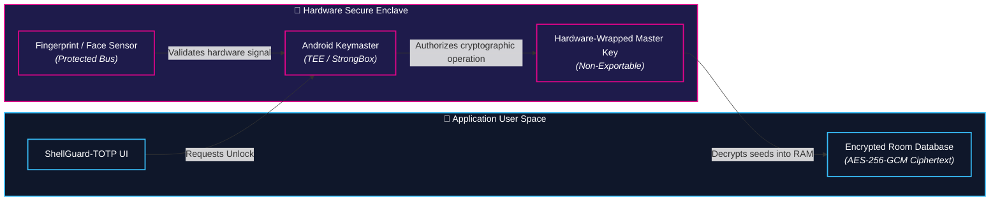

# 🛡️ Companion Security & Hardware Isolation

<CopyPage />

The security architecture of **ShellGuard-TOTP** is engineered to provide uncompromising defense-in-depth on untrusted and multi-tenant mobile devices. By leveraging Android's hardware security modules and strict lifecycle controls, your two-factor authentication secrets remain protected even if other apps on the device are compromised.

---

## 🔒 1. Hardware Enclave (Android KeyStore & TEE)

All cryptographic keys governing local vault storage are generated and managed through the **Android KeyStore provider**:



### Key Management Invariants:
- **Non-Exportable Keys:** The master key (`sg_totp_master_key`) is generated with `PURPOSE_ENCRYPT | PURPOSE_DECRYPT` inside hardware. The private key bytes can **never** be extracted from the secure hardware module, even by the application itself or root-level processes.
- **Hardware Backing:** On supported devices (Android 9.0+), keys are bound to **StrongBox Keymaster**—a dedicated tamper-resistant hardware chip separate from the primary application processor.
- **Per-Record IVs:** Database records are encrypted at rest using **AES-256-GCM** with unique 96-bit initialization vectors (IVs) and Authenticated Additional Data (AAD) binding to detect and block SQL tampering.

---

## 🧬 2. Biometric Isolation (`BiometricPrompt`)

ShellGuard-TOTP integrates with Android's official `androidx.biometric:biometric` framework to deliver rapid, secure unlocking without exposing biological data:

1. **Hardware-Level Verification:** Biometric capture and matching (fingerprint scanning, 3D facial mapping) occur entirely within the hardware sensor's isolated enclave over a dedicated secure bus.
2. **Zero Biometric Access:** The application code **never** has access to fingerprint bitmaps, face models, or biometric templates.
3. **CryptoObject Authorization:** Unlocking the vault requires passing a `BiometricPrompt.CryptoObject` initialized with the hardware cipher. The KeyStore releases the cryptographic operation only upon a verified biometric confirmation signal from the OS.

---

## 🛑 3. Window Screenshot Protection (`FLAG_SECURE`)

To prevent sensitive 6-digit TOTP codes from leaking outside the app:

```kotlin
// Window security enabled across all Activities in ShellGuard-TOTP
window.setFlags(
    WindowManager.LayoutParams.FLAG_SECURE,
    WindowManager.LayoutParams.FLAG_SECURE
)
```

### What `FLAG_SECURE` Enforces:
- **Task Switcher Suppression:** Prevents the Android operating system from creating screenshot thumbnails in the "Recents" / task-switching carousel.
- **Screen Recording Shield:** Third-party screen recorders, streaming tools, and malware with display-capture permissions only see a blank, black screen.
- **OS Screenshot Blocking:** Hardware screenshot combinations (Power + Volume Down) are blocked by the OS with an alert: *"Can't take screenshot due to security policy"*.

---

## ⏱️ 4. Lifecycle Auto-Lock & RAM Zeroization

Sensitive seeds in memory are ephemeral. ShellGuard-TOTP implements an active `AppLifecycleObserver` that safeguards the application lifecycle:

- **Background Auto-Lock:** When the application moves into the background (e.g., user switches apps or presses the Home button), an auto-lock countdown timer begins.
- **Screen Off Trigger:** When the device display turns off, the vault locks immediately.
- **RAM Zeroization:** Upon locking, all decrypted Base32 secret seeds, decoded byte arrays, and active TOTP codes are zeroized in memory, forcing complete re-authentication via PIN or biometrics upon resume.

---

## 📷 5. Ephemeral In-Memory Camera Processing

Scanning two-factor QR codes requires real-time optical analysis:

- **100% In-Memory Analysis:** Video frames from CameraX are streamed directly into ML Kit's Barcode Scanning engine in volatile memory.
- **Zero Disk Persistence:** No camera frames, photos, or video clips are ever saved to device storage or transmitted over any network interface.
- **Photo Picker Fallback:** When selecting a QR code from a gallery screenshot, the app utilizes Android's privacy-preserving Storage Access Framework (SAF) photo picker, decoding the image in RAM without requiring broad `READ_EXTERNAL_STORAGE` permissions.

---

## 📜 Regulatory & App Store Compliance

For complete disclosures regarding data safety, network air-gapping, and Google Play Store declarations, review the [ShellGuard-TOTP Android Companion Specification](/privacy#shellguard-totp-android-companion) in our official Privacy Policy.
