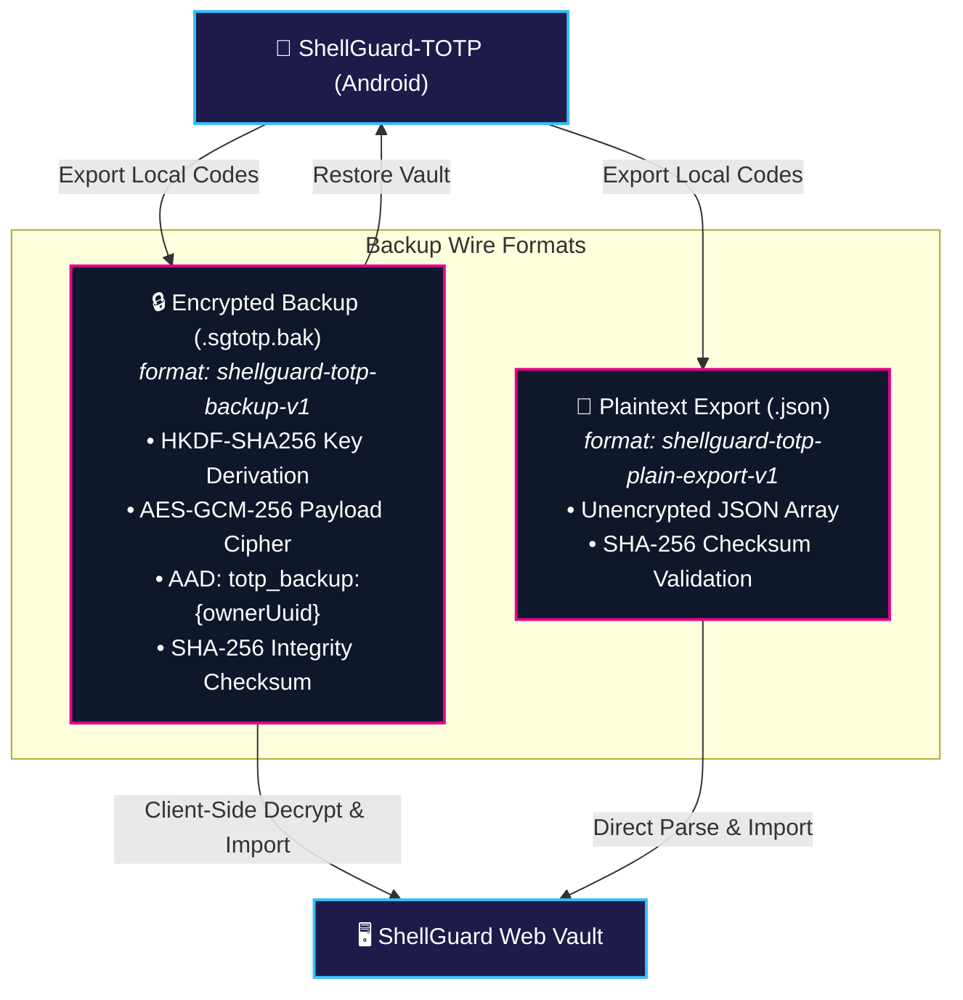
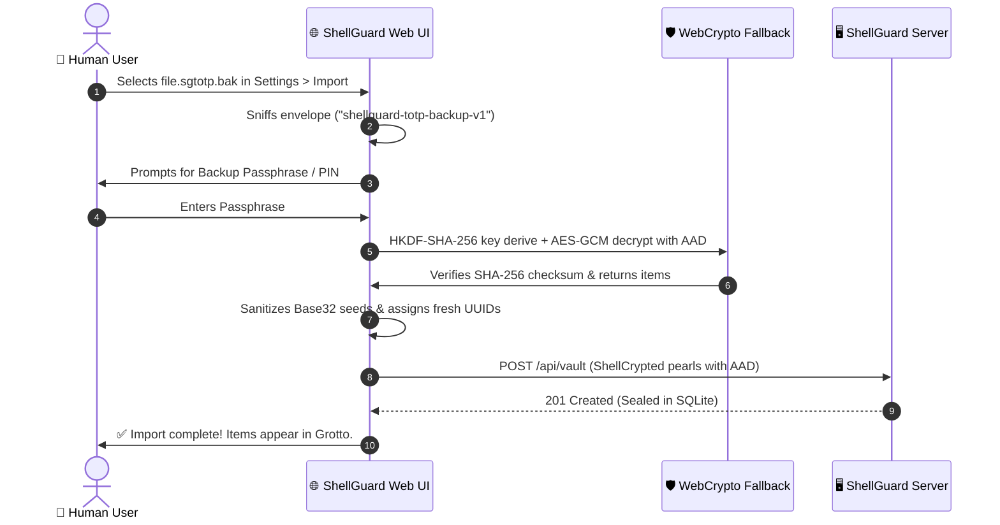

# 📦 Sync & Encrypted Backups (`sgtotp.bak`)

<CopyPage />

To ensure complete data sovereignty and seamless cross-ecosystem mobility, ShellGuard and ShellGuard-TOTP share a standardized, cryptographically verified backup format: **`sgtotp.bak`**.

This format allows you to export your sovereign two-factor authentication codes from your Android phone and directly import them into your self-hosted ShellGuard Web Vault—or restore them to a brand new Android device without cloud intervention.

---

## 🗂️ Backup Format Architecture

ShellGuard supports two distinct export formats:



---

## 🔒 1. Encrypted Envelope Specification (`shellguard-totp-backup-v1`)

The standard `.sgtotp.bak` file is an encrypted JSON envelope protecting the serialized items list with authenticated encryption.

### Wire Format Schema:
```json
{
  "version": 1,
  "type": "shellguard-totp-backup-v1",
  "format": "sgtotp.bak",
  "protectionMode": "PIN",
  "isBiometricEnabled": false,
  "pinLength": 6,
  "createdAt": 1725243851000,
  "ownerUuid": "local",
  "kdf": {
    "algorithm": "HKDF-SHA256",
    "salt": "base64-encoded-salt",
    "info": "totp_backup_key"
  },
  "cipher": {
    "algorithm": "AES-256-GCM",
    "iv": "base64-encoded-96bit-iv",
    "aad": "totp_backup:local",
    "ciphertext": "base64-encoded-ciphertext",
    "tagLength": 128
  },
  "checksumSha256": "4a7d1ed414474e4033ac29ccb8653d9b..."
}
```

### Cryptographic Invariants:
1. **Key Derivation (HKDF-SHA-256):** When encrypted with a PIN or passphrase, the 256-bit encryption key is derived using RFC 5869 HKDF-SHA-256 using a unique 16-byte random salt and context info string `"totp_backup_key"`.
2. **Authenticated Cipher (AES-GCM-256):** The payload is sealed with a unique 96-bit initialization vector (IV) and a 128-bit authentication tag.
3. **AAD Binding Defense:** Authenticated Additional Data (`AAD`) is strictly set to `"totp_backup:{ownerUuid}"`. Tampering with the envelope metadata causes decryption to fail immediately.
4. **Integrity Checksum:** A SHA-256 digest of the unencrypted payload is stored in `checksumSha256` and verified byte-for-byte post-decryption before any records are committed.

---

## 📄 2. Plaintext Export Specification (`shellguard-totp-plain-export-v1`)

For air-gapped archival or manual inspection, users may export an unencrypted JSON snapshot:

```json
{
  "version": 1,
  "format": "shellguard-totp-plain-export-v1",
  "createdAt": 1725243851000,
  "itemCount": 1,
  "checksumSha256": "4a7d1ed414474e4033ac29ccb8653d9b...",
  "items": [
    {
      "id": "c7a86f7b-60a1-4ce8-8f81-645b23d9a1e0",
      "ownerUuid": "local",
      "title": "GitHub",
      "username": "lucas@example.com",
      "category": "Development",
      "secret": "JBSWY3DPEHPK3PXP",
      "algorithm": "SHA1",
      "digits": 6,
      "period": 30,
      "isLocalOnly": true,
      "syncState": "LOCAL",
      "remoteUpdatedAt": null,
      "localUpdatedAt": 1725243851000
    }
  ]
}
```

---

## 🔄 3. Importing Backups into the Web Vault

ShellGuard's web frontend includes a native client-side parsing engine (`src/lib/sgtotpBackup.ts`):



### Security Guarantees:
- **Zero-Knowledge Decryption:** Backup decryption happens **100% in your browser**. The backup passphrase and plaintext TOTP seeds are never transmitted to the server unencrypted.
- **Base32 Sanitization:** The import engine automatically strips spaces and hyphens, capitalizes characters, and validates RFC 3548 compliance before seeding vault records.
- **Category Pod Normalization:** Categories in the backup are normalized and mapped to ShellGuard Pods using `normalizePod()`.
