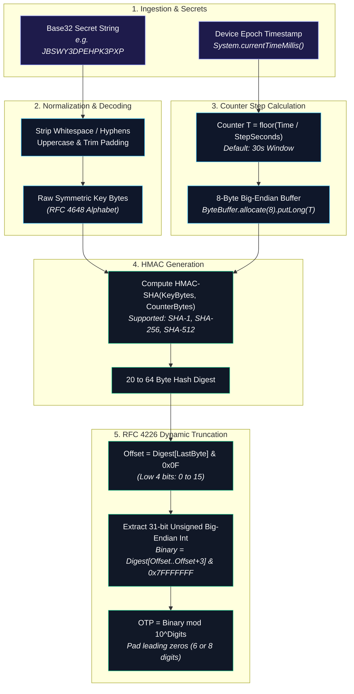
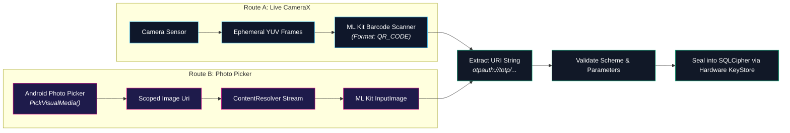

# ⏱️ RFC 6238 TOTP Engine Specification

<CopyPage />

The **ShellGuard-TOTP** companion application embeds a high-performance, strictly offline **RFC 6238** (Time-Based One-Time Password) cryptographic engine. This document specifies the mathematical model, Base32 normalization, URI ingestion syntax, and camera/photo picker security pipelines.

---

## 🧮 Mathematical Model & Algorithm Definition

ShellGuard-TOTP calculates dynamic verification codes strictly using local monotonic device time and the shared cryptographic seed. No network connectivity is required or permitted during computation.



### 1. Counter Calculation ($T$)
Given Unix timestamp $t$ (seconds elapsed since Jan 1, 1970 00:00:00 UTC) and step size $X$ (default 30 seconds):

$$T = \left\lfloor \frac{t - T_0}{X} \right\rfloor \quad \text{where } T_0 = 0$$

$T$ is represented as an 8-byte big-endian binary array (`Long` in Kotlin / Java).

### 2. HMAC Hash Computation
$$H = \text{HMAC-Hash}(K, T)$$
Where:
- $K$ is the decoded symmetric key byte array.
- $\text{Hash}$ is one of the supported HMAC primitives:
  - `HmacSHA1` (RFC 6238 default, 20-byte digest)
  - `HmacSHA256` (32-byte digest)
  - `HmacSHA512` (64-byte digest)

### 3. Dynamic Truncation (RFC 4226 Section 5.4)
The low 4 bits of the final digest byte determine the extraction offset:
$$\text{Offset} = H[\text{len}(H) - 1] \ \& \ \text{0x0F}$$

A 31-bit unsigned integer is extracted from the 4-byte sequence starting at $\text{Offset}$:
$$\text{Binary} = \Big((H[\text{Offset}] \ \& \ \text{0x7F}) \ll 24\Big) \mid \Big((H[\text{Offset} + 1] \ \& \ \text{0xFF}) \ll 16\Big) \mid \Big((H[\text{Offset} + 2] \ \& \ \text{0xFF}) \ll 8\Big) \mid (H[\text{Offset} + 3] \ \& \ \text{0xFF})$$

### 4. Code Generation & Zero-Padding
$$\text{Code} = \text{Binary} \pmod{10^{\text{Digits}}}$$

The result is left-padded with `'0'` to the designated digit length (6 or 8 digits).

---

## 🔤 Base32 Sanitization & Decoding (RFC 4648)

Authenticator secret keys are distributed as Base32-encoded strings. ShellGuard-TOTP implements a resilient internal Base32 decoder that tolerates common user formatting quirks:

```kotlin
object Base32Decoder {
    private const val ALPHABET = "ABCDEFGHIJKLMNOPQRSTUVWXYZ234567"

    fun decode(base32: String): ByteArray {
        // Strip whitespace, hyphens, and padding characters
        val clean = base32.trim()
            .replace(" ", "")
            .replace("-", "")
            .replace("=", "")
            .uppercase()

        var buffer = 0
        var bitsLeft = 0
        val output = mutableListOf<Byte>()

        for (char in clean) {
            val charValue = ALPHABET.indexOf(char)
            if (charValue < 0) continue // Skip invalid glyphs safely

            buffer = (buffer shl 5) or charValue
            bitsLeft += 5

            if (bitsLeft >= 8) {
                output.add(((buffer shr (bitsLeft - 8)) and 0xFF).toByte())
                bitsLeft -= 8
            }
        }
        return output.toByteArray()
    }
}
```

### Ingestion Tolerances:
- **Case-Insensitive:** Automatically converts lowercase inputs (`jbswy3dpehpk3pxp` → `JBSWY3DPEHPK3PXP`).
- **Delimiter Stripping:** Strips spaces and dashes commonly inserted for human readability (`JBSW-Y3DP EHPK-3PXP`).
- **Padding Stripping:** Removes trailing `=` padding symbols prior to bitwise processing.

---

## 🔗 URI Scheme & Ingestion Protocol (`otpauth://`)

ShellGuard-TOTP parses standard RFC-compliant authentication URIs generated by identity providers and services:

```text
otpauth://totp/[issuer:]account?secret=BASE32_SECRET&issuer=ISSUER&algorithm=ALGORITHM&digits=DIGITS&period=PERIOD
```

### Parameter Matrix

| Parameter | Type | Required | Default | Supported Values / Notes |
| :--- | :--- | :--- | :--- | :--- |
| **`type`** | Path | Yes | `totp` | Only `totp` is supported (`hotp` event-based is rejected). |
| **`label`** | Path | Yes | — | `[issuer:]account` (URL-decoded label). |
| **`secret`** | Query | Yes | — | Base32-encoded cryptographic seed. |
| **`issuer`** | Query | No | Label prefix | Service identity (e.g. `GitHub`, `Cloudflare`, `Proton`). |
| **`algorithm`** | Query | No | `SHA1` | `SHA1`, `SHA256`, `SHA512` (case-insensitive). |
| **`digits`** | Query | No | `6` | `6` or `8`. |
| **`period`** | Query | No | `30` | Time step in seconds (`30` or `60`). |

### Example Ingestion URIs:
```text
# Standard 6-digit 30s GitHub TOTP
otpauth://totp/GitHub:octocat?secret=JBSWY3DPEHPK3PXP&issuer=GitHub

# Advanced 8-digit 60s SHA-256 Corporate Enterprise Token
otpauth://totp/ClawStack:admin@corp.net?secret=NBSWY3DPEHPK3PXP&issuer=ClawStack&algorithm=SHA256&digits=8&period=60
```

---

## 📷 CameraX & Barcode Ingestion Pipeline

ShellGuard-TOTP provides two seamless ingestion routes for importing QR codes without compromising user privacy.



### 1. Live Camera Scanner (`CameraX + ML Kit`)
- **Single-Thread Background Executor:** In-memory frames are processed on an isolated `ExecutorService` (`Executors.newSingleThreadExecutor()`).
- **Ephemeral Buffer Analysis:** Frames arrive as `ImageProxy` objects in `YUV_420_888` format. The ML Kit barcode scanner analyzes the buffer in RAM and immediately triggers `imageProxy.close()`.
- **Zero Disk Persistence:** No camera frames or intermediate bitmaps are ever written to the application cache, temporary directories, or external storage.
- **Hardware Permission Isolation:** The `android.permission.CAMERA` permission is requested at runtime solely when the scan view is active, and the camera hardware is immediately unbinded on view dispose.

### 2. "Scan from Gallery" Fallback (Android Photo Picker)
For users scanning saved screenshots or QR images stored locally:
- **Zero Storage Permissions:** Uses the Android 13+ Photo Picker API (`ActivityResultContracts.PickVisualMedia()`). No broad storage permissions (`READ_EXTERNAL_STORAGE` or `READ_MEDIA_IMAGES`) are requested.
- **In-Memory Bitmaps:** Reads the selected image stream directly into memory via `android.content.ContentResolver`, scans for `Barcode.FORMAT_QR_CODE`, and promptly allows the GC to reclaim the buffer.

---

## 🛡️ Clipboard & Active Display Hardening

1. **Monotonic Countdown Ticker:** StateFlow emits the remaining seconds calculated against the step window:
   ```kotlin
   fun getRemainingSeconds(timestampMillis: Long, timeStepSeconds: Long = 30L): Int {
       val currentSecond = (timestampMillis / 1000L) % timeStepSeconds
       return (timeStepSeconds - currentSecond).toInt()
   }
   ```
2. **One-Tap Copy with Clipboard Zeroization:** When a code is copied, it is placed on the Android system clipboard with `ClipDescription.EXTRA_IS_SENSITIVE` set to `true` (instructing Android 13+ keyboards and clipboard history managers to conceal the preview and discard after 60 seconds).
3. **`FLAG_SECURE` Display Shielding:** The entire companion activity enforces `WindowManager.LayoutParams.FLAG_SECURE`. Screen captures, screen sharing, and recent task switcher snapshots are blocked by the OS kernel, preventing dynamic TOTP codes from leaking.
