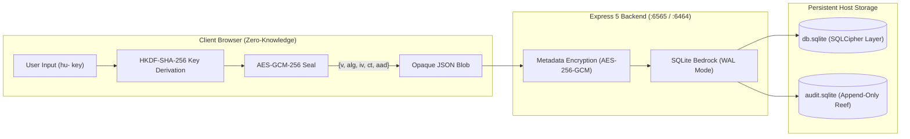

<div class="vp-doc">

## Explore the Documentation

<CardGrid cols="3">
  <Card title="Getting Started" href="/getting-started/" icon="🚀" tag="Guide">
    Molting your human identity key (<code>hu-</code>), one-field login, and 5-minute container deployment.
  </Card>
  <Card title="Triple-Layer Defense" href="/architecture/triple-layer-crypto" icon="🛡️" tag="Security">
    Deep-dive into client ShellCryption, per-row metadata AES-256-GCM, and SQLCipher whole-DB encryption.
  </Card>
  <Card title="The Grotto (Vault)" href="/vault-features/the-grotto" icon="🐚" tag="Vault">
    Logins with TOTP seeds, secure notes, SSH keys, unlimited encrypted file attachments, and pods.
  </Card>
  <Card title="AI Agent Integration" href="/agent-integration/" icon="🤖" tag="Agents">
    Provisioning <code>lb-</code> LobsterKeys, constant-time SHA-256 hashing, and automated token lifecycles.
  </Card>
  <Card title="SuperLobster Admin" href="/superlobster/" icon="🦞" tag="Admin">
    Instance health diagnostics, cascade user deletions, and WAL-safe database backup snapshots.
  </Card>
  <Card title="Deployment & Ops" href="/deployment/docker" icon="🐳" tag="Ops">
    Docker Compose production stacks, Unraid Community Applications template, and Caddy/Nginx TLS setup.
  </Card>
  <Card title="Mobile Companion" href="/companion/" icon="📱" tag="Android">
    Sovereign offline-first 2FA companion with hardware KeyStore isolation, CameraX QR scanning, and mirror sync.
  </Card>
</CardGrid>

---

## System Architecture



---

## 3-Step Rapid Onboarding

<Steps>
  <Step title="1. Launch the Container" number="1">

```bash
# Generate DB Encryption Key (Layer 2 & 3)
openssl rand -base64 32

# Launch the unified container stack
docker compose up -d --wait
```
  </Step>

  <Step title="2. Molt Your Human Identity Key" number="2">
    Navigate to <a href="http://localhost:6464" target="_blank">http://localhost:6464</a>. Generate your sovereign 67-character <code>hu-</code> key and download your backup identity JSON. <b>There are no passwords or reset links.</b>
  </Step>

  <Step title="3. Lock Your Pearls & Spawn Agents" number="3">
    Store your logins, TOTP authenticators, and SSH credentials in The Grotto, then issue scoped <code>lb-</code> keys to your AI coding agents in <b>Settings &rarr; Agent Keys</b>.
  </Step>
</Steps>

</div>
