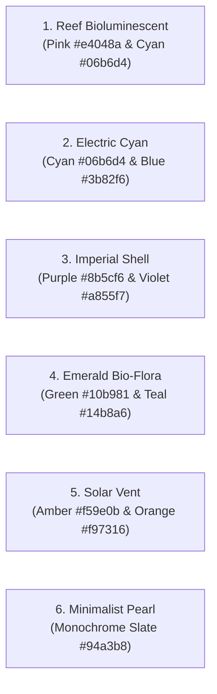

# 🎨 Reef Modernist Design System

<CopyPage />

The ShellGuard aesthetic, dubbed **"Bioluminescent Defense"**, marries deep abyssal ocean dark surfaces with high-visibility glowing accent neon. It provides an intuitive, high-contrast visual hierarchy designed for fast recognition and minimal eye fatigue.

---

## 🌊 Core Design Tokens

| Token Name | Hex Code | Role | Context & Usage |
| :--- | :--- | :--- | :--- |
| **Abyssal Base** | `#080C14` / `#0F1419` | Background canvas | Main viewport body and outer margins |
| **Abyssal Surface** | `#0F172A` / `#171C21` | Surface container | Cards, sidebar panels, table rows |
| **Elevated Surface**| `#1E252C` | Modal / Popover | Dialog modals, dropups, tooltip containers |
| **Border Soft** | `#3D484E` / `#1E293B` | Subtle dividers | Card outlines, tab separators, inputs |
| **Text Primary** | `#DEE3EA` / `#F8FAFC` | High emphasis | Headings, titles, unmasked passwords |
| **Text Muted** | `#879298` / `#94A3B8` | Low emphasis | Timestamps, field labels, metadata counts |
| **Brand Primary** | `#E4048A` | Lobster Pink | Primary action buttons, active tab indicators |
| **Energy Accent** | `#06B6D4` | Bioluminescent Cyan| Code highlights, copy badges, 2FA tickers |
| **Success Guard** | `#10B981` | Emerald | Active sessions, successful backups, checks |
| **Destruction** | `#EF4444` | Crimson Red | Delete buttons, revocation alerts, warnings |

---

## 👁️ Control Ergonomics — The Eye-beside-Copy Rule

On **every masked field row** (password, SSH private key, hidden custom field), the **Unmask (Eye/EyeOff) toggle sits in the right-hand action cluster, immediately LEFT of Copy** — matching the eye-cluster the eye is already drawn to. The masked value stays in the value column; the full-value mask invariant holds (every character → `•`, no partial masks — NEVER-list). Introduced for hidden custom fields in Phase 19 (v0.0.2.1, folded forward from the Phase 22 ergonomics pass); the password/secret row already shipped this cluster.

---

## 🌈 6 Curated Bioluminescent Theme Palettes

Both the ShellGuard Web Vault and the [ShellGuard-TOTP Android Companion](/companion/) share the same 6 harmonized accent palettes, allowing users to customize their visual experience while maintaining brand identity:

1. **Reef Bioluminescent (Default)**: The iconic ShellGuard look pairing high-energy lobster magenta with crisp abyssal cyan.
2. **Electric Cyan**: Pure oceanic neon blue-cyan for maximum terminal contrast.
3. **Imperial Shell**: Deep royal purple and violet gradients for refined administrative workspaces.
4. **Emerald Bio-Flora**: Organic marine green representing verified encryption and stability.
5. **Solar Vent**: Geothermal amber and gold highlights for alert states and high-visibility.
6. **Minimalist Pearl**: Monochromatic grayscale and silver for subdued, distraction-free environments.

---

## 🏷️ Unified Pod & Tag Bioluminescent Color Engine

Both hierarchical Pods and multi-dimensional Tags share the unified bioluminescent color engine located in `src/client/utils/podUtils.ts`:

- **16-Color Curated Abyssal Palette (`POD_COLOR_PALETTE`)**: High-contrast, vibrant oceanic tones including Cyan (`#06b6d4`), Emerald (`#10b981`), Lobster Pink (`#e4048a`), Violet (`#8b5cf6`), Amber (`#f59e0b`), Rose (`#f43f5e`), Electric Blue (`#3b82f6`), and Mint (`#14b8a6`).
- **Deterministic Hash Function (`hashStringToColor`)**: Automatically maps any pod path (e.g. `"Infra/Bastion"`) or tag label (e.g. `"production"`) to a consistent palette color via string char-code hashing, ensuring immediate visual recognition without manual assignment.
- **Client-Side Color Overrides**: Users can assign custom color choices stored in `localStorage` (`sg_pod_colors` and `sg_tag_colors`), overriding the deterministic hash.
- **Bioluminescent Pill Badges**: Rendered with glowing 20% opacity backgrounds (`${color}20`), 60% opacity borders (`${color}60`), and full-chroma text, providing unmistakable visual contrast on abyssal surfaces.

---

## 🔤 Typography & Metrics

- **Display & Headings**: `Sora`, `Switzer`, or `Inter` (geometric, clean, authoritative).
- **Body & Controls**: `Inter` or `Geist` (optimized for readability at 13px–15px).
- **Cryptographic Keys & Hashes**: `JetBrains Mono` or tabular monospace (ensures byte-for-byte visual alignment for `hu-`, `lb-`, and SHA-256 fingerprints).

---

## ⚡ Motion Physics & Interactions

Interactive components utilize Framer Motion springs (`stiffness: 400`, `damping: 30`) and Jetpack Compose physics:
- **Instant Response**: Hover states and active selections react within 80ms.
- **Organic Deceleration**: Modals slide with subtle spring momentum rather than robotic linear transitions.
- **Haptic Feedback**: Mobile companion triggers haptic clicks on successful barcode scans and clipboard copies.
