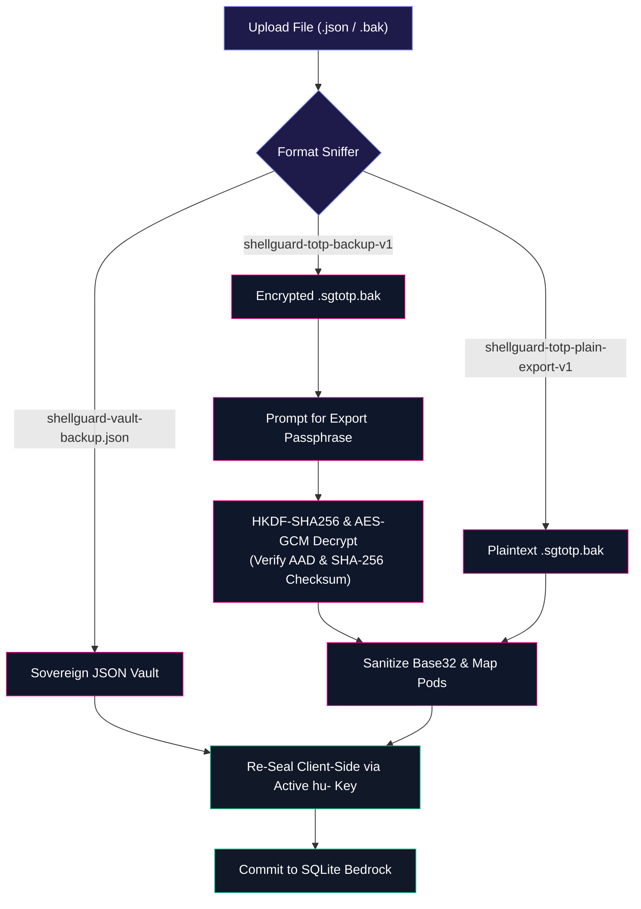

# 📦 Import & Sovereign Export

<CopyPage />

ShellGuard adheres to the principle of absolute data sovereignty. Your secrets are never locked into proprietary formats or vendor databases. You can export, backup, migrate, or restore your vault across any ShellGuard instance or client companion at any time.

Navigate to **Settings &rarr; Import & Export** to manage data portability.

---

## 📤 Sovereign Export Formats

### 1. Full Sovereign JSON Export (Complete Vault Backup)
- **Identity Re-Authentication**: Requires re-entering your `hu-` sovereign master key to authorize decryption.
- **Payload Scope**: Exports all vault pearls (with passwords and TOTP seeds), secure notes, SSH keys, attachments, and custom fields.
- **Export Formats**:
  - **Decrypted Plaintext JSON**: Ideal for transferring secrets to another vault or creating a personal physical cold-storage backup.
  - **Encrypted Backup JSON**: Fully re-sealed with a user-supplied passphrase, suitable for offsite cloud storage.

### 2. Metadata CSV Export
- **Auditing Catalog**: Generates a structured CSV containing item titles, usernames, URLs, categories, and creation dates.
- **Confidential Field Redaction**: Passwords, notes bodies, private SSH keys, and TOTP seeds are strictly omitted.
- **Use Case**: Excellent for credential hygiene auditing, identifying legacy accounts, and cataloging domain usage.

---

## 📥 Import Formats & Compatibility

ShellGuard features a unified client-side import engine capable of auto-detecting and ingesting three distinct backup formats:

### 1. Sovereign ShellGuard JSON Import
Upload any previously exported `shellguard-vault-backup.json`. The client validates schema compliance and batch-imports logins, notes, SSH keys, and custom fields. Every secret is re-encrypted in browser RAM with your active `hu-` master key before transmission to the server.

### 2. ShellGuard-TOTP Android Backup (`.sgtotp.bak`)
ShellGuard natively supports direct import of backups generated by the official [ShellGuard-TOTP Android Companion](/companion/sync-and-backups):

- **Auto-Sniffing**: The file uploader automatically detects `.sgtotp.bak` extensions and envelope headers.
- **Encrypted Backups (`shellguard-totp-backup-v1`)**: When an encrypted companion backup is uploaded, an in-browser modal prompts for the export passphrase. Decryption is performed entirely client-side using HKDF-SHA256 and AES-GCM-256, verifying the AAD (`totp_backup:{ownerUuid}`) and the byte-exact SHA-256 payload checksum.
- **Plaintext Backups (`shellguard-totp-plain-export-v1`)**: Unencrypted companion exports and raw JSON token arrays are parsed directly.
- **Normalization Invariants**:
  - **Base32 Normalization**: Secret seeds are sanitized (stripping spaces, hyphens, and converting to uppercase).
  - **Fresh UUID Assignment**: Items receive new collision-free Web UUIDs.
  - **Pod Mapping**: Android categories map to vault Pods using `normalizePod()`.
