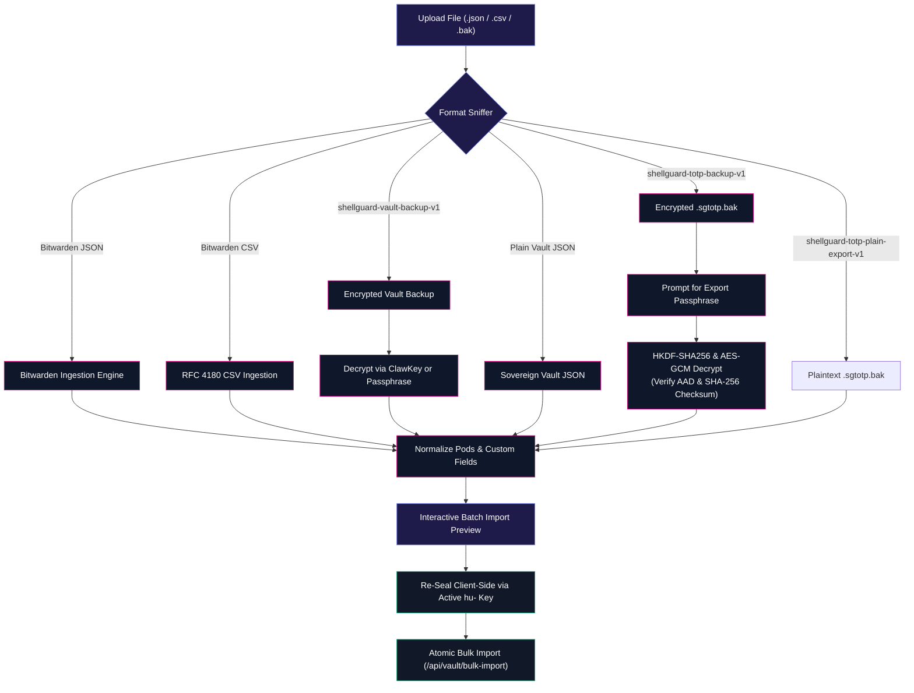

# 📦 Import & Sovereign Export

<CopyPage />

ShellGuard adheres to the principle of absolute data sovereignty. Your secrets are never locked into proprietary formats or vendor databases. You can export, backup, migrate, or restore your vault across any ShellGuard instance or client companion at any time.

Navigate to **Settings &rarr; Import & Export** to manage data portability.

--## 📤 Sovereign Export Formats

### 1. Dual Vault Export Suite
- **Identity Re-Authentication**: Requires re-entering your `hu-` sovereign master key to authorize decryption of in-memory items before export.
- **Payload Scope**: Complete vault archive containing pearls, logins (with multi-URI and password history), secure notes, SSH keys, attachments, and custom fields.
- **Export Options**:
  - **Encrypted Backup JSON (`shellguard-vault-backup-v1`, Envelope `v: 1`)**: Sealed client-side via AES-256-GCM. Derives encryption keys from either your 256-bit ClawKey (HKDF-SHA256) or a custom user passphrase (PBKDF2-SHA256, 100,000 iterations). Enforces CSPRNG generation for salt and IV. Includes byte-exact SHA-256 checksum and AAD tamper protection.
  - **Decrypted Plaintext JSON**: Complete unencrypted vault schema suitable for cold offline storage or direct migration to another ShellGuard instance.
  - **RFC 4180 CSV Spreadsheet Export**: Clean tabular export with a user-toggleable **"Include Decrypted Passwords"** audit control. Omitting passwords produces a sanitized credential registry for organizational hygiene auditing.

---

## 📥 Import Formats & Compatibility

ShellGuard features a unified client-side import engine capable of auto-detecting and ingesting five distinct backup formats:

### 1. Bitwarden Ingestion Parity (JSON & CSV)
ShellGuard provides first-class, seamless migration from Bitwarden:
- **Unencrypted Bitwarden JSON**: Automatically parses `items[]` across Logins, Secure Notes, and SSH keys. Normalizes Bitwarden folders to ShellGuard pods (`normalizePod`), converts multi-URIs into structured login rows, extracts password revision history, translates custom fields (`Text`, `Hidden`, `Checkbox`, `Linked`), and parses dynamic TOTP seeds (`otpauth://` URIs with SHA1/256/512, 6/8 digits, custom periods).
- **Bitwarden CSV**: Adheres to RFC 4180 CSV standards for quoted multiline fields, commas, and escaped quotes.
- **Encrypted Bitwarden Sniffer**: Detects encrypted Bitwarden exports (`encrypted: true`) and immediately informs the user to export unencrypted JSON/CSV from the Bitwarden web vault or use the Bitwarden CLI, preventing silent corrupt imports.

### 2. Sovereign ShellGuard Vault Backups (Encrypted & Plaintext)
Upload any previously exported ShellGuard backup. If encrypted (`v: 1`), an in-browser modal prompts for either the active ClawKey or the custom passphrase used during export. The client decrypts, verifies integrity, displays the import preview, and re-seals each item under the current session's key.

### 3. ShellGuard-TOTP Android Backup (`.sgtotp.bak`)
ShellGuard natively supports direct import of backups generated by the official [ShellGuard-TOTP Android Companion](/companion/sync-and-backups):
- **Auto-Sniffing**: The file uploader automatically detects `.sgtotp.bak` extensions and envelope headers.
- **Encrypted Backups (`shellguard-totp-backup-v1`)**: When an encrypted companion backup is uploaded, an in-browser modal prompts for the export passphrase. Decryption is performed entirely client-side using HKDF-SHA256 and AES-GCM-256, verifying the AAD (`totp_backup:{ownerUuid}`) and the byte-exact SHA-256 payload checksum.
- **Plaintext Backups (`shellguard-totp-plain-export-v1`)**: Unencrypted companion exports and raw JSON token arrays are parsed directly.
- **Normalization Invariants**:
  - **Base32 Normalization**: Secret seeds are sanitized (stripping spaces, hyphens, and converting to uppercase).
  - **Fresh UUID Assignment**: Items receive new collision-free Web UUIDs.
  - **Pod Mapping**: Android categories map to vault Pods using `normalizePod()`.

---

## ⚡ High-Throughput Bulk Import & Partial-Failure Engine

ShellGuard includes an optimized transactional bulk import engine (`POST /api/vault/bulk-import`) engineered for migrating large credential databases without single-item request round-trips:

- **10MB Scoped Payload Parser**: Accommodates bulk imports of up to 1,000 items in a single HTTP request while preserving tight 1MB limits across other API endpoints.
- **Transactional Atomicity**: All valid items are committed inside an atomic SQLite transaction.
- **Interactive UI Error Resolution**: Skipped items are visually flagged in the Import view with warning badges and item chips detailing the zero-based index and field validation errors.
