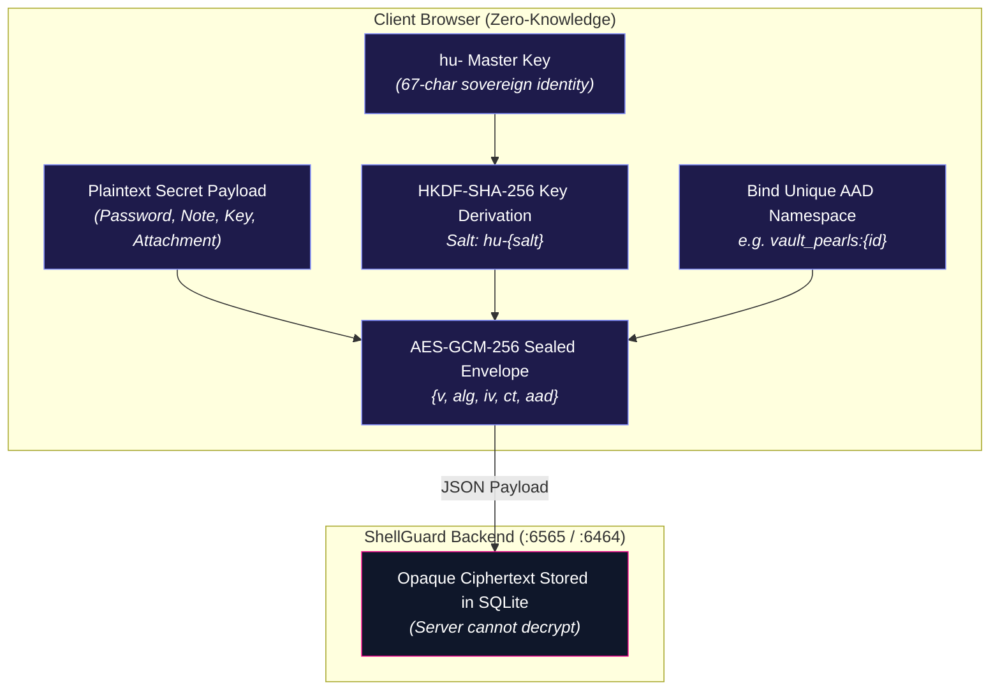

# 🐚 Vault Features Overview

<CopyPage />

The ShellGuard vault is an offline-capable, sovereign secrets engine engineered around zero-knowledge cryptographic isolation. Everything stored inside your vault is encrypted in your browser using **ShellCryption©™** (HKDF-SHA-256 key derivation with AES-GCM-256 authenticated encryption) before it ever touches the network or disk.

---

## 🏗️ Core Vault Capabilities

<CardGrid cols="2">
  <Card title="The Grotto & Pods" href="/vault-features/the-grotto" icon="🐚" tag="Organization">
    Organize passwords, secure notes, and SSH keys into user-defined hierarchical Pods with color-coded tags.
  </Card>
  <Card title="Bitwarden-Style Custom Fields" href="/vault-features/the-grotto#custom-fields" icon="🧩" tag="Flexibility">
    Extend credentials with Text, Hidden, Checkbox, and dynamic Linked fields, protected by dedicated AAD namespaces.
  </Card>
  <Card title="Password Attachments" href="/vault-features/attachments" icon="📎" tag="Files">
    Store license files, keypairs, and documents up to 10 MB per file using our isolated Reference Model architecture.
  </Card>
  <Card title="Pearl Password Generator" href="/vault-features/pearl-generator" icon="🎲" tag="Security">
    Generate cryptographically strong passwords using browser CSPRNG with real-time entropy scoring and session history.
  </Card>
  <Card title="Import & Sovereign Export" href="/vault-features/import-export" icon="📦" tag="Data Portability">
    Export full decrypted/encrypted JSON backups, CSV audit catalogs, and import <code>.sgtotp.bak</code> mobile companion archives.
  </Card>
  <Card title="Built-In TOTP Authenticator" href="/vault-features/the-grotto#built-in-totp-authenticator-engine" icon="⏱️" tag="2FA">
    Generate RFC 6238 two-factor authentication codes in-memory with real-time rolling countdown tickers.
  </Card>
</CardGrid>

---

## 🔒 Zero-Knowledge Storage Architecture

Every secret entity inside the vault adheres to strict cryptographic boundaries:

---

## 🧭 Navigating Vault Documentation

- **[The Grotto & Pods](/vault-features/the-grotto)**: Deep dive into login credentials, secure notes, SSH keys, custom fields, and hierarchical pod categorization.
- **[Password Attachments](/vault-features/attachments)**: Learn how the reference-model file attachment engine isolates encrypted binary files without bloating login queries.
- **[Pearl Password Generator](/vault-features/pearl-generator)**: Explore entropy scoring, CSPRNG character sets, and ephemeral memory management.
- **[Import & Export](/vault-features/import-export)**: Understand sovereign JSON vault backups, CSV metadata export, and client-side `.sgtotp.bak` Android companion decryption.
