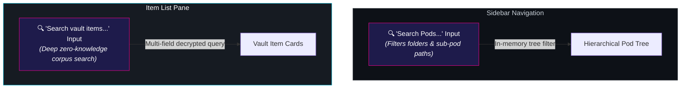

# 🔍 Unified Vault & Pod Search

<CopyPage />

Search in ShellGuard is strictly **zero-knowledge, client-side, and ergonomically scoped**. Because ShellGuard never trusts the server with plaintext credentials, search indexing and query matching occur entirely within browser RAM against already-decrypted vault payloads.

To maximize clarity and eliminate visual clutter, ShellGuard organizes search into **two dedicated, purpose-built controls** anchored directly to where your focus lives.

---

## 🧭 The Two Dedicated Search Controls

---

## 1. 🔑 The Vault Item Search Bar (`ItemListPane`)

The primary credential search bar is anchored directly above the item list in the `ItemListPane`:

### Deep Multi-Field Querying
The search engine (`src/lib/vaultSearch.ts`) performs case-insensitive, tokenized substring matching across all decrypted fields:

| Search Target | Fields Inspected | Example Queries |
| :--- | :--- | :--- |
| **Primary Credentials** | `title`, `username`, `category` | `github`, `admin@example.com` |
| **Network URIs** | Primary `url` and all secondary `uris` array entries | `aws.amazon.com`, `internal.corp` |
| **Notes & Markdown** | Login `notes` and Secure Note `content` | `api keys`, `wifi passphrase` |
| **Custom Fields** | Custom field names and decrypted values (`text`, `hidden`, `linked`, `checkbox`) | `recovery-code`, `client-secret` |
| **File Attachments** | Linked and standalone attachment `file_name`s | `license.jwt`, `id_ed25519` |
| **Bioluminescent Tags** | All assigned item tag labels | `production`, `finance` |

### Zero-Knowledge Guarantee
- **Zero Network Keystrokes**: Typing into the search bar produces zero HTTP requests. The backend server never receives your search terms or query substrings.
- **Ephemeral State**: Search queries exist purely in component state. When you lock the vault or sign out, the active search query and filtered results are immediately erased from memory.
- **No Plaintext Persistence**: Neither the search query nor decrypted match excerpts are ever saved to `localStorage`, `sessionStorage`, or IndexedDB.

---

## 2. 🗂️ The Pod Filter Search Bar (`SidebarFolderTree`)

The Pod Search bar is anchored in the navigation sidebar, directly above the folder tree:

### Scoped Folder Navigation
- **High-Density Organization**: Power users managing 50+ pods and nested folder hierarchies (e.g. `Infra/AWS/Production`, `Personal/Banking/Checking`) can filter folders in real time.
- **Instant Path Matching**: Typing `AWS` instantly narrows the folder tree to pods matching the path without affecting the active item list query.
- **Dedicated Responsibility**: Pod filtering stays where folder management occurs, rather than polluting or conflicting with item-level credential queries.

---

## ✂️ Surface Consolidation: Why Other Search Bars Were Pruned

In earlier iterations, ShellGuard experimented with global search bars located in the top-right header and the top of the sidebar. User testing revealed that these redundant search surfaces created confusion:
- Users were unsure whether the header search was searching items, documentation, or admin settings.
- Dual item search bars caused split attention and orphaned query state between views.

By **sealing the two search bars** into their natural homes:
1. **Pod Search** lives exclusively in the Pod navigation tree.
2. **Item Search** lives exclusively above the decrypted Item cards.

The header and top sidebar remain uncluttered, clean, and distraction-free.

---

## 🔒 Security & Privacy Invariants

| Invariant | Enforcement Mechanism |
| :--- | :--- |
| **Zero Query Leakage** | Client-side only; no query string parameters or body payloads are transmitted to `/api/vault`. |
| **Cryptographic Firewall** | Search runs exclusively on in-memory decrypted objects (`decryptedItems`). The database holds only Layer 1 and Layer 2 ciphertexts. |
| **Automatic Memory Purge** | When `isLocked` transitions to `true`, `setSearchQuery('')` executes synchronously, dropping search references from browser RAM. |
| **Audit Log Immunity** | Because queries never hit the API, search strings are never written to `audit.sqlite` or server log files. |

---

## 📚 Related Documentation

- [The Grotto, Pods & Tags](/vault-features/the-grotto) — Pod hierarchy and bioluminescent color palettes.
- [Bitwarden-Style Custom Fields](/vault-features/the-grotto#custom-fields) — Encrypted custom field architecture.
- [Mobile Companion TOTP](/companion/totp-engine) — In-memory RFC 6238 two-factor authentication.
