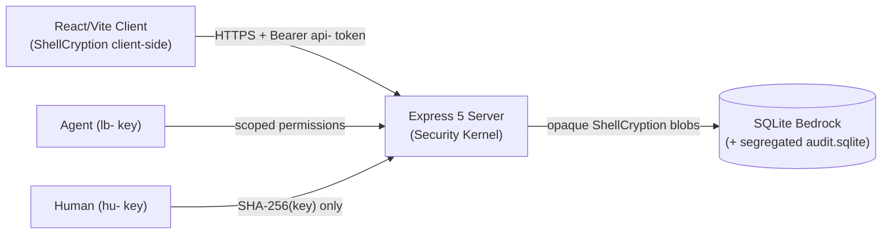

# 🏛️ ShellGuard — Architecture Specification

> **System Role, Boundaries, Topology, Threat Model & Invariants**
> *Grows with the walk. Each section exists because a phase references it.*

---

## §1. System Role

ShellGuard©™ is a **privacy-first, self-hosted, zero-knowledge secrets vault web
application**. The client generates and holds the keys; the server stores only
opaque encrypted blobs. One human (`hu-` key) owns a vault; agents (`lb-` keys)
receive scoped, revocable, expiring access to it.

**Tagline**: *"Your reef. Your keys. Your secrets."*

---

## §2. Boundaries

| Boundary | Rule |
|:---|:---|
| **Client ↔ Server** | Server NEVER sees plaintext secrets or the `hu-` key. Login sends `SHA-256(hu-)` only. |
| **Server ↔ Disk** | Secrets are stored as `{v, alg, iv, ct, aad}` ShellCryption blobs; server-side metadata encryption layers on top in a later phase. |
| **Human ↔ Agent** | `hu-` keys are human-only root identity. `lb-` agent keys are granular (scoped permissions, expiry, rate limits) and revocable without affecting human sessions. |
| **Vault ↔ Audit** | The audit log is a segregated, append-only database — never mixed with vault data. |

---

## §3. Topology

- **Client**: React 18 + Vite + Tailwind; environment config for ShellCryption and app URL.
- **Server**: Express 5 + better-sqlite3 ("Bedrock"), `helmet`, CORS, zod validation.
- **Ports (v0)**: twin-port topology — web `:4545`, API `:4646`.
  *(Molted upward through later phases: `5353`/`5454`, then the final
  `:6464` web / `:6565` API; production collapses to a single port
  serving `dist/` + API.)*
- **Database (v0)**: three tables — `lobsters` (users), `vault_pearls`
  (passwords, secure notes, cards, SSH keys), `lobster_keys` (agent keys).

---

## §4. Threat Model & Invariants

1. **Zero-knowledge invariant**: the server stores only `{v, alg, iv, ct, aad}`
   ShellCryption envelopes. Plaintext secrets never cross the wire or touch disk.
2. **Key hierarchy separation**: `hu-` (human root) and `lb-` (agent-scoped) keys
   are distinct types with distinct lifecycles.
3. **Ownership scoping**: every vault query is scoped to the authenticated owner.
   A missing ownership clause is a catastrophic security failure.
4. **Constant-time comparison**: security-sensitive string comparisons
   (key-hash verification, admin tokens) use constant-time compare, never `===`.
5. **No hardcoded defaults**: pods/categories are 100% user-created.
6. **Build features around security, not security around features.**
7. **TLS is transport armor, not identity** — secrecy lives client-side (§5).

---

## §5. Transport Security — Native LAN TLS (Phase 14)

Self-hosted instances run on LAN IPs where Let's Encrypt is impossible; the
server therefore runs **its own CA of one**:

- **Activation**: `TLS_ENABLED=true` → `server.ts` wraps the Express app in
  `https.createServer`; HSTS activates when TLS terminates natively
  (or via `ENFORCE_HTTPS` upstream).
- **Material resolution (three tiers)** — `src/server/utils/tlsManager.ts`:
  1. **Bring-your-own** via `TLS_CERT_PATH` / `TLS_KEY_PATH`.
  2. **Reuse** an existing generated pair in `DATA_DIR/certs/`
     (fingerprint stays stable across restarts).
  3. **Generate** a fresh 10-year **EC P-256** self-signed pair
     (`selfsigned`, curve P-256) and persist it.
- **SAN collection**: `localhost` + loopback + **every non-internal network
  interface** — the cert is valid for however the operator reaches the box
  (LAN IP, Tailscale IP, hostname).
- **Fingerprint**: SHA-256 of the cert, logged at boot so operators can pin
  trust on first use (TOFU).
- **Test oracle**: `tests/tls.test.ts` — generation, persistence/reuse,
  fingerprint stability, SAN completeness, conditional server protocol.

> Invariant: TLS is **transport armor**, not identity — the zero-knowledge
> model never depends on it. Client-side ShellCryption remains the secrecy
> boundary; TLS protects metadata and availability.

---

