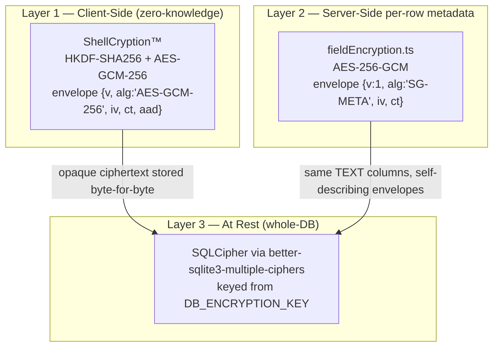

# 🔐 ShellGuard — Encryption Layers Specification

> **The triple-layer model, server-side metadata encryption & the double-encryption firewall**
> *Pulled into existence by Phase 5. Grows with the walk.*

---

## §1. The Triple-Layer Encryption Model



| Layer | Governs | Key | Sees plaintext? |
|:---|:---|:---|:---|
| 1. ShellCryption | Secrets (`secret`, `content`, `key_value`, `file_data`, `totp_secret`) | Client-derived from `hu-` | Only the client |
| 2. Field encryption | Metadata (`title`, `username`, `url`, `category`, `tags`, `notes`, `file_name`) | HKDF from `DB_ENCRYPTION_KEY` | Server, in memory, transiently |
| 3. SQLCipher | Everything on disk | `DB_ENCRYPTION_KEY` | Nobody |

---

## §2. Server-Side Field Encryption (`fieldEncryption.ts`)

- **Key derivation**: `crypto.hkdfSync('sha256', rawKey, 'shellguard-metadata-encryption-v1', 'sg-meta-aes-256-gcm', 32)` — deterministic from `DB_ENCRYPTION_KEY` (base64). The same env var governs layers 2 and 3.
- **Envelope**: self-describing JSON **in the same TEXT column** — no schema migration of column types:
  `{ "v": 1, "alg": "SG-META", "iv": "<b64>", "ct": "<b64>" }` (auth tag appended to `ct`).
- **IV**: 96-bit random per encryption. Empty/falsy strings pass through unencrypted.
- **No-op mode**: without `DB_ENCRYPTION_KEY`, every function is a passthrough — the app runs plaintext (legacy rows decrypt transparently on read).
- **Implementation note**: Node native `crypto` (`createCipheriv`/`hkdfSync`), never `crypto.webcrypto.subtle` (environment compatibility).

---

## §3. The metadataGuard Registry & the Double-Encryption Firewall

`metadataGuard.ts` is the **single registry** of which columns layer 2 may touch:

| Table | Guarded metadata columns |
|:---|:---|
| `vault_pearls` | `title`, `username`, `url`, `category`, `tags`, `notes` |
| `vault_secure_notes` | `title`, `category`, `tags` |
| `vault_ssh_keys` | `title`, `username`, `category`, `tags` |
| `vault_secure_attachments` | `title`, `file_name`, `category` |

**⛔ THE FIREWALL (inviolable):** client-ShellCryption columns — `secret`,
`content`, `key_value`, `file_data`, `totp_secret`, and later
`custom_fields` — are **NEVER registered in metadataGuard**. They are already
zero-knowledge ciphertext; re-encrypting them under `DB_ENCRYPTION_KEY`
would (a) double-encrypt, (b) break the zero-knowledge model, and (c) make
server-side reads impossible to satisfy without the client key.

`prepareWrite(tableName, body, cipher)` encrypts only registered columns;
`prepareRead(tableName, row, cipher)` decrypts only them — legacy plaintext
and empty strings pass through unchanged. Unknown tables are passthrough.

---

## §4. Migration & Tooling

- `migrations/0002_metadata_encryption.{up,down}.sql` — the schema-side accompaniment.
- `scripts/encrypt-existing-metadata.ts` / `scripts/decrypt-existing-metadata.ts` —
  one-shot in-place converters for existing rows (idempotent via envelope detection).
- `migrations/0003_custom_fields.{up,down}.sql` (Phase 13) — adds a
  `custom_fields` TEXT column to `vault_pearls`, `vault_secure_notes`,
  `vault_ssh_keys`. The column holds **client-ShellCrypted `CustomField[]`
  JSON** and stays **off the metadataGuard registry**.
- `migrations/0006_vault_tags.{up,down}.sql` (Phase 20) — adds a `tags` TEXT column
  to `vault_pearls`, `vault_secure_notes`, and `vault_ssh_keys`. The column holds
  serialized tag arrays and **is registered in metadataGuard** for Layer 2 AES-256-GCM encryption.

### A. Custom Fields Data Model (Phase 13)

```typescript
type CustomFieldType = "text" | "hidden" | "checkbox" | "linked";
type CustomFieldLinkedProperty = "username" | "password" | "url" | "notes" | "totp";

interface CustomField {
  id: string;
  name: string;
  type: CustomFieldType;
  // text/hidden: the value; checkbox: "true"/"false";
  // linked: resolved at render time, stored as source property name.
  value: string;
  linkedProperty?: CustomFieldLinkedProperty;
}
```

- **Client-side encryption with distinct AAD namespaces per item type**:
  `vault_pearls_custom:{id}`, `vault_secure_notes_custom:{id}`,
  `vault_ssh_keys_custom:{id}`, and `vault_pearls_history:{id}` (for item password revision history) — same ShellCryption engine, namespace isolates cross-item substitution.
- Server treatment: opaque blob — validated only for length/type, stored
  byte-for-byte, never inspected, never registered in metadataGuard.

---

## §5. The WebCrypto Fallback Engine (Phase 12)

**Problem**: on non-secure browser origins (self-hosted HTTP LAN, e.g. Unraid
at `192.168.x.x`), `window.crypto.subtle` is **undefined** — the entire
client-side ShellCryption stack would be dead on the most common self-host
topology.

**Solution**: `src/lib/webCryptoFallback.ts` — pure TypeScript implementations
of the four primitives, **cryptographically identical byte-for-byte** with
the native API:

| Primitive | Standard |
|:---|:---|
| SHA-256 | FIPS 180-4 (full K256 constant table) |
| HMAC-SHA256 | RFC 2104 |
| HKDF (extract + expand) | RFC 5869 |
| AES-GCM-256 | NIST SP 800-38D |

- `crypto.ts` detects availability and routes: native `crypto.subtle` when
  present, fallback engine when not — callers never branch.
- `shellCryption.ts` routes through the same selector; envelope format is
  identical either way (`{v, alg:'AES-GCM-256', iv, ct, aad}`).
- **Test oracle**: `tests/unit/webCryptoFallback.test.ts` proves the TS
  engine produces byte-identical output to native WebCrypto vectors.
- **Companion UX fixes in the same bracket**: drag-drop handlers
  `preventDefault()` so dropping a key file never navigates the browser
  away; QR code downloads convert to `Blob` + `ObjectURL` (completing the
  Phase 9 origin-safety migration).

> Invariant: the fallback engine is **not** a different cipher stack — it is
> the same stack, ported. Any divergence from native output is a defect.

---

