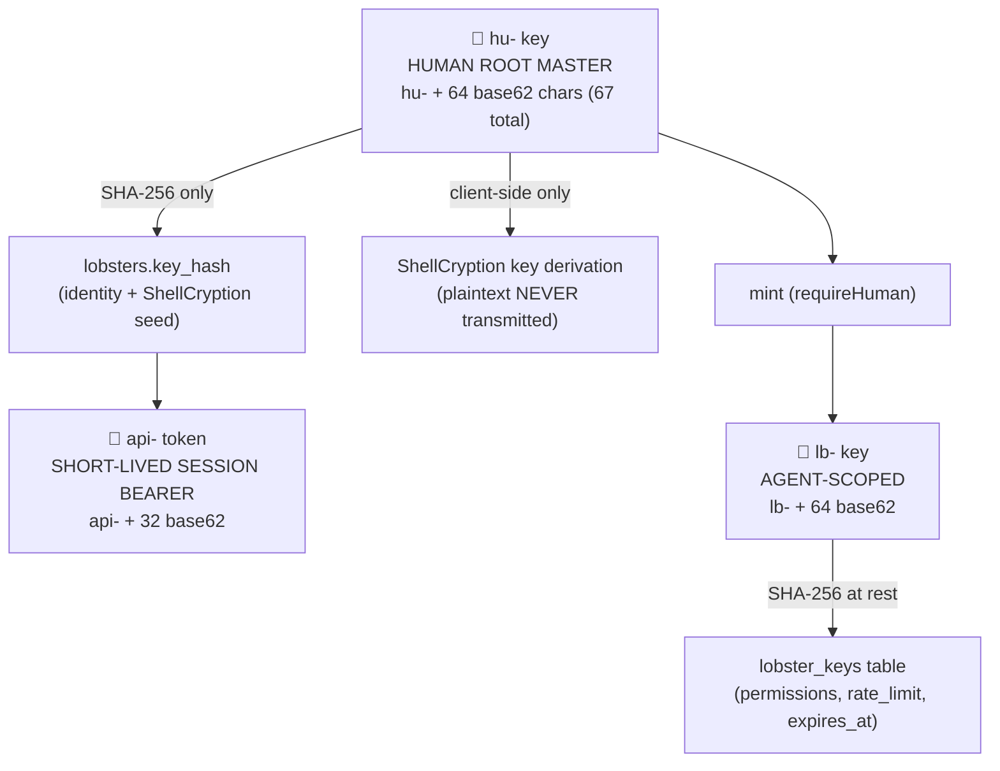

# 🔑 ShellGuard — Key Hierarchy Specification

> **The three key types, their lifecycles, permissions & boundaries**
> *Pulled into existence by Phase 3 (Lobster Keys). Grows with the walk.*

---

## §1. The Three Key Types

## §2. Lifecycle Rules (inviolable)

| Type | Generation | Transmission | Storage | Death |
|:---|:---|:---|:---|:---|
| `hu-` | Client-generated | **SHA-256(hu-) only** — plaintext NEVER crosses the wire | `lobsters.key_hash` (unique) | User destroys key → vault unrecoverable by design |
| `api-` | Issued by `/api/auth/token` from a verified key hash | Bearer header | `api_tokens` with `expires_at` | TTL expiry or logout |
| `lb-` | Minted by a human via `POST /api/agent-keys` | Returned **once** in plaintext at mint | Hashed server-side, plus `permissions`, `rate_limit`, `expires_at` | Revocable (`PATCH …/revoke`) or deletable — **without affecting human sessions** |

## §3. Permission Model (claw strength)

Scoped booleans per `lb-` key; enforced per-route via `requirePermission`:

- `canRead` — `GET`
- `canWrite` — `POST`
- `canEdit` — `PUT`
- `canDelete` — `DELETE`

A missing permission is a `403`. Rate limits are per-key (LRU limiter) and
enforced **after** authentication (auth-before-limit ordering is a Phase 2
invariant).

## §4. Human-Only Gates (`requireHuman`)

Operations that only a `hu-`-derived session may perform — agents are
 categorically excluded:

- Minting, revoking, deleting Lobster Keys (`/api/agent-keys`)
- Reading/writing instance settings (`/api/settings/:key`)
- (Later phases: admin plane access, backup operations)

---
