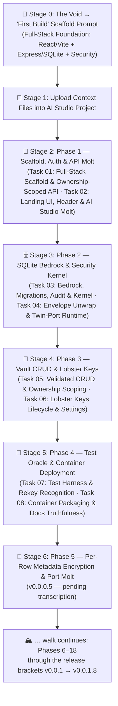

# 🤖 Master Meta-Prompt: ShellGuard Secrets Vault (Web Application)

> **INSTRUCTIONS & MULTI-STAGE PROMPTS FOR GOOGLE AI STUDIO (WEB BUILD MODE) — AND ANY CODING AGENT**
> *Aligned with ClawStack Standards and the ShellGuard-TOTP reference structure.*

---

## 📋 Multi-Stage Execution Strategy

To ensure optimal token economy and avoid context degradation, development proceeds
in deterministic 2-task stages mapped 1:1 to the **[`ROADMAP.md`](./ROADMAP.md)**.
The full ascent — from `v0.0.0.0` (the void) to `v0.0.1.8` (current parity) — is
recounted stage by stage. This spine **grows with the roadmap**: stages are added
as each phase of the story is walked.



> **Transcription state**: Phases marked *(pending transcription)* exist as real work
> in git history but not yet as stages in this spine. The walk is in progress.

---

## 🚀 Stage 0: The Void — "First Build" Initial Scaffold Prompt

> **📖 Required Reference Files Attached in AI Studio**:
> 1. [`architecture.md`](./architecture.md) — System role (§1), boundaries (§2), topology (§3), threat model & invariants (§4).

Copy and paste this exact prompt into Google AI Studio as the **First Build Message**:

```markdown
# FIRST BUILD PROMPT: ShellGuard Secrets Vault — Full-Stack Foundation

## 🎯 Objective
Initialize and scaffold the complete architecture and security foundation for
**ShellGuard**, a privacy-first, self-hosted, zero-knowledge secrets vault web
application. The client is React + Vite; the server is Express + SQLite.

**Tagline**: *"Your reef. Your keys. Your secrets."*

## 📖 Reference Architecture Files
Before writing code, inspect and adhere to:
- `architecture.md`: Section 1 (System Role), Section 2 (Boundaries), Section 3 (Topology), Section 4 (Threat Model & Invariants).

## 🛡️ Core Operating Invariant
"Build features around security, not security around features."
Do NOT build complex vault interactions in this initial build. Focus 100% on:
project scaffold, database schema and connection layer, auth middleware,
REST routers with ownership scoping, client-side ShellCryption wiring, and
the Reef Modernist shell of the UI.

## 🛠️ Technical Specifications & Dependencies
- **Client**: React 18 + Vite + Tailwind, environment config for ShellCryption and app URL.
- **Server**: Express 5 + better-sqlite3 ("Bedrock"), `helmet`, CORS, zod validation.
- **Database tables (v0)**: `lobsters` (users), `vault_pearls` (secrets: passwords,
  secure notes, cards, SSH keys), `lobster_keys` (agent keys with scoped permissions).
- **Ports (v0)**: twin-port topology — web `:4545`, API `:4646` (molted to
  `:6464`/`:6565` in a later phase).

## 📐 Required Deliverables for this First Build:
1. Database schema + connection layer for the three v0 tables.
2. Auth middleware supporting `hu-` human keys and `lb-` agent keys with
   scoped claw-strength permissions (`canRead` / `canWrite`).
3. REST routers for vault items — passwords, secure notes, cards, SSH keys —
   each enforcing ownership checks.
4. Vite-based UI shell with Landing, Setup and Login views on Reef Modernist tokens.
5. `BLUEPRINT.md`, `.env.example`, `README.md`, agent knowledge files
   describing Lobster Keys usage and audit rules.

Verify the server boots, the three tables create, a vault item round-trips
with ownership scoping, and the landing shell renders!
```

---


## 📂 Stage 1: Uploading Context Files

After the First Build lands, upload the current context files into the AI Studio
project so subsequent stages can reference them:

1. `architecture.md` (grows each phase — always upload the latest)
2. Any spec files referenced by the current stage's header

---

## 🥚 Stage 2: Phase 1 Prompt — Scaffold, Auth & API Molt [Baseline: v0.0.0.1 (Build 2)]

> 🗺️ **Master Roadmap Reference**: See [`ROADMAP.md`](./ROADMAP.md#phase-1-scaffold-auth--api-molt-baseline-v00001-build-2)
> for complete specifications on **Task 01** and **Task 02**.
> **📖 Required Context Files for Phase 1**:
> 1. [`architecture.md`](./architecture.md) — §2 (Boundaries), §3 (Topology), §4 (Invariants).

Copy and paste this prompt to execute **Phase 1 (Tasks 01 & 02)**:

```markdown
# PHASE 1 EXECUTION: Scaffold, Auth & API Molt [Baseline: v0.0.0.1 (Build 2)]

## 📖 Reference Documentation & Roadmap
Before writing code, inspect:
- `ROADMAP.md`: Phase 1 (Task 01: Full-Stack Scaffold & Ownership-Scoped API · Task 02: Landing UI, Header & Molt).
- `architecture.md`: §2 (Boundaries), §3 (Topology), §4 (Threat Model & Invariants).

Execute Phase 1 adhering to the Functionality + UI Component pairing:

### Task 01: [Functionality] Full-Stack Scaffold & Ownership-Scoped API
- Initialize the ShellGuard©™ application: a full-stack secrets vault with a
  React/Vite client and an Express + SQLite ("Bedrock") server.
- **Backend**: database schema and connection layer for `lobsters` (users),
  `vault_pearls` (secrets), `lobster_keys` (agent keys); auth middleware
  supporting `hu-` human keys and `lb-` agent keys with scoped permissions
  (`canRead`/`canWrite` claw strength); REST routers for vault items —
  passwords, secure notes, cards, SSH keys — each enforcing ownership checks.
- **Frontend**: Vite-based UI with environment config for ShellCryption
  client-side encryption and app URL.
- **Project setup**: `BLUEPRINT.md` documenting architecture and data model;
  `.env.example`; agent knowledge files describing Lobster Keys usage and
  audit rules.
- **The Molt**: remove all first-build AI Studio scaffolding artifacts
  (patch scripts, lockfile debris, vestigial dependencies) so the repo
  stands on its own as a canonical codebase.

### Task 02: [UI Component] Landing Shell, Header & Reef Unification
- Extract header controls into a reusable `Header` component.
- Add the **Hatch Vault** button to `LandingView` with compact styling.
- Unify surface backgrounds and header borders across dark/light themes so
  the Reef Modernist token set is consistent from first paint.
- Keep the vault shell minimal — detail panes come in later phases.

Verify the server boots with all three tables, an `hu-` key authenticates,
a vault item round-trips with ownership scoping, an `lb-` key is denied
outside its permissions, and the landing shell renders on unified tokens!
```


## 🗄️ Stage 3: Phase 2 Prompt — SQLite Bedrock, Security Kernel & Identity Bridge [Baseline: v0.0.0.2 (Build 3)]

> 🗺️ **Master Roadmap Reference**: See [`ROADMAP.md`](./ROADMAP.md#phase-2-sqlite-bedrock-security-kernel--identity-bridge-baseline-v00002-build-3)
> for complete specifications on **Task 03** and **Task 04**.
> **📖 Required Context Files for Phase 2**:
> 1. [`database-schema.md`](./database-schema.md) — §1 (DATA_DIR layout), §2 (Migrations), §3 (Schema v1), §4 (Audit redaction).
> 2. [`routes-and-contracts.md`](./routes-and-contracts.md) — §1 (Uniform envelope), §2 (Auth identity endpoints).
> 3. [`architecture.md`](./architecture.md) — §4 (Invariants).

Copy and paste this prompt to execute **Phase 2 (Tasks 03 & 04)**:

```markdown
# PHASE 2 EXECUTION: SQLite Bedrock, Security Kernel & Identity Bridge [Baseline: v0.0.0.2 (Build 3)]

## 📖 Reference Documentation & Roadmap
Before writing code, inspect:
- `ROADMAP.md`: Phase 2 (Task 03: Bedrock, Migrations, Audit DB & Security Kernel · Task 04: Envelope Unwrap & Twin-Port Runtime).
- `database-schema.md`: §1–§4 (layout, migrations, schema v1, audit redaction).
- `routes-and-contracts.md`: §1–§2 (uniform envelope, identity endpoints).
- `architecture.md`: §4 (Threat Model & Invariants).

Execute Phase 2 adhering to the Functionality + Integration pairing:

### Task 03: [Functionality] SQLite Bedrock, Transactional Migrations, Audit DB & Security Kernel
- Swap the database driver to `better-sqlite3-multiple-ciphers`.
- Rebuild storage as the `DATA_DIR` bedrock:
  - `migrations/0001_initial.{up,down}.sql` define clean schema v1
    (`lobsters`, `api_tokens`, `vault_pearls`, `vault_secure_notes`,
    `vault_ssh_keys`) — payload columns hold opaque ShellCryption ciphertext.
  - `migrationRunner.ts` tracks `schema_migrations`, transactional application.
  - Delete the legacy inline-DDL singleton and root `shellguard.db`;
    repoint all routers at the database singleton.
  - Add `scripts/scuttle-reset.ts` fresh-start wipe tooling.
- Create the segregated append-only `audit.sqlite` with `createAuditLogger()`
  enforcing the zero-knowledge redaction invariant (fail-closed on lookalike
  field names).
- Assemble the Express 5 security kernel in strict order:
  `httpsRedirect` → `helmet` (vault CSP) → CORS config → scoped body limits
  (1mb global / 32mb attachments) → global/auth/per-key rate limiters →
  zod validation → centralized error handler.
- Add hardened TTL parsing (`30m`/`12h`/`24h`/`7d`/`never`/ISO/bare-minutes)
  and constant-time comparison utilities.
- Add `POST /api/auth/register` and `POST /api/auth/token` — transmit and
  store only SHA-256 key hashes, never plaintext keys.

### Task 04: [Integration Component] Client Envelope Unwrap, Session Handoff & Twin-Port Runtime
- `restAdapter.ts` unwraps the uniform `{success, data}` envelope centrally;
  views never parse raw responses.
- `LoginView.tsx` / `SetupView.tsx` consume the unwrapped session; `App.tsx`
  routes on it.
- Pin twin-port topology: Vite `:4545` proxying `/api` → API `:4646`, with
  tsconfig project references split for server/client contexts.

Verify a fresh `DATA_DIR` boot applies schema v1 transactionally, the audit DB
redacts sensitive details, the middleware chain orders auth before rate limits,
a key hash round-trips register → token, and the client completes a
register → login → vault-fetch journey through the unwrapped envelope!
```

---

## 🔗 Stage 4: Phase 3 Prompt — Vault CRUD, Lobster Keys & Settings Storage [Baseline: v0.0.0.3 (Build 4)]

> 🗺️ **Master Roadmap Reference**: See [`ROADMAP.md`](./ROADMAP.md#phase-3-vault-crud-lobster-keys--settings-storage-baseline-v00003-build-4)
> for complete specifications on **Task 05** and **Task 06**.
> **📖 Required Context Files for Phase 3**:
> 1. [`routes-and-contracts.md`](./routes-and-contracts.md) — §3 (Vault domains & verb-permission map), §4 (Lobster Keys lifecycle), §5 (Settings).
> 2. [`key-hierarchy-spec.md`](./key-hierarchy-spec.md) — §1–§4 (key types, lifecycles, permissions, human-only gates).
> 3. [`database-schema.md`](./database-schema.md) — §3 (Schema v1), §4 (Audit redaction).

Copy and paste this prompt to execute **Phase 3 (Tasks 05 & 06)**:

```markdown
# PHASE 3 EXECUTION: Vault CRUD, Lobster Keys & Settings Storage [Baseline: v0.0.0.3 (Build 4)]

## 📖 Reference Documentation & Roadmap
Before writing code, inspect:
- `ROADMAP.md`: Phase 3 (Task 05: Validated Vault CRUD · Task 06: Lobster Keys Lifecycle & Settings).
- `routes-and-contracts.md`: §3–§5 (vault domains, verb→permission map, agent keys, settings).
- `key-hierarchy-spec.md`: §2–§4 (lifecycles, claw-strength permissions, requireHuman gates).
- `database-schema.md`: §3–§4 (schema v1, audit redaction).

Execute Phase 3 adhering to the Functionality + Security Component pairing:

### Task 05: [Functionality] Validated Vault CRUD — Four Domains, Ownership Scoping & Audit Trail
- Consolidate vault routing into `src/server/routes/` (`vault.ts`, `notes.ts`,
  `sshKeys.ts`, `attachments.ts`); delete the legacy `src/services/vault/*`.
- Uniform contract per domain: GET (canRead) · POST (canWrite + zod) ·
  PUT /:id (canEdit + zod) · DELETE /:id (canDelete).
- Scope every query by `owner_uuid` from the authenticated identity; audit
  every mutation; treat payload columns as opaque ShellCryption ciphertext.
- Extend `src/server/validation/schemas.ts` with per-domain schemas.

### Task 06: [Security Component] Lobster Keys Lifecycle Parity & Settings Storage
- `src/server/routes/agentKeys.ts`: GET / POST (mint: scoped permissions,
  rate_limit, expires_at, behind authLimiter) / PATCH /:id/revoke / DELETE /:id
  — all requireHuman; plaintext returned once, only hashes persist.
- `src/server/routes/settings.ts`: GET/PUT /api/settings/:key (requireHuman).
- Delete legacy `src/services/agents/` and `src/services/auth/` remnants.

Verify all four vault domains round-trip with cross-owner access failing
closed, unvalidated bodies rejected, a minted agent key constrained to its
permissions/rate limit/expiry, revoked keys rejected without touching human
sessions, and settings persisting per owner!
```


## 🧪 Stage 5: Phase 4 Prompt — Test Oracle, Container Deployment & License [Baseline: v0.0.0.4 (Build 5)]

> 🗺️ **Master Roadmap Reference**: See [`ROADMAP.md`](./ROADMAP.md#phase-4-test-oracle-container-deployment--license-baseline-v00004-build-5)
> for complete specifications on **Task 07** and **Task 08**.
> **📖 Required Context Files for Phase 4**:
> 1. [`verification-gates.md`](./verification-gates.md) — §1 (Harness), §2 (Suites), §3 (Build gates).
> 2. [`database-schema.md`](./database-schema.md) — §1 (DATA_DIR layout), §2 (Migrations).
> 3. [`routes-and-contracts.md`](./routes-and-contracts.md) — §3 (Vault domains).

Copy and paste this prompt to execute **Phase 4 (Tasks 07 & 08)**:

```markdown
# PHASE 4 EXECUTION: Test Oracle, Container Deployment & License [Baseline: v0.0.0.4 (Build 5)]

## 📖 Reference Documentation & Roadmap
Before writing code, inspect:
- `ROADMAP.md`: Phase 4 (Task 07: Test Harness & Rekey Recognition · Task 08: Container Packaging & Docs Truthfulness).
- `verification-gates.md`: §1–§3 (harness, suites, build gates).
- `database-schema.md`: §1–§2 (DATA_DIR layout, migrations).
- `routes-and-contracts.md`: §3 (vault domains & verb-permission map).

Execute Phase 4 adhering to the Functionality + Infrastructure pairing:

### Task 07: [Functionality] Test Harness with Per-Suite Isolation & In-Place Encryption Recognition
- Build the Vitest + supertest oracle: auth-flow, security (cross-owner
  isolation, opacity invariant, rate limits), vault-crud (all four domains),
  settings, build-gates (lint/type/build as executable tests), error-handler
  unit tests — with testDb/testAuth/testFactories helpers.
- Per-suite `DATA_DIR` sandboxes created before dynamic server import; no
  shared state, parallel-safe.
- Fix integration wrinkles: test wiring, schema validation, import paths.
- Bedrock connection recognizes a plaintext DB under an active
  `DB_ENCRYPTION_KEY` and encrypts in-place via SQLCipher `PRAGMA rekey`.

### Task 08: [Infrastructure Component] Single-Container Packaging, ghcr CI, Unraid Template & Documentation Truthfulness
- Multi-stage `node:20-alpine` Dockerfile, PUID/PGID entrypoint, healthcheck;
  docker-publish.yml → ghcr.io; prod/dev compose stacks; lockfile-keeping
  .dockerignore.
- Unraid Community Applications template + agent skill document
  (`skills/shellguard/SKILL.md`).
- Rebuild docs truthful to runtime: ARCHITECTURE, SECURITY, QUICKSTART,
  CONTRIBUTING, README, BLUEPRINT schema-v1 accuracy.
- Adopt AGPL-3.0; fix npm audit findings.

Verify all suites pass in isolation and parallel with zero shared state,
cross-owner access fails closed in tests, a plaintext DB rekeys transparently,
the container builds and boots healthy on a fresh DATA_DIR, and every doc
claim matches runtime behavior!
```

---

---

