# 🤖 Master Meta-Prompt: ShellGuard Secrets Vault (Web Application)

> **INSTRUCTIONS & MULTI-STAGE PROMPTS FOR GOOGLE AI STUDIO (WEB BUILD MODE) — AND ANY CODING AGENT**
> *Aligned with ClawStack Standards and the ShellGuard-TOTP reference structure.*

---

## 📋 Multi-Stage Execution Strategy

To ensure optimal token economy and avoid context degradation, development proceeds
in deterministic 2-task stages mapped 1:1 to the roadmap system — the active
sliding-window [`../ROADMAP.md`](../ROADMAP.md) and the historical archive
[`ROADMAP-HISTORY.md`](../.agents/memory-bank/ROADMAP-HISTORY.md) (Phases 1–13).
The full ascent — from `v0.0.0.0` (the void) to `v0.0.1.8` (current parity) — is
recounted stage by stage. This spine **grows with the roadmap**: stages are added
as each phase of the story is walked.

```mermaid
flowchart TD
    Step0["🚀 Stage 0: The Void → 'First Build' Scaffold Prompt<br/>(Full-Stack Foundation: React/Vite + Express/SQLite + Security)"]
    UploadContext["📂 Stage 1: Upload Context Files into AI Studio Project"]
    Phase1["🥚 Stage 2: Phase 1 — Scaffold, Auth & API Molt<br/>(Task 01: Full-Stack Scaffold & Ownership-Scoped API · Task 02: Landing UI, Header & AI Studio Molt)"]
    Phase2["🗄️ Stage 3: Phase 2 — SQLite Bedrock & Security Kernel<br/>(Task 03: Bedrock, Migrations, Audit & Kernel · Task 04: Envelope Unwrap & Twin-Port Runtime)"]
    Phase3["🔗 Stage 4: Phase 3 — Vault CRUD & Lobster Keys<br/>(Task 05: Validated CRUD & Ownership Scoping · Task 06: Lobster Keys Lifecycle & Settings)"]
    Phase4["🧪 Stage 5: Phase 4 — Test Oracle & Container Deployment<br/>(Task 07: Test Harness & Rekey Recognition · Task 08: Container Packaging & Docs Truthfulness)"]
    Phase5["🔐 Stage 6: Phase 5 — Per-Row Metadata Encryption & Port Molt<br/>(Task 09: Metadata Encryption & Guard Registry · Task 10: Port Molt & Triple-Layer Docs)"]
    Phase6["🦞 Stage 7: Phase 6 — SuperLobster Admin Plane<br/>(Task 11: Admin API & requireAdmin · Task 12: Panel Suite & Admin Gate)"]
    Phase7["🐚 Stage 8: Phase 7 — Multi-Account, QuickLogin & Landing Gateway<br/>(Task 13: Session Manager & Multi-Account · Task 14: LandingView & AuthGateway)"]
    Phase8["🏛️ Stage 9: Phase 8 — Vault UX Renaissance<br/>(Task 15: Pods, Lock Hardening & NavIntent · Task 16: Master-Detail & Claw-In)"]
    Phase9["🥚 Stage 10: Phase 9 — Genesis Release & Origin Hardening<br/>(Task 17: Origin-Safety Fallbacks · Task 18: Genesis Release Protocol) 🏷️"]
    Phase10["🔧 Stage 11: Phase 10 — Deployment Hotfixes & Dev Loop<br/>(Task 19: Dev-Loop Rules & Workflows · Task 20: Rolling RELEASE File) 🏷️"]
    Phase11["🚀 Stage 12: Phase 11 — Release Publishing CI & Iconography<br/>(Task 21: Release Workflow & GHCR Triggers · Task 22: SVG Icons & Doc Re-Alignment)"]
    Phase12["🔒 Stage 13: Phase 12 — WebCrypto Fallback Engine<br/>(Task 23: Pure TS Crypto Engine · Task 24: Release & Docs CI)"]
    Phase13["🎛️ Stage 14: Phase 13 — Bitwarden-Style Custom Fields<br/>(Task 25: Data Layer & AAD Namespaces · Task 26: Editor & Renderers) ★Milestone"]
    Phase14["🌐 Stage 15: Phase 14 — Native LAN TLS<br/>(Task 27: TLS Manager & TOFU · Task 28: --release Flag & Docs Sync)"]
    Phase15["📥 Stage 16: Phase 15 — sgtotp.bak Import Compatibility<br/>(Task 29: Parser & Client-Side Decryption · Task 30: ImportExportView & Strict Mirror)"]
    Phase16["🏔️ Stage 17: Phase 16 — Docs Bridge Parity & Version Resolver<br/>(Task 31: Agentic Infrastructure & Version Resolver · Task 32: Privacy, Parity & Mirror)"]
    Phase17["🔐 Stage 18: Phase 17 — Key Ledger Hardening & Pod Purity<br/>(Task 33: Agent Key Hash Ledger & Pod Default Purge · Task 34: Key Fingerprint Display & Pod Purity UI) 🏷️"]
    Summit["🏔️ SUMMIT — v0.0.1.8 parity reached, v0.0.1.9 SHIPPED<br/>(17 phases · 34 task pairs · 10 oracles · receipts = tag v0.0.1.9) + post-summit hotfix stage"]

    Step0 --> UploadContext
    UploadContext --> Phase1
    Phase1 --> Phase2
    Phase2 --> Phase3
    Phase3 --> Phase4
    Phase4 --> Phase5
    Phase5 --> Phase6
    Phase6 --> Phase7
    Phase7 --> Phase8
    Phase8 --> Phase9
    Phase9 --> Phase10
    Phase10 --> Phase11
    Phase11 --> Phase12
    Phase12 --> Phase13
    Phase13 --> Phase14
    Phase14 --> Phase15
    Phase15 --> Phase16
    Phase16 --> Phase17
    Phase17 --> Summit
```



> **Transcription state**: ✅ **COMPLETE** — all 16 phases transcribed
> (`v0.0.0.0` void → `v0.0.1.8` parity). Every stage is live; the walk and
> the codebase occupy the same commit. **Phase 17 (`v0.0.1.9`) is SHIPPED — the genome was released and the summit tag pushed.** Stage 19 below records the post-summit hotfix path.

---

## 🚀 Stage 0: The Void — "First Build" Initial Scaffold Prompt

> **📖 Required Reference Files Attached in AI Studio**:
> 1. [`architecture.md`](./architecture.md) — System role (§1), boundaries (§2), topology (§3), threat model & invariants (§4).

Copy and paste this exact prompt into Google AI Studio as the **First Build Message**:

```markdown
# FIRST BUILD PROMPT: ShellGuard Secrets Vault — Full-Stack Foundation

## 🎯 Objective
Initialize and scaffold the complete architecture and security foundation for
**ShellGuard**, a privacy-first, self-hosted, zero-knowledge secrets vault web
application. The client is React + Vite; the server is Express + SQLite.

**Tagline**: *"Your reef. Your keys. Your secrets."*

## 📖 Reference Architecture Files
Before writing code, inspect and adhere to:
- `architecture.md`: Section 1 (System Role), Section 2 (Boundaries), Section 3 (Topology), Section 4 (Threat Model & Invariants).

## 🛡️ Core Operating Invariant
"Build features around security, not security around features."
Do NOT build complex vault interactions in this initial build. Focus 100% on:
project scaffold, database schema and connection layer, auth middleware,
REST routers with ownership scoping, client-side ShellCryption wiring, and
the Reef Modernist shell of the UI.

## 🛠️ Technical Specifications & Dependencies
- **Client**: React 18 + Vite + Tailwind, environment config for ShellCryption and app URL.
- **Server**: Express 5 + better-sqlite3 ("Bedrock"), `helmet`, CORS, zod validation.
- **Database tables (v0)**: `lobsters` (users), `vault_pearls` (secrets: passwords,
  secure notes, cards, SSH keys), `lobster_keys` (agent keys with scoped permissions).
- **Ports (v0)**: twin-port topology — web `:4545`, API `:4646` (molted to
  `:6464`/`:6565` in a later phase).

## 📐 Required Deliverables for this First Build:
1. Database schema + connection layer for the three v0 tables.
2. Auth middleware supporting `hu-` human keys and `lb-` agent keys with
   scoped claw-strength permissions (`canRead` / `canWrite`).
3. REST routers for vault items — passwords, secure notes, cards, SSH keys —
   each enforcing ownership checks.
4. Vite-based UI shell with Landing, Setup and Login views on Reef Modernist tokens.
5. `BLUEPRINT.md`, `.env.example`, `README.md`, agent knowledge files
   describing Lobster Keys usage and audit rules.

Verify the server boots, the three tables create, a vault item round-trips
with ownership scoping, and the landing shell renders!
```

---


## 📂 Stage 1: Uploading Context Files

After the First Build lands, upload the current context files into the AI Studio
project so subsequent stages can reference them:

1. `architecture.md` (grows each phase — always upload the latest)
2. Any spec files referenced by the current stage's header

---

## 🥚 Stage 2: Phase 1 Prompt — Scaffold, Auth & API Molt [Baseline: v0.0.0.1 (Build 2)]

> 🗺️ **Master Roadmap Reference**: See [`../ROADMAP.md`](./../.agents/memory-bank/ROADMAP-HISTORY.md#phase-1-scaffold-auth--api-molt-baseline-v0001-build-2)
> for complete specifications on **Task 01** and **Task 02**.
> **📖 Required Context Files for Phase 1**:
> 1. [`architecture.md`](./architecture.md) — §2 (Boundaries), §3 (Topology), §4 (Invariants).

Copy and paste this prompt to execute **Phase 1 (Tasks 01 & 02)**:

```markdown
# PHASE 1 EXECUTION: Scaffold, Auth & API Molt [Baseline: v0.0.0.1 (Build 2)]

## 📖 Reference Documentation & Roadmap
Before writing code, inspect:
- `../.agents/memory-bank/ROADMAP-HISTORY.md`: Phase 1 (Task 01: Full-Stack Scaffold & Ownership-Scoped API · Task 02: Landing UI, Header & Molt).
- `architecture.md`: §2 (Boundaries), §3 (Topology), §4 (Threat Model & Invariants).

Execute Phase 1 adhering to the Functionality + UI Component pairing:

### Task 01: [Functionality] Full-Stack Scaffold & Ownership-Scoped API
- Initialize the ShellGuard©™ application: a full-stack secrets vault with a
  React/Vite client and an Express + SQLite ("Bedrock") server.
- **Backend**: database schema and connection layer for `lobsters` (users),
  `vault_pearls` (secrets), `lobster_keys` (agent keys); auth middleware
  supporting `hu-` human keys and `lb-` agent keys with scoped permissions
  (`canRead`/`canWrite` claw strength); REST routers for vault items —
  passwords, secure notes, cards, SSH keys — each enforcing ownership checks.
- **Frontend**: Vite-based UI with environment config for ShellCryption
  client-side encryption and app URL.
- **Project setup**: `BLUEPRINT.md` documenting architecture and data model;
  `.env.example`; agent knowledge files describing Lobster Keys usage and
  audit rules.
- **The Molt**: remove all first-build AI Studio scaffolding artifacts
  (patch scripts, lockfile debris, vestigial dependencies) so the repo
  stands on its own as a canonical codebase.

### Task 02: [UI Component] Landing Shell, Header & Reef Unification
- Extract header controls into a reusable `Header` component.
- Add the **Hatch Vault** button to `LandingView` with compact styling.
- Unify surface backgrounds and header borders across dark/light themes so
  the Reef Modernist token set is consistent from first paint.
- Keep the vault shell minimal — detail panes come in later phases.

Verify the server boots with all three tables, an `hu-` key authenticates,
a vault item round-trips with ownership scoping, an `lb-` key is denied
outside its permissions, and the landing shell renders on unified tokens!
```


## 🗄️ Stage 3: Phase 2 Prompt — SQLite Bedrock, Security Kernel & Identity Bridge [Baseline: v0.0.0.2 (Build 3)]

> 🗺️ **Master Roadmap Reference**: See [`../ROADMAP.md`](./../.agents/memory-bank/ROADMAP-HISTORY.md#phase-2-sqlite-bedrock-security-kernel--identity-bridge-baseline-v0002-build-3)
> for complete specifications on **Task 03** and **Task 04**.
> **📖 Required Context Files for Phase 2**:
> 1. [`database-schema.md`](./database-schema.md) — §1 (DATA_DIR layout), §2 (Migrations), §3 (Schema v1), §4 (Audit redaction).
> 2. [`routes-and-contracts.md`](./routes-and-contracts.md) — §1 (Uniform envelope), §2 (Auth identity endpoints).
> 3. [`architecture.md`](./architecture.md) — §4 (Invariants).

Copy and paste this prompt to execute **Phase 2 (Tasks 03 & 04)**:

```markdown
# PHASE 2 EXECUTION: SQLite Bedrock, Security Kernel & Identity Bridge [Baseline: v0.0.0.2 (Build 3)]

## 📖 Reference Documentation & Roadmap
Before writing code, inspect:
- `../.agents/memory-bank/ROADMAP-HISTORY.md`: Phase 2 (Task 03: Bedrock, Migrations, Audit DB & Security Kernel · Task 04: Envelope Unwrap & Twin-Port Runtime).
- `database-schema.md`: §1–§4 (layout, migrations, schema v1, audit redaction).
- `routes-and-contracts.md`: §1–§2 (uniform envelope, identity endpoints).
- `architecture.md`: §4 (Threat Model & Invariants).

Execute Phase 2 adhering to the Functionality + Integration pairing:

### Task 03: [Functionality] SQLite Bedrock, Transactional Migrations, Audit DB & Security Kernel
- Swap the database driver to `better-sqlite3-multiple-ciphers`.
- Rebuild storage as the `DATA_DIR` bedrock:
  - `migrations/0001_initial.{up,down}.sql` define clean schema v1
    (`lobsters`, `api_tokens`, `vault_pearls`, `vault_secure_notes`,
    `vault_ssh_keys`) — payload columns hold opaque ShellCryption ciphertext.
  - `migrationRunner.ts` tracks `schema_migrations`, transactional application.
  - Delete the legacy inline-DDL singleton and root `shellguard.db`;
    repoint all routers at the database singleton.
  - Add `scripts/scuttle-reset.ts` fresh-start wipe tooling.
- Create the segregated append-only `audit.sqlite` with `createAuditLogger()`
  enforcing the zero-knowledge redaction invariant (fail-closed on lookalike
  field names).
- Assemble the Express 5 security kernel in strict order:
  `httpsRedirect` → `helmet` (vault CSP) → CORS config → scoped body limits
  (1mb global / 32mb attachments) → global/auth/per-key rate limiters →
  zod validation → centralized error handler.
- Add hardened TTL parsing (`30m`/`12h`/`24h`/`7d`/`never`/ISO/bare-minutes)
  and constant-time comparison utilities.
- Add `POST /api/auth/register` and `POST /api/auth/token` — transmit and
  store only SHA-256 key hashes, never plaintext keys.

### Task 04: [Integration Component] Client Envelope Unwrap, Session Handoff & Twin-Port Runtime
- `restAdapter.ts` unwraps the uniform `{success, data}` envelope centrally;
  views never parse raw responses.
- `LoginView.tsx` / `SetupView.tsx` consume the unwrapped session; `App.tsx`
  routes on it.
- Pin twin-port topology: Vite `:4545` proxying `/api` → API `:4646`, with
  tsconfig project references split for server/client contexts.

Verify a fresh `DATA_DIR` boot applies schema v1 transactionally, the audit DB
redacts sensitive details, the middleware chain orders auth before rate limits,
a key hash round-trips register → token, and the client completes a
register → login → vault-fetch journey through the unwrapped envelope!
```

---

## 🔗 Stage 4: Phase 3 Prompt — Vault CRUD, Lobster Keys & Settings Storage [Baseline: v0.0.0.3 (Build 4)]

> 🗺️ **Master Roadmap Reference**: See [`../ROADMAP.md`](./../.agents/memory-bank/ROADMAP-HISTORY.md#phase-3-vault-crud-lobster-keys--settings-storage-baseline-v0003-build-4)
> for complete specifications on **Task 05** and **Task 06**.
> **📖 Required Context Files for Phase 3**:
> 1. [`routes-and-contracts.md`](./routes-and-contracts.md) — §3 (Vault domains & verb-permission map), §4 (Lobster Keys lifecycle), §5 (Settings).
> 2. [`key-hierarchy-spec.md`](./key-hierarchy-spec.md) — §1–§4 (key types, lifecycles, permissions, human-only gates).
> 3. [`database-schema.md`](./database-schema.md) — §3 (Schema v1), §4 (Audit redaction).

Copy and paste this prompt to execute **Phase 3 (Tasks 05 & 06)**:

```markdown
# PHASE 3 EXECUTION: Vault CRUD, Lobster Keys & Settings Storage [Baseline: v0.0.0.3 (Build 4)]

## 📖 Reference Documentation & Roadmap
Before writing code, inspect:
- `../.agents/memory-bank/ROADMAP-HISTORY.md`: Phase 3 (Task 05: Validated Vault CRUD · Task 06: Lobster Keys Lifecycle & Settings).
- `routes-and-contracts.md`: §3–§5 (vault domains, verb→permission map, agent keys, settings).
- `key-hierarchy-spec.md`: §2–§4 (lifecycles, claw-strength permissions, requireHuman gates).
- `database-schema.md`: §3–§4 (schema v1, audit redaction).

Execute Phase 3 adhering to the Functionality + Security Component pairing:

### Task 05: [Functionality] Validated Vault CRUD — Four Domains, Ownership Scoping & Audit Trail
- Consolidate vault routing into `src/server/routes/` (`vault.ts`, `notes.ts`,
  `sshKeys.ts`, `attachments.ts`); delete the legacy `src/services/vault/*`.
- Uniform contract per domain: GET (canRead) · POST (canWrite + zod) ·
  PUT /:id (canEdit + zod) · DELETE /:id (canDelete).
- Scope every query by `owner_uuid` from the authenticated identity; audit
  every mutation; treat payload columns as opaque ShellCryption ciphertext.
- Extend `src/server/validation/schemas.ts` with per-domain schemas.

### Task 06: [Security Component] Lobster Keys Lifecycle Parity & Settings Storage
- `src/server/routes/agentKeys.ts`: GET / POST (mint: scoped permissions,
  rate_limit, expires_at, behind authLimiter) / PATCH /:id/revoke / DELETE /:id
  — all requireHuman; plaintext returned once, only hashes persist.
- `src/server/routes/settings.ts`: GET/PUT /api/settings/:key (requireHuman).
- Delete legacy `src/services/agents/` and `src/services/auth/` remnants.

Verify all four vault domains round-trip with cross-owner access failing
closed, unvalidated bodies rejected, a minted agent key constrained to its
permissions/rate limit/expiry, revoked keys rejected without touching human
sessions, and settings persisting per owner!
```


## 🧪 Stage 5: Phase 4 Prompt — Test Oracle, Container Deployment & License [Baseline: v0.0.0.4 (Build 5)]

> 🗺️ **Master Roadmap Reference**: See [`../ROADMAP.md`](./../.agents/memory-bank/ROADMAP-HISTORY.md#phase-4-test-oracle-container-deployment--license-baseline-v0004-build-5)
> for complete specifications on **Task 07** and **Task 08**.
> **📖 Required Context Files for Phase 4**:
> 1. [`verification-gates.md`](./verification-gates.md) — §1 (Harness), §2 (Suites), §3 (Build gates).
> 2. [`database-schema.md`](./database-schema.md) — §1 (DATA_DIR layout), §2 (Migrations).
> 3. [`routes-and-contracts.md`](./routes-and-contracts.md) — §3 (Vault domains).

Copy and paste this prompt to execute **Phase 4 (Tasks 07 & 08)**:

```markdown
# PHASE 4 EXECUTION: Test Oracle, Container Deployment & License [Baseline: v0.0.0.4 (Build 5)]

## 📖 Reference Documentation & Roadmap
Before writing code, inspect:
- `../.agents/memory-bank/ROADMAP-HISTORY.md`: Phase 4 (Task 07: Test Harness & Rekey Recognition · Task 08: Container Packaging & Docs Truthfulness).
- `verification-gates.md`: §1–§3 (harness, suites, build gates).
- `database-schema.md`: §1–§2 (DATA_DIR layout, migrations).
- `routes-and-contracts.md`: §3 (vault domains & verb-permission map).

Execute Phase 4 adhering to the Functionality + Infrastructure pairing:

### Task 07: [Functionality] Test Harness with Per-Suite Isolation & In-Place Encryption Recognition
- Build the Vitest + supertest oracle: auth-flow, security (cross-owner
  isolation, opacity invariant, rate limits), vault-crud (all four domains),
  settings, build-gates (lint/type/build as executable tests), error-handler
  unit tests — with testDb/testAuth/testFactories helpers.
- Per-suite `DATA_DIR` sandboxes created before dynamic server import; no
  shared state, parallel-safe.
- Fix integration wrinkles: test wiring, schema validation, import paths.
- Bedrock connection recognizes a plaintext DB under an active
  `DB_ENCRYPTION_KEY` and encrypts in-place via SQLCipher `PRAGMA rekey`.

### Task 08: [Infrastructure Component] Single-Container Packaging, ghcr CI, Unraid Template & Documentation Truthfulness
- Multi-stage `node:20-alpine` Dockerfile, PUID/PGID entrypoint, healthcheck;
  docker-publish.yml → ghcr.io; prod/dev compose stacks; lockfile-keeping
  .dockerignore.
- Unraid Community Applications template + agent skill document
  (`skills/shellguard/SKILL.md`).
- Rebuild docs truthful to runtime: ARCHITECTURE, SECURITY, QUICKSTART,
  CONTRIBUTING, README, BLUEPRINT schema-v1 accuracy.
- Adopt AGPL-3.0; fix npm audit findings.

Verify all suites pass in isolation and parallel with zero shared state,
cross-owner access fails closed in tests, a plaintext DB rekeys transparently,
the container builds and boots healthy on a fresh DATA_DIR, and every doc
claim matches runtime behavior!
```

---

---


## 🔐 Stage 6: Phase 5 Prompt — Per-Row Metadata Encryption & Port Molt [Baseline: v0.0.0.5 (Build 6)]

> 🗺️ **Master Roadmap Reference**: See [`../ROADMAP.md`](./../.agents/memory-bank/ROADMAP-HISTORY.md#phase-5-per-row-metadata-encryption--port-molt-baseline-v0005-build-6)
> for complete specifications on **Task 09** and **Task 10**.
> **📖 Required Context Files for Phase 5**:
> 1. [`encryption-layers-spec.md`](./encryption-layers-spec.md) — §1 (Triple-layer model), §2 (Field encryption), §3 (Guard registry & firewall), §4 (Migration & tooling).
> 2. [`database-schema.md`](./database-schema.md) — §1 (DATA_DIR), §2 (Migrations).
> 3. [`verification-gates.md`](./verification-gates.md) — §2–§3 (Suites, gates).

Copy and paste this prompt to execute **Phase 5 (Tasks 09 & 10)**:

```markdown
# PHASE 5 EXECUTION: Per-Row Metadata Encryption & Port Molt [Baseline: v0.0.0.5 (Build 6)]

## 📖 Reference Documentation & Roadmap
Before writing code, inspect:
- `../.agents/memory-bank/ROADMAP-HISTORY.md`: Phase 5 (Task 09: Per-Row Metadata Encryption · Task 10: Port Molt & Triple-Layer Docs).
- `encryption-layers-spec.md`: §1–§4 (triple-layer model, field encryption, firewall, tooling).
- `database-schema.md`: §1–§2 (layout, migrations).
- `verification-gates.md`: §2–§3 (suites, build gates).

Execute Phase 5 adhering to the Functionality + Configuration pairing:

### Task 09: [Functionality] Per-Row AES-256-GCM Metadata Encryption with Guard Registry
- `src/server/utils/fieldEncryption.ts`: HKDF-SHA256 key from
  `DB_ENCRYPTION_KEY` (salt `shellguard-metadata-encryption-v1`, info
  `sg-meta-aes-256-gcm`); `{v:1, alg:'SG-META', iv, ct}` envelopes in the
  same TEXT columns; Node native crypto; 96-bit IVs; empty strings pass
  through; no-op passthrough without the key.
- `src/server/utils/metadataGuard.ts`: single registry (`prepareWrite` /
  `prepareRead`) for vault_pearls, vault_secure_notes, vault_ssh_keys,
  vault_secure_attachments — NEVER register client ShellCryption columns
  (secret, content, key_value, file_data, totp_secret).
- Wire into all four vault domain routes.
- `migrations/0002_metadata_encryption.{up,down}.sql` + one-shot
  encrypt/decrypt converter scripts (idempotent via envelope detection).

### Task 10: [Configuration Component] Port Molt & Triple-Layer Encryption Documentation
- Migrate ports `4545→5353` (web) / `4646→5454` (API) across package.json,
  apiConfig.ts, Dockerfile, compose stacks, Unraid template, tests, docs.
- Document the triple-layer encryption model (ShellCryption → per-row
  metadata → SQLCipher) across ARCHITECTURE, SECURITY, README, QUICKSTART,
  BLUEPRINT, including ClawKey backup guidance.

Verify metadata columns persist as SG-META envelopes with legacy plaintext
decrypting transparently, ShellCryption columns remain byte-for-byte
untouched, the no-op mode works without a key, no stale port references
remain, and the docs' encryption model matches runtime exactly!
```


## 🦞 Stage 7: Phase 6 Prompt — SuperLobster Admin Plane [Baseline: v0.0.0.6 (Build 7)]

> 🗺️ **Master Roadmap Reference**: See [`../ROADMAP.md`](./../.agents/memory-bank/ROADMAP-HISTORY.md#phase-6-superlobster-admin-plane-baseline-v0006-build-7)
> for complete specifications on **Task 11** and **Task 12**.
> **📖 Required Context Files for Phase 6**:
> 1. [`admin-suite-spec.md`](./admin-suite-spec.md) — §1–§4 (threat model, API, inviolable rules, component architecture).
> 2. [`verification-gates.md`](./verification-gates.md) — §2–§3 (Suites, gates).
> 3. [`routes-and-contracts.md`](./routes-and-contracts.md) — §1 (Uniform envelope).

Copy and paste this prompt to execute **Phase 6 (Tasks 11 & 12)**:

```markdown
# PHASE 6 EXECUTION: SuperLobster Admin Plane [Baseline: v0.0.0.6 (Build 7)]

## 📖 Reference Documentation & Roadmap
Before writing code, inspect:
- `../.agents/memory-bank/ROADMAP-HISTORY.md`: Phase 6 (Task 11: Admin API & requireAdmin · Task 12: Panel Suite & Admin Gate).
- `admin-suite-spec.md`: §1–§4 (T1/T2 threat model, admin API, inviolable rules, components).
- `verification-gates.md`: §2–§3 (suites, build gates).
- `routes-and-contracts.md`: §1 (uniform envelope).

Execute Phase 6 adhering to the Functionality + UI Component pairing:

### Task 11: [Functionality] Admin API, requireAdmin Middleware & Offline Restore Validator
- `requireAdmin.ts`: T1 (no ADMIN_TOKEN ⇒ 503), T2 (volatile in-memory
  sessions, 20-min sliding expiry, sg_admin_session httpOnly/SameSite=Strict
  cookie separate from Bearer tokens), constant-time comparison,
  dedicated adminAuthLimiter.
- `admin.ts`: POST /auth, GET /verify, POST /logout; strict-metadata
  GET /users + cascade DELETE /users/:uuid; GET /status, /uptime;
  whitelist-only GET/PATCH /settings; GET /audit (segregated audit.sqlite);
  fail-safe POST /backup (Online-Backup-API, manifest + rotation) +
  GET /backups. Never swap/restore/delete the audit DB over HTTP.
- `scripts/restore.ts` offline restore validator; ADMIN.md threat model doc.
- First sprout of `src/lib/attachmentUtils.ts`.

### Task 12: [UI Component] SuperLobster Panel Suite, Admin Gate & BouncyBrand
- Eight components under `src/components/Admin/`: Context, Login (hash
  alias), Panel (tabs), Status, Users, Settings, Audit, Backups.
- `src/components/ui/BouncyBrand.tsx` brand-motion component.
- `App.tsx` routing for /superlobster; docs across README, ARCHITECTURE,
  SECURITY, QUICKSTART, BLUEPRINT, .env.example.

Verify every admin route returns 503 without ADMIN_TOKEN, a restart kills
all admin sessions, restore is impossible over HTTP, a failed backup never
touches the live DB, settings edits fail closed outside the whitelist, and
the panel renders each API section with graceful T1 failure!
```

---

---


## 🐚 Stage 8: Phase 7 Prompt — Multi-Account, QuickLogin & Landing Gateway [Baseline: v0.0.0.7 (Build 8)]

> 🗺️ **Master Roadmap Reference**: See [`../ROADMAP.md`](./../.agents/memory-bank/ROADMAP-HISTORY.md#phase-7-multi-account-quicklogin--landing-gateway-baseline-v0007-build-8)
> for complete specifications on **Task 13** and **Task 14**.
> **📖 Required Context Files for Phase 7**:
> 1. [`ui-ux-design-system.md`](./ui-ux-design-system.md) — §1 (Tokens), §2 (Gateway pattern), §3 (Session UX), §4 (Brand motion).
> 2. [`key-hierarchy-spec.md`](./key-hierarchy-spec.md) — §2 (Lifecycle rules).
> 3. [`routes-and-contracts.md`](./routes-and-contracts.md) — §1–§2 (Envelope, identity endpoints).

Copy and paste this prompt to execute **Phase 7 (Tasks 13 & 14)**:

```markdown
# PHASE 7 EXECUTION: Multi-Account, QuickLogin & Landing Gateway [Baseline: v0.0.0.7 (Build 8)]

## 📖 Reference Documentation & Roadmap
Before writing code, inspect:
- `../.agents/memory-bank/ROADMAP-HISTORY.md`: Phase 7 (Task 13: Session Manager & Multi-Account State · Task 14: LandingView & AuthGateway).
- `ui-ux-design-system.md`: §1–§4 (tokens, gateway pattern, session UX, brand motion).
- `key-hierarchy-spec.md`: §2 (hu-/lb- lifecycle rules).
- `routes-and-contracts.md`: §1–§2 (envelope, identity endpoints).

Execute Phase 7 adhering to the Functionality + UI Component pairing:

### Task 13: [Functionality] Session Manager, Multi-Account State & Lock/Unlock Flow
- `src/lib/sessionManager.ts`: per-identity sessions (token, type, user),
  identity isolation, active-identity switching.
- Refactor `App.tsx` + `Header.tsx` onto the lobster state model; active
  identity drives the vault fetch; header hosts the account switcher.
- QuickLogin flow state: locked/reload resolves through QuickLoginModal
  (switch known accounts or re-unlock current identity).
- Untrack the agent memory bank from the repo; `.env.example` gitignore
  exception.

### Task 14: [UI Component] LandingView Hero, Dual-Mode AuthGateway & VitePress Portal
- `LandingView.tsx`: hero, feature grid, compact dual-mode AuthGateway
  (human hu- / agent lb- tabs, monospace brand inputs, Hatch CTA).
- Render the key-lifecycle protocol diagram with the invariant verbatim:
  "✅ hu- keys NEVER sent plaintext".
- Polish `BouncyBrand.tsx` spring-bounce motion.
- VitePress docs suite + deploy-docs.yml GitHub Pages workflow.

Verify two identities hold simultaneous sessions without data bleed, vault
fetches follow the active identity only, quick-unlock works without setup,
both gateway modes authenticate against the real endpoints, the rendered
protocol diagram matches key-hierarchy-spec.md §2, and the docs portal
deploys!
```

---


## 🏛️ Stage 9: Phase 8 Prompt — Vault UX Renaissance [Baseline: v0.0.0.8 (Build 9)]

> 🗺️ **Master Roadmap Reference**: See [`../ROADMAP.md`](./../.agents/memory-bank/ROADMAP-HISTORY.md#phase-8-vault-ux-renaissance--master-detail-pure-pods--lock-hardening-baseline-v0008-build-9)
> for complete specifications on **Task 15** and **Task 16**.
> **📖 Required Context Files for Phase 8**:
> 1. [`ui-ux-design-system.md`](./ui-ux-design-system.md) — §5 (Master-detail & pod invariants), §6 (Claw-in & identity-aware tools).
> 2. [`database-schema.md`](./database-schema.md) — §3 (Schema v1 category semantics).
> 3. [`verification-gates.md`](./verification-gates.md) — §2–§3 (Suites, gates).

Copy and paste this prompt to execute **Phase 8 (Tasks 15 & 16)**:

```markdown
# PHASE 8 EXECUTION: Vault UX Renaissance [Baseline: v0.0.0.8 (Build 9)]

## 📖 Reference Documentation & Roadmap
Before writing code, inspect:
- `../.agents/memory-bank/ROADMAP-HISTORY.md`: Phase 8 (Task 15: Pods, Lock Hardening & NavIntent · Task 16: Master-Detail & Claw-In).
- `ui-ux-design-system.md`: §5–§6 (master-detail architecture, pod invariants, gateway tools).
- `database-schema.md`: §3 (category semantics).
- `verification-gates.md`: §2–§3 (suites, gates).

Execute Phase 8 adhering to the Functionality + UI Component pairing:

### Task 15: [Functionality] Pod Normalization, Zero Hardcoded Pods, Lock Hardening & NavIntent
- DEFAULT_ROOT_PODS = []; INITIAL_DEFAULT_COLORS = {} — zero hardcoded pods.
- normalizePod() for ALL pod/category comparisons; targetPod + "/" prefix
  for sub-pods.
- Optimistic deletions; pod deletion cascades items to uncategorized ("").
- isLocked guards on every mutation path (pods, items, dropdowns, menus).
- NavIntent in sessionManager (sg_nav_intent): "landing" on manual logout,
  "dashboard" + quick unlock on lock/reload.

### Task 16: [UI Component] Master-Detail Dashboard, Claw-In Gateway & Identity-Aware Tools
- Refactor tabs → VaultShell two-pane master-detail (ItemListPane +
  ItemDetailPane) with unified ItemFormModal; responsive detail-pane/sheet.
- Extract LobsterKeysTab component; drag-and-drop key files + stronger
  key validation on the gateway.
- Generator binds to current identity; TOTP issuer renamed to ShellGuard;
  attractor-beacon philosophy in README.

Verify a fresh vault renders zero pods and stays functional, Work/DevOps
items match a Work filter, deleted pods vanish instantly with items
cascading to uncategorized, mutations fail while locked, NavIntent routes
correctly, the two-pane layout is responsive, dropped key files validate,
and the issuer reads "ShellGuard"!
```

---

## 🥚 Stage 10: Phase 9 Prompt — Genesis Release & Origin Hardening [v0.0.1 (Build 10) — 🏷️ First Tag]

> 🗺️ **Master Roadmap Reference**: See [`../ROADMAP.md`](./../.agents/memory-bank/ROADMAP-HISTORY.md#phase-9-genesis-release--origin-hardening-v001-build-10--first-tag)
> for complete specifications on **Task 17** and **Task 18**.
> **📖 Required Context Files for Phase 9**:
> 1. [`architecture.md`](./architecture.md) — §1 (System role), §4 (Invariants).
> 2. [`verification-gates.md`](./verification-gates.md) — §2–§3 (Suites, gates).

Copy and paste this prompt to execute **Phase 9 (Tasks 17 & 18)**:

```markdown
# PHASE 9 EXECUTION: Genesis Release & Origin Hardening [v0.0.1 (Build 10)]

## 📖 Reference Documentation & Roadmap
Before writing code, inspect:
- `../.agents/memory-bank/ROADMAP-HISTORY.md`: Phase 9 (Task 17: Origin-Safety Fallbacks · Task 18: Genesis Release Protocol).
- `architecture.md`: §1, §4 (system role, invariants).
- `verification-gates.md`: §2–§3 (suites, build gates).

Execute Phase 9 adhering to the Functionality + Release pairing:

### Task 17: [Functionality] Origin-Safety Fallbacks — Blob Downloads & Entropy Resilience
- Replace all `data:` URI downloads with in-memory Blob +
  URL.createObjectURL (+ revocation) in attachmentUtils.ts and crypto.ts —
  Chromium blocks data: downloads on insecure HTTP LAN origins.
- Multi-tier fallbacks in src/lib/crypto.ts: crypto.randomUUID →
  getRandomValues v4 → Math.random v4 last resort; equivalent entropy
  fallbacks for key material.

### Task 18: [Release Component] Genesis Release Protocol
- README Unicode block-text identity.
- RELEASE-v0.0.1.md (themed, commit-ledger-backed); CHANGELOG genesis
  entry; package.json → 0.0.1.
- Establish release grammar: tag → RELEASE doc → CHANGELOG → version bump.

Verify attachments and QR downloads work over plain HTTP LAN, UUID/entropy
generation never throws regardless of crypto availability, the v0.0.1 tag
exists with honest release notes matching Phases 1-8, and CHANGELOG and
package.json agree!
```

---

## 🔧 Stage 11: Phase 10 Prompt — Deployment Hotfixes & Dev-Loop Formalization [v0.0.1.2 (Build 11)]

> 🗺️ **Master Roadmap Reference**: See [`../ROADMAP.md`](./../.agents/memory-bank/ROADMAP-HISTORY.md#phase-10-deployment-hotfixes--dev-loop-formalization-v0012-build-11)
> for complete specifications on **Task 19** and **Task 20**.
> **📖 Required Context Files for Phase 10**:
> 1. [`verification-gates.md`](./verification-gates.md) — §4 (Verification principle), §5 (Release protocol).

Copy and paste this prompt to execute **Phase 10 (Tasks 19 & 20)**:

```markdown
# PHASE 10 EXECUTION: Deployment Hotfixes & Dev-Loop Formalization [v0.0.1.2 (Build 11)]

## 📖 Reference Documentation & Roadmap
Before writing code, inspect:
- `../.agents/memory-bank/ROADMAP-HISTORY.md`: Phase 10 (Task 19: Dev-Loop Rules & Workflows · Task 20: Rolling RELEASE File).
- `verification-gates.md`: §4–§5 (verification principle, release protocol).

Execute Phase 10 adhering to the Process + Release pairing:

### Task 19: [Process Component] Full Development Loop Rules & Workflows
- `.agents/rules/docs-hygiene.md`: docs evolve in the same change as the
  code they describe; deferred doc updates are incomplete tasks.
- `.agents/workflows/start-task.md`: branch isolation, memory-bank load,
  receipt discipline.
- `.agents/workflows/finish-task.md`: verification gates, handoff, commit
  grammar.

### Task 20: [Release Component] Rolling RELEASE File & Hotfix Version Bump
- git mv RELEASE-v0.0.1.md RELEASE-v0.0.1.2.md; rewrite contents for the
  hotfix — exactly one RELEASE-v*.md, forever.
- package.json → 0.0.1.2; README version reference; CHANGELOG hotfix entry.
- Follow the release grammar: tag → RELEASE doc → CHANGELOG → bump.

Verify the repo contains exactly one RELEASE file named for the current
version, the rules are agent-consumable as written, docs-hygiene is
enforced by finish-task, and CHANGELOG and package.json agree!
```

---


## 🚀 Stage 12: Phase 11 Prompt — Release Publishing CI & Iconography [v0.0.1.3 (Build 12)]

> 🗺️ **Master Roadmap Reference**: See [`../ROADMAP.md`](./../.agents/memory-bank/ROADMAP-HISTORY.md#phase-11-release-publishing-ci--iconography-v0013-build-12)
> for complete specifications on **Task 21** and **Task 22**.
> **📖 Required Context Files for Phase 11**:
> 1. [`verification-gates.md`](./verification-gates.md) — §5 (Release protocol).
> 2. [`ui-ux-design-system.md`](./ui-ux-design-system.md) — §1 (Brand tokens/gradient).

Copy and paste this prompt to execute **Phase 11 (Tasks 21 & 22)**:

```markdown
# PHASE 11 EXECUTION: Release Publishing CI & Iconography [v0.0.1.3 (Build 12)]

## 📖 Reference Documentation & Roadmap
Before writing code, inspect:
- `../.agents/memory-bank/ROADMAP-HISTORY.md`: Phase 11 (Task 21: Release Publishing Workflow · Task 22: SVG Iconography & Doc Re-Alignment).
- `verification-gates.md`: §5 (release protocol, rolling RELEASE file).
- `ui-ux-design-system.md`: §1 (brand gradient).

Execute Phase 11 adhering to the Functionality + Configuration pairing:

### Task 21: [Functionality] Release Publishing Workflow & GHCR Tag Triggers
- .github/workflows/release.yml: on tag push, publish a GitHub Release with
  the body exactly = rolling RELEASE-v*.md contents (no auto-notes).
- docker-publish.yml triggers on tags with semver image tags.
- Molt RELEASE-v0.0.1.2.md → RELEASE-v0.0.1.3.md (git mv), rewrite, sync
  commit ledger; CHANGELOG entry; version bump.

### Task 22: [Configuration Component] SVG Iconography & Documentation Re-Alignment
- Unraid template icon + browser favicon → SVG (favicon.svg, brand
  gradient #e4048a → #ec4899 → #06b6d4).
- Remove CRUSTAGENT.md / CRUSTSECURITY.md; re-align all version references
  to v0.0.1; purge legacy migration text.

Verify a tag push publishes a Release matching the RELEASE file
byte-for-byte, GHCR receives semver tags, exactly one RELEASE file exists,
no stale version references remain, and the favicon renders the brand
gradient!
```

---


## 🔒 Stage 13: Phase 12 Prompt — Pure TypeScript WebCrypto Fallback Engine [v0.0.1.4 (Build 13)]

> 🗺️ **Master Roadmap Reference**: See [`../ROADMAP.md`](./../.agents/memory-bank/ROADMAP-HISTORY.md#phase-12-pure-typescript-webcrypto-fallback-engine-v0014-build-13)
> for complete specifications on **Task 23** and **Task 24**.
> **📖 Required Context Files for Phase 12**:
> 1. [`encryption-layers-spec.md`](./encryption-layers-spec.md) — §1 (Triple-layer model), §5 (WebCrypto fallback engine).
> 2. [`verification-gates.md`](./verification-gates.md) — §4–§5 (Verification principle, release protocol).

Copy and paste this prompt to execute **Phase 12 (Tasks 23 & 24)**:

```markdown
# PHASE 12 EXECUTION: Pure TypeScript WebCrypto Fallback Engine [v0.0.1.4 (Build 13)]

## 📖 Reference Documentation & Roadmap
Before writing code, inspect:
- `../.agents/memory-bank/ROADMAP-HISTORY.md`: Phase 12 (Task 23: Fallback Engine · Task 24: Release & Docs CI).
- `encryption-layers-spec.md`: §1, §5 (triple-layer model, fallback engine).
- `verification-gates.md`: §4–§5 (verification principle, release protocol).

Execute Phase 12 adhering to the Functionality + Release pairing:

### Task 23: [Functionality] Pure TypeScript WebCrypto Fallback Engine
- webCryptoFallback.ts: SHA-256 (FIPS 180-4), HMAC-SHA256 (RFC 2104),
  HKDF (RFC 5869), AES-GCM-256 (SP 800-38D) — byte-identical with native.
- Availability selector in crypto.ts; shellCryption.ts routed through it;
  envelope format identical either way; callers never branch.
- tests/unit/webCryptoFallback.test.ts proves native-vector parity.
- Drag-drop preventDefault(); remaining QR downloads → Blob + ObjectURL.

### Task 24: [Release Component] v0.0.1.4 Release & Docs CI Hardening
- Molt RELEASE-v0.0.1.3.md → RELEASE-v0.0.1.4.md; CHANGELOG; version bump.
- deploy-docs.yml: VITEPRESS_BASE env-driven base path (default
  /ShellGuard/); broadened main triggers. README banner restyle.

Verify ShellCryption round-trips succeed with crypto.subtle undefined,
fallback output is byte-identical to native vectors, dropping a key file
never navigates away, the portal renders under its Pages subpath, and
exactly one RELEASE file exists!
```

---


## 🎛️ Stage 14: Phase 13 Prompt — Bitwarden-Style Custom Fields [v0.0.1.5 (Build 14) — Milestone]

> 🗺️ **Master Roadmap Reference**: See [`../ROADMAP.md`](./../.agents/memory-bank/ROADMAP-HISTORY.md#phase-13-bitwarden-style-custom-fields-v0015-build-14--milestone)
> for complete specifications on **Task 25** and **Task 26**.
> **📖 Required Context Files for Phase 13**:
> 1. [`encryption-layers-spec.md`](./encryption-layers-spec.md) — §3 (Guard registry & firewall), §4 (Custom fields data model).
> 2. [`ui-ux-design-system.md`](./ui-ux-design-system.md) — §7 (Custom fields render behavior).
> 3. [`database-schema.md`](./database-schema.md) — §2 (Migrations).

Copy and paste this prompt to execute **Phase 13 (Tasks 25 & 26)**:

```markdown
# PHASE 13 EXECUTION: Bitwarden-Style Custom Fields [v0.0.1.5 (Build 14) — Milestone]

## 📖 Reference Documentation & Roadmap
Before writing code, inspect:
- `../.agents/memory-bank/ROADMAP-HISTORY.md`: Phase 13 (Task 25: Custom Fields Data Layer · Task 26: Editor & Renderers).
- `encryption-layers-spec.md`: §3–§4 (firewall, custom fields model & AAD namespaces).
- `ui-ux-design-system.md`: §7 (render behavior per field type).
- `database-schema.md`: §2 (migrations).

Execute Phase 13 adhering to the Functionality + UI Component pairing:

### Task 25: [Functionality] Custom Fields Data Layer — Migration, Types & Opaque-Blob Routing
- types.ts: CustomFieldType (text|hidden|checkbox|linked),
  CustomFieldLinkedProperty (username|password|url|notes|totp), CustomField
  interface (linked stores source property name; resolution at render).
- migrations/0003_custom_fields.{up,down}.sql: custom_fields TEXT DEFAULT ''
  on vault_pearls, vault_secure_notes, vault_ssh_keys.
- Route custom_fields through vault/notes/sshKeys + schemas as an opaque
  blob: length/type validated, never inspected, never in metadataGuard.
- Client-side ShellCryption with per-item-type AAD namespaces
  (vault_pearls_custom:{id}, vault_secure_notes_custom:{id},
  vault_ssh_keys_custom:{id}).

### Task 26: [UI Component] Custom Fields Editor & Detail Renderers, Modal Polish
- ItemFormModal: restructured custom-fields section; add-field dropdown
  positioning + backdrop; scrollable body, pinned header/footer.
- ItemDetailPane per-type rendering: Text (copy), Hidden (mask + eye
  toggle + copy), Checkbox (status chip), Linked (badge + live resolution,
  totp → live 30s countdown).
- README AGPL-3.0 badge; molt RELEASE file; cut v0.0.1.5.

Verify fields round-trip encrypted across all three domains, the blob is
byte-for-byte opaque server-side, AAD verification fails on cross-item
substitution, custom_fields is absent from the metadataGuard registry, all
four types render correctly, and linked fields update live when the parent
property changes!
```

---


## 🌐 Stage 15: Phase 14 Prompt — Native LAN TLS [v0.0.1.6 (Build 15)]

> 🗺️ **Master Roadmap Reference**: See [`../ROADMAP.md`](./../ROADMAP.md#phase-14-native-lan-tls-with-self-signed-certificates-v0016-build-15)
> for complete specifications on **Task 27** and **Task 28**.
> **📖 Required Context Files for Phase 14**:
> 1. [`architecture.md`](./architecture.md) — §5 (Transport security), §4 (Invariants).
> 2. [`verification-gates.md`](./verification-gates.md) — §2–§5 (Suites, gates, release protocol).

Copy and paste this prompt to execute **Phase 14 (Tasks 27 & 28)**:

```markdown
# PHASE 14 EXECUTION: Native LAN TLS [v0.0.1.6 (Build 15)]

## 📖 Reference Documentation & Roadmap
Before writing code, inspect:
- `../ROADMAP.md`: Phase 14 (Task 27: TLS Manager & Conditional HTTPS · Task 28: --release Flag & Docs Sync).
- `architecture.md`: §4–§5 (invariants, transport security).
- `verification-gates.md`: §2–§5 (suites, gates, release protocol).

Execute Phase 14 adhering to the Functionality + CI/Configuration pairing:

### Task 27: [Functionality] TLS Manager, Conditional HTTPS Server & TOFU Fingerprinting
- tlsManager.ts three-tier resolution: BYO (TLS_CERT_PATH/TLS_KEY_PATH) →
  reuse DATA_DIR/certs/ pair (stable fingerprint) → generate 10-year EC
  P-256 self-signed and persist.
- SANs: localhost + loopback + every non-internal interface.
- server.ts: TLS_ENABLED=true → https.createServer; HSTS on native TLS;
  boot logs protocol + SHA-256 fingerprint (TOFU).
- TLS-aware Docker healthcheck + .env.example; SECURITY.md transport threat
  model; QUICKSTART LAN-HTTPS recipe; tests/tls.test.ts oracle.

### Task 28: [CI/Configuration Component] --release Publishing Flag & Documentation Sync
- release.yml: commit-message `--release <version>` triggers automated
  publication (rolling RELEASE file as body).
- DESIGN.md sync (master-detail + custom fields); untrack .agents/ from
  git index; release-notes hygiene; initialize Android companion docs;
  molt RELEASE file; cut v0.0.1.6.

Verify a fresh instance boots HTTPS with a fingerprint stable across
restarts, the cert validates for the LAN IP, HSTS appears exactly on native
TLS termination, all TLS tests pass, a --release commit publishes without a
manual tag, and no agent-internal state remains tracked!
```

---


## 📥 Stage 16: Phase 15 Prompt — `sgtotp.bak` Import Compatibility Layer [v0.0.1.7 (Build 16)]

> 🗺️ **Master Roadmap Reference**: See [`../ROADMAP.md`](./../ROADMAP.md#phase-15-sgtotpbak-import-compatibility-layer-v0017-build-16)
> for complete specifications on **Task 29** and **Task 30**.
> **📖 Required Context Files for Phase 15**:
> 1. [`import-export-spec.md`](./import-export-spec.md) — §2 (Compatibility layer contract), §3 (Import security invariants).
> 2. [`encryption-layers-spec.md`](./encryption-layers-spec.md) — §5 (WebCrypto fallback engine).
> 3. [`compatibility_layer.md`](../compatibility_layer.md) — the cross-project format contract (root).

Copy and paste this prompt to execute **Phase 15 (Tasks 29 & 30)**:

```markdown
# PHASE 15 EXECUTION: sgtotp.bak Import Compatibility Layer [v0.0.1.7 (Build 16)]

## 📖 Reference Documentation & Roadmap
Before writing code, inspect:
- `../ROADMAP.md`: Phase 15 (Task 29: sgtotpBackup Parser · Task 30: ImportExportView & Strict Mirror).
- `import-export-spec.md`: §2–§3 (compatibility contract, security invariants).
- `encryption-layers-spec.md`: §5 (fallback engine — LAN-safe primitives).
- `compatibility_layer.md` (root): the cross-project format contract.

Execute Phase 15 adhering to the Functionality + UI Component pairing:

### Task 29: [Functionality] sgtotpBackup.ts Parser, Client-Side Decryption & Timestamp Preservation
- Sniff: shellguard-totp-backup-v1 (encrypted) /
  shellguard-totp-plain-export-v1 / bare BackupItemDto[].
- Decrypt: HKDF-SHA256 (ikm = export key, salt = envelope.ownerUuid,
  info = clawchives-shellcryption-v1) → AES-GCM-256, AAD
  totp_backup:{ownerUuid} — via pure TS fallback primitives.
- Enforce SHA-256 checksum over the exact decrypted item-array string
  (post-decrypt).
- Map: fresh UUIDs (never reuse Android ids), normalizePod() categories,
  algorithm/digits/period passthrough, original localUpdatedAt preserved.
- Full round-trip tests incl. checksum mismatch + AAD tamper.
- Write compatibility_layer.md as the cross-project contract.

### Task 30: [UI Component] ImportExportView Format Sniffing, Key Modal & Strict Release Mirror
- ImportExportView: sniff on selection, PIN/key modal for encrypted
  envelopes, count preview, sanitized errors.
- release.yml: strict RELEASE-doc mirror — exact-version RELEASE-<tag>.md
  resolution, hard fail, no auto-notes; body = RELEASE file verbatim.
- Dynamic theme engine (light/dark + multi-accent); AGENTS.md for the
  companion; landing header dark-mode divider fix; molt RELEASE; cut
  v0.0.1.7.

Verify all three formats import on HTTP LAN origins, checksum mismatch and
AAD tamper abort before persistence, seeds re-encrypt under
vault_pearls_totp:{id}, timestamps survive, the Release body matches the
RELEASE file byte-for-byte, and themes switch live!
```

---


## 🏔️ Stage 17: Phase 16 Prompt — Docs Bridge Parity, Agentic Infrastructure & Version Resolver [v0.0.1.8 (Build 17) — SUMMIT]

> 🗺️ **Master Roadmap Reference**: See [`../ROADMAP.md`](./../ROADMAP.md#phase-16-docs-bridge-parity-agentic-infrastructure--version-resolver-v0018-build-17--summit)
> for complete specifications on **Task 31** and **Task 32**.
> **📖 Required Context Files for Phase 16**:
> 1. [`README.md`](./README.md) — the pipeline contract itself (the walk's lesson).
> 2. [`verification-gates.md`](./verification-gates.md) — §4–§5 (Verification principle, release protocol).
> 3. [`import-export-spec.md`](./import-export-spec.md) — §2 (Companion bridge).

Copy and paste this prompt to execute **Phase 16 (Tasks 31 & 32)**:

```markdown
# PHASE 16 EXECUTION: Docs Bridge Parity, Agentic Infrastructure & Version Resolver [v0.0.1.8 (Build 17) — SUMMIT]

## 📖 Reference Documentation & Roadmap
Before writing code, inspect:
- `../ROADMAP.md`: Phase 16 (Task 31: Agentic Infrastructure & Version Resolver · Task 32: Privacy, Parity & Mirror).
- `README.md`: the pipeline contract.
- `verification-gates.md`: §4–§5 (verification principle, release protocol).
- `import-export-spec.md`: §2 (companion bridge).

Execute Phase 16 adhering to the Functionality + Documentation pairing:

### Task 31: [Functionality] Agentic Knowledge Infrastructure & Dynamic Version Resolver
- .agents/memory-bank/ core files + android/ sub-bank (api-client,
  crypto-spec, room-schema, totp-engine, ui-compose-models); workflow
  templates; agentic rule sets.
- Synchronize release-pipeline invariants; formalize agent git tracking.
- src/server/utils/version.ts: getAppVersion() from package.json with
  multi-tier fallback; replace env reads in admin.ts, backupManager.ts,
  server.ts; tests/unit/version.test.ts.

### Task 32: [Documentation Component] Privacy Policy, Docs Bridge Parity & Chained Mirror Release
- docs/privacy.md (Play-compliant zero-knowledge disclosures) + portal
  cross-links; docs/companion/ suite.
- Two-sided bridge parity across ARCHITECTURE, BLUEPRINT, SECURITY,
  README, ADMIN, CONTRIBUTING + docs portal.
- release.yml: optimized triggers + chained mirror job; placeholder IPs in
  install guide; molt RELEASE to v0.0.1.8; cut via --release commit flag.

Verify the presented version always equals package.json, the memory bank
loads a cold agent into full context, both sides of every documentation
bridge match runtime truth, a RELEASE-file edit on main re-syncs the
published release, and the summit tag exists — the walk and the codebase
occupy the same commit!
```

---

## 🔐 Stage 18: Phase 17 Prompt — Key Ledger Hardening & Pod Purity [v0.0.1.9 (Build 18) — Security Hotfix]

> 🗺️ **Master Roadmap Reference**: See [`../ROADMAP.md`](../ROADMAP.md#phase-17-key-ledger-hardening--pod-purity-v0019-build-18--security-hotfix)
> for complete specifications on **Task 33** and **Task 34**.
> **📖 Required Context Files for Phase 17**:
> 1. [`key-hierarchy-spec.md`](./key-hierarchy-spec.md) — §2 (Lifecycle rules: hashes-only storage is the spec of record).
> 2. [`shellcryption-spec.md`](./shellcryption-spec.md) — §1 (The firewall), §6 (Invariants).
> 3. [`database-schema.md`](./database-schema.md) — §3 (Schema · category columns).
> 4. [`verification-gates.md`](./verification-gates.md) — §2–§3 (Suites, gates).

Copy and paste this prompt to execute **Phase 17 (Tasks 33 & 34)**:

```markdown
# PHASE 17 EXECUTION: Key Ledger Hardening & Pod Purity [v0.0.1.9 (Build 18) — Security Hotfix]

## 📖 Reference Documentation & Roadmap
Before writing code, inspect:
- `../ROADMAP.md`: Phase 17 (Task 33: Agent Key Hash Ledger & Pod Default Purge · Task 34: Key Fingerprint Display & Pod Purity Confirmation).
- `key-hierarchy-spec.md`: §2 (lifecycle rules — hashes-only storage is the spec of record).
- `shellcryption-spec.md`: §1, §6 (the firewall, zero-knowledge invariants).
- `database-schema.md`: §3 (category columns).
- `verification-gates.md`: §2–§3 (suites, build gates).

Execute Phase 17 adhering to the Functionality + UI Component pairing:

### Task 33: [Functionality] Agent Key Hash Ledger & Pod Default Purge
- migrations/0004_key_ledger.{up,down}.sql: agent_keys gains key_hash; existing
  plaintext api_key values are SHA-256 hashed in place (live keys keep
  authenticating); the plaintext column is retired.
- requireAuth (agent path), the /api/auth/token sentinel search, and
  agentKeys.ts mint/list store and compare hashes only via constantTimeCompare;
  minted plaintext is returned exactly once.
- Drop DEFAULT 'Personal' from the category columns of vault_pearls,
  vault_secure_notes, vault_ssh_keys, vault_secure_attachments; remove the
  category || 'Personal' fallback from vault.ts, notes.ts, sshKeys.ts,
  attachments.ts — the default becomes "" (uncategorized), matching
  normalizePod() semantics. Zod schemas pass category through unmodified.
- Prove it in tests/agent-key-hash.test.ts and extend tests/vault-crud.test.ts
  with uncategorized-default assertions.

### Task 34: [UI Component] Key Fingerprint Display & Pod Purity Confirmation
- LobsterKeysTab.tsx renders a SHA-256 fingerprint (first 8 hex + …) on key
  cards — never key material; one-time "keys secured" notice post-migration.
- Confirm pod purity end-to-end: SidebarFolderTree.tsx and ItemFormModal.tsx
  render zero phantom pods on a fresh boot; unassigned items show the
  uncategorized chip; no code path re-introduces a default category.
- Sync the ledger change across key-hierarchy-spec receipts, ARCHITECTURE.md,
  SECURITY.md.

Verify a raw DB dump contains no plaintext lb- keys, a pre-migration key still
authenticates after migration, a minted key's plaintext is returned exactly
once and never stored, a fresh vault renders zero pods with "" categories
staying "" (no "Personal" resurrection), and the full test oracle passes!
```


## 🩹 Stage 19 (Post-Summit): Vault Header Flush & Version-Test Integrity [v0.0.1.9 hotfix — unphased]

> This stage sits **outside** phase numbering — single-commit hotfixes shipped after
> the v0.0.1.9 tag are recorded here so the spine stays receipt-honest. Post-summit
> hotfixes do not follow the 2-Task Pairing Law; they are surgical single-commit fixes
> appended below until the next phase absorbs them into its story.

**Receipt:** `07ccd61` (2026-09-13) — `fix: flush vault master-detail headers + de-hardcode version test`

**What it fixed:**
1. **The dashboard T-junction** — the item-list search header (`ItemListPane`) and the
   Item Details header (`ItemDetailPane`) rendered stepping border lines (left bar ~59px
   via `p-3`, right ~64px via `p-4`). Both headers are pinned to a shared `h-16` so the
   `border-b` rules form one continuous line, guaranteed regardless of inner content.
2. **A latent test failure shipped inside v0.0.1.9** — `tests/unit/version.test.ts`
   hardcoded `'0.0.1.8'` and silently failed after the release bump (the bump commit
   landed after the last full oracle run). The test now asserts `package.json` ground
   truth + `X.Y.Z.N` shape only — version bumps can never break it again.

**The walk's lesson, extended:** a release cuts a *story boundary*, not a *quality
boundary* — run the full oracle AFTER the version bump, before the tag. Version-bump
commits are code changes and belong inside the verification gate.

---
## 🏔️ The Summit

The spine is complete: **Stage 0 (the void) → Stage 17 (v0.0.1.8 parity)** —
17 phases (16 transcribed + Phase 17, shipped as `v0.0.1.9`), 34 task pairs,
10 oracles (incl. `shellcryption-spec.md`), every receipt a real commit,
every success criterion a real gate. Anyone cloning this repository can paste
these prompts into a fresh agent and rebuild the exact application, phase by
phase, from nothing.

*"Build the docs first, and so tightly, the application has no choice but to
follow that."* — the lesson of ShellGuard-TOTP, now written into ShellGuard's
own genome.


